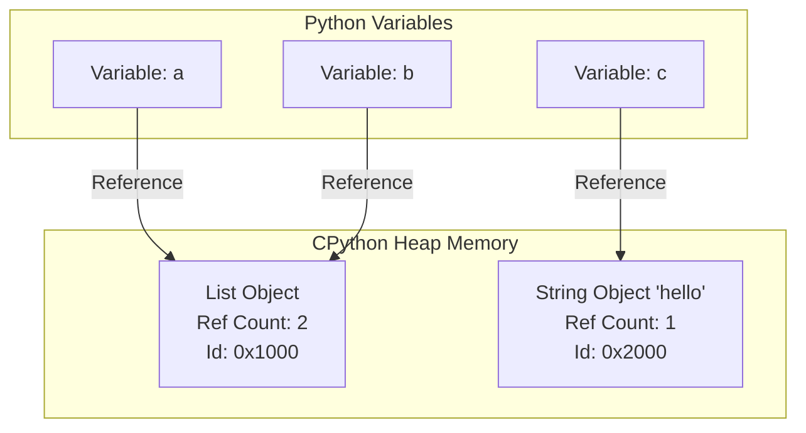

# Python Memory Optimization: A Deep Dive

## 1. Title and Objective
**Objective**: To master the inner workings of Python's memory management, understand the overhead of Python objects, and learn how to write highly memory-efficient code by leveraging CPython internals, profiling tools, and specialized data structures. This lesson provides a textbook-level understanding of reference counting, garbage collection, and advanced optimization techniques like `__slots__`, string interning, and weakrefs.

## 2. Why This Matters
In languages like C or C++, memory management is manual; developers must explicitly allocate and free memory using `malloc` and `free`. While this provides ultimate control and minimal overhead, it frequently leads to memory leaks, dangling pointers, and segmentation faults. Python abstracts memory management away, allowing developers to focus on business logic. 

However, this abstraction comes with a significant cost:
- **Object Overhead**: Every Python object (even a simple integer) carries substantial metadata overhead. In CPython, a basic integer can consume 28 bytes compared to a C integer's 4 or 8 bytes.
- **Garbage Collection Pauses**: Cyclic references require a generational garbage collector, which can cause non-deterministic pauses in your application.
- **Memory Bloat**: Loading large datasets into memory using inefficient data structures (like lists of dictionaries) can exhaust system memory, leading to out-of-memory (OOM) kills or severe disk swapping (thrashing).

Understanding how Python manages memory is crucial for developing high-performance applications, data pipelines, web servers handling thousands of concurrent requests, and memory-constrained embedded systems. Without this knowledge, your applications will run slower, cost more to host, and crash under heavy loads.

## 3. Prerequisites
Before diving into this comprehensive lesson, ensure you have a solid grasp of:
- **Python Fundamentals**: Variables, mutability, data types (lists, dicts, sets, tuples).
- **Object-Oriented Programming in Python**: Classes, inheritance, instance attributes.
- **Basic C Concepts (Optional but helpful)**: Pointers, structs, and memory allocation basics.
- **Python's C-API (Conceptual)**: Understanding that CPython is written in C and executes Python bytecode.

## 4. Introduction
Python is dynamically typed, meaning variables do not have types; only values have types. Variables are merely names bound to objects in memory. This simple concept drastically impacts how memory is allocated and reclaimed. In this lesson, we will peel back the layers of Python's execution environment (specifically CPython, the reference implementation) to examine how it allocates memory on the heap, tracks references, collects garbage, and provides mechanisms for optimization.

## 5. The Problem Solved
This lesson solves the "invisible wall" problem. Many developers write clean, functional Python code that works perfectly on small datasets or low traffic. But as the data scales to gigabytes, the code grinds to a halt. The problem is that the abstraction of infinite memory breaks down. By learning the techniques in this lesson—profiling memory, using generators instead of lists, optimizing classes with `__slots__`, and leveraging built-in optimizations—you solve the problem of unpredictable resource consumption and prevent application failure at scale.


## 6. Mental Model
Think of Python's memory management as a vast, highly organized warehouse (the **Heap**). 
- **The Objects**: Every piece of data is a physical box (an object) in the warehouse. Each box has a label (its type), a weight counter (the reference count), and actual contents (the value).
- **The Variables**: Variables are just post-it notes with names on them, stuck to the boxes. You can stick multiple post-it notes on the same box.
- **The Manager (Reference Counter)**: A manager constantly walks around. Whenever a new post-it note is attached to a box, the manager increments the box's weight counter. When a post-it is removed (or destroyed), the counter is decremented. If a box's counter reaches zero, the manager instantly crushes the box and reclaims the shelf space.
- **The Clean-up Crew (Garbage Collector)**: Sometimes boxes are tied together with ropes (cyclic references). Even if all post-it notes from the outside are removed, they hold each other's weight counters above zero. The clean-up crew periodically sweeps the warehouse, identifies these isolated clusters of tied boxes, and throws them away.

## 7. Visual Explanation


*If `del a` is executed, the Ref Count for Obj1 becomes 1. If `del b` is also executed, Ref Count becomes 0, and the memory at `0x1000` is immediately freed.*

## 8. CPython Internals: Memory Management
CPython does not simply call the operating system's `malloc` and `free` every time you create or destroy an integer or a string. Doing so would be catastrophically slow due to the overhead of system calls. 

Instead, CPython utilizes a layered architecture for memory allocation:
1. **OS Allocator**: Requests large blocks of memory (Arenas) from the operating system (e.g., via `mmap` or `malloc`).
2. **CPython Arenas**: Large chunks of memory (usually 256KB) allocated directly from the OS.
3. **Pools**: Arenas are divided into Pools (usually 4KB, matching the typical OS page size). A pool only contains blocks of a single size class.
4. **Blocks**: Pools are divided into Blocks. A block is the smallest unit of memory, allocated for a specific Python object. Block sizes range from 8 bytes to 512 bytes (in multiples of 8).

When you create a small object (like an `int`), CPython finds a Block of the appropriate size within an existing Pool. This makes allocation and deallocation extremely fast, as it happens purely in user-space without bothering the OS kernel. This system is known as the **Pymalloc** allocator, optimized specifically for objects smaller than 512 bytes. Larger objects bypass Pymalloc and use the standard C `malloc`.


## 9. Reference Counting Deep Dive
The bedrock of CPython's memory management is Reference Counting. Every Python object is fundamentally a C structure named `PyObject`.

```c
typedef struct _object {
    _PyObject_HEAD_EXTRA
    Py_ssize_t ob_refcnt;   // The Reference Count
    PyTypeObject *ob_type;  // Pointer to the object's type
} PyObject;
```
Every object has an `ob_refcnt`. 
- **Incrementing**: When an object is bound to a new name, placed in a container (list, dict), or passed as an argument to a function, its `ob_refcnt` increases (`Py_INCREF`).
- **Decrementing**: When a name goes out of scope, is reassigned, `del` is called, or a container is destroyed, the `ob_refcnt` decreases (`Py_DECREF`).
- **Deallocation**: The moment `ob_refcnt` hits exactly 0, CPython instantly calls the deallocation function specific to that object's type (`ob_type->tp_dealloc`), returning the memory to the respective Pool.

**Pros of Reference Counting**:
- Real-time, deterministic destruction of objects.
- High memory locality.

**Cons**:
- Thread-safety (requires locks, hence the GIL).
- Cannot detect cyclical references.

## 10. Garbage Collection in CPython
Because reference counting cannot resolve circular references (e.g., `a = []`; `a.append(a)`), CPython employs a supplementary **Generational Garbage Collector** (GC). The GC only concerns itself with "container objects" (lists, dictionaries, custom classes) because simple types (integers, strings) cannot hold references to other objects and thus cannot form cycles.

**Generations**: CPython's GC divides objects into three generations (0, 1, and 2).
- **Generation 0**: Newly created objects.
- **Generation 1**: Objects that survived a Gen 0 collection.
- **Generation 2**: Objects that survived a Gen 1 collection.

**The Thresholds**: The GC is triggered by thresholds, not purely by time. By default, if the number of allocations minus deallocations for Gen 0 exceeds 700, a GC sweep runs on Gen 0.

**How it works (The Mark-and-Sweep variant for cycles)**:
1. The GC creates a copy of the reference counts for all container objects in the generation.
2. It iterates through the objects, and for every reference an object holds, it temporarily decrements the copied reference count of the target object.
3. After traversing all references, any object whose copied reference count is strictly greater than zero is considered "reachable" from outside the cycle.
4. Reachable objects rescue any objects they reference (transitively).
5. Any objects with a copied reference count of 0 at the end of this process are definitively garbage (isolated cycles) and are deleted.

You can interact with the GC using the `gc` module:
```python
import gc
gc.disable()  # Turns off cyclic GC (use with extreme caution!)
gc.collect()  # Manually forces a full collection
print(gc.get_threshold()) # e.g., (700, 10, 10)
```

## 11. The Global Interpreter Lock (GIL) and Memory
The Global Interpreter Lock (GIL) is intrinsically tied to memory management. Because reference counting (`ob_refcnt`) requires incrementing and decrementing, doing so in a multithreaded environment without locks would result in race conditions. Two threads could simultaneously decrement a count from 2, both read it as 1, both decrement it to 0, and both attempt to free the same memory, causing a fatal crash.

The GIL ensures that only one native OS thread can execute Python bytecodes at any given time, thereby protecting the reference counts from race conditions. While the GIL severely limits CPU-bound parallelism in CPython, it drastically simplifies memory management and makes single-threaded execution very fast.


## 12. Python Implementation: Objects in Memory
In Python, "everything is an object". Let's look at the actual byte overhead of common objects using `sys.getsizeof()`.

```python
import sys
print(sys.getsizeof(1))           # 28 bytes (on 64-bit)
print(sys.getsizeof(""))          # 49 bytes (empty string)
print(sys.getsizeof([]))          # 56 bytes (empty list)
print(sys.getsizeof({}))          # 64 bytes (empty dict)
```

Why is an empty list 56 bytes?
- PyObject HEAD (Ref count + Type pointer): 16 bytes.
- Size of the collection (ob_size): 8 bytes.
- Pointer to the array of items: 8 bytes.
- Allocated capacity (to avoid resizing on every append): 8 bytes.
- Total: 40 bytes (plus alignment/GC overhead).

When you build a list of 1,000,000 integers, you are not just allocating 1,000,000 * 8 bytes (pointers). You are allocating the list structure itself, the array of pointers, AND 1,000,000 individual Integer objects scattered across the heap, each costing 28 bytes.

## 13. `__slots__` and Class Memory Optimization
By default, every instance of a custom Python class has a `__dict__` attribute. This dictionary stores the instance variables. Dictionaries are highly optimized in Python, but they still carry a heavy memory footprint (minimum 104 bytes in modern Python) and require separate heap allocations.

If you are creating millions of instances of a class (e.g., nodes in a graph, rows in a dataset), the `__dict__` overhead is devastating.

**The Solution: `__slots__`**
By defining `__slots__` in your class, you tell Python to suppress the creation of the `__dict__` and instead allocate space for a fixed set of attributes directly within the instance's memory layout (like a C struct).

```python
class NodeDict:
    def __init__(self, x, y):
        self.x = x
        self.y = y

class NodeSlots:
    __slots__ = ['x', 'y']
    def __init__(self, x, y):
        self.x = x
        self.y = y

import sys
# Comparing instance size
nd = NodeDict(1, 2)
ns = NodeSlots(1, 2)

print(sys.getsizeof(nd) + sys.getsizeof(nd.__dict__)) # ~ 48 + 104 = 152 bytes
print(sys.getsizeof(ns))                              # ~ 48 bytes (No dict!)
```
Using `__slots__` can easily reduce the memory footprint of your objects by 50% to 70%, and slightly improve attribute access speed due to better memory locality.

## 14. Generators and Generator Expressions
The most common cause of Out-Of-Memory (OOM) errors in Python is eagerly loading data into memory when it could be processed lazily.

**The Anti-Pattern (Eager Loading)**:
```python
def process_file(filename):
    with open(filename, 'r') as f:
        # readlines() loads the entire file into memory as a list of strings
        lines = f.readlines() 
    
    return [line.upper() for line in lines]
```
If the file is 10 GB, this code will crash a standard laptop. 

**The Optimization (Generators)**:
Generators yield one item at a time, keeping only a single item in memory. The memory footprint of a generator is constant, regardless of the size of the dataset.

```python
def process_file_lazy(filename):
    with open(filename, 'r') as f:
        for line in f:             # File object is an iterator
            yield line.upper()     # Yields one line at a time

# Generator expression (analogous to list comprehension)
# Uses () instead of []
gen_expr = (line.upper() for line in open('massive_file.txt'))
```
By switching from list comprehensions `[...]` to generator expressions `(...)`, you drastically reduce memory consumption.


## 15. Integer Caching (Small Integer Pool)
CPython attempts to mitigate the overhead of object creation for extremely common values. It pre-allocates an array of small integers at startup. 
Specifically, the integers from **-5 to 256** are cached.

Whenever you request one of these integers, CPython returns a reference to the existing singleton object in the pool, rather than creating a new one.

```python
a = 100
b = 100
print(a is b)  # True. Both point to the exact same memory address.

x = 257
y = 257
print(x is y)  # False (in the REPL). They are distinct objects.
```
*Note: If you run `x=257; y=257` in a script rather than the REPL, the compiler's peephole optimizer might assign them the same object if they are in the same code block, but this is an implementation detail, whereas the -5 to 256 cache is a systemic guarantee in CPython.*

## 16. String Interning
Similar to integer caching, CPython optimizes memory usage for strings through "interning." String interning means that only one copy of a distinct string value is stored in memory.

**Implicit Interning**:
CPython automatically interns strings that look like identifiers (strings containing only ASCII letters, digits, and underscores) of moderate length.

```python
s1 = "hello_world"
s2 = "hello_world"
print(s1 is s2)  # True, they are implicitly interned.

s3 = "hello world!" # Contains a space and an exclamation mark
s4 = "hello world!"
print(s3 is s4)  # False (in REPL), not an identifier.
```

**Explicit Interning**:
You can force CPython to intern a string using the `sys.intern()` function. This is incredibly useful for memory optimization if you are parsing large files (like JSON or CSV) containing many repetitive strings (e.g., country codes, status strings).

```python
import sys
# Imagine loading a column of 1 million rows containing only "SUCCESS" or "FAILED"
# Without interning: 1 million string objects.
# With interning: 2 string objects, and 1 million pointers.
status = sys.intern(row['status']) 
```
String interning not only saves massive amounts of memory but also makes string comparisons instantaneous (O(1)), because CPython can compare their memory addresses (pointer equality) instead of comparing them character-by-character.


## 17. Weak References (weakref module)
Sometimes you need to track objects (e.g., in a cache) without preventing them from being garbage collected. If you put an object in a standard dictionary to cache it, the dictionary holds a strong reference, preventing the object's reference count from ever reaching zero. This is a classic source of memory leaks.

The `weakref` module solves this. A weak reference does NOT increment the object's reference count.

```python
import weakref

class HeavyObject:
    def __init__(self, name):
        self.name = name

obj = HeavyObject("Data")
# Create a weak reference dictionary
cache = weakref.WeakValueDictionary()
cache["item1"] = obj

print(cache["item1"].name) # Prints "Data"
print(list(cache.items())) # [('item1', <HeavyObject>)]

del obj  # We remove the strong reference. Ref count goes to 0.
# The WeakValueDictionary automatically removes the entry!
print(list(cache.items())) # []
```
Weak references are essential for implementing caches (like LRU caches) and managing complex object lifecycles without creating memory leaks through circular references.

## 18. Memory Profiling Tools
You cannot optimize what you cannot measure. Python provides several tools to analyze memory consumption.

**1. `sys.getsizeof()`**:
Good for checking the size of a single object, but it is shallow. It does not count the size of objects referenced by a container.
```python
import sys
nested = [[1, 2, 3], [4, 5, 6]]
# Only measures the outer list, not the inner lists or integers
print(sys.getsizeof(nested)) 
```

**2. `memory_profiler`**:
A third-party module that provides line-by-line memory consumption analysis.
```bash
pip install memory_profiler
```
Usage:
```python
from memory_profiler import profile

@profile
def my_func():
    a = [1] * (10 ** 6)
    b = [2] * (2 * 10 ** 7)
    del b
    return a

if __name__ == '__main__':
    my_func()
```
Output will show memory increments at each line, making it trivial to spot which exact line caused a spike.

**3. `tracemalloc`**:
Built directly into Python's standard library since Python 3.4. It traces memory blocks allocated by Python and provides highly detailed statistics on where memory was allocated.


## 19. Detecting and Fixing Memory Leaks
In Python, "memory leaks" are rarely caused by un-freed C-level pointers (unless you are writing C extensions). Python memory leaks are almost always **logical leaks**: you are keeping strong references to objects longer than necessary.

**Common Causes of Logical Leaks**:
1. **Global Variables & Caches**: Appending to a global list or dict (e.g., a custom cache) without bounds or eviction policies.
2. **Event Listeners/Callbacks**: Registering an object's method as a callback to a long-lived publisher, keeping the object alive forever.
3. **Unclosed Files/Resources**: Leaving file handles open can sometimes leak associated memory buffers.
4. **Exceptions**: Catching exceptions and storing the traceback objects globally can keep entire frame stacks alive.

**How to detect them**:
Run a load test against your application and monitor the RSS (Resident Set Size) memory at the OS level. If the memory grows continuously without plateauing after warmup, you have a leak.

## 20. Tracemalloc Deep Dive
`tracemalloc` is the ultimate tool for pinpointing logical memory leaks. It hooks into Python's memory allocator and tracks the traceback of every allocation.

**Typical Workflow to Find a Leak**:
1. Start `tracemalloc`.
2. Take a snapshot of memory.
3. Perform the operations that you suspect are leaking (e.g., process 100 requests).
4. Take a second snapshot.
5. Compare the two snapshots to see what was allocated and not freed.

```python
import tracemalloc

# 1. Start tracing
tracemalloc.start()

# 2. Take initial snapshot
snapshot1 = tracemalloc.take_snapshot()

# 3. Do some work (simulate a leak)
my_list = []
for i in range(100000):
    my_list.append(dict(a=i, b=i*2))

# 4. Take second snapshot
snapshot2 = tracemalloc.take_snapshot()

# 5. Compare snapshots
top_stats = snapshot2.compare_to(snapshot1, 'lineno')

print("[ Top 5 memory differences ]")
for stat in top_stats[:5]:
    print(stat)
```
The output will directly point you to the file name and line number (`file.py:12: size=24.5 MiB, count=100000`) where the leaked objects were instantiated.


## 21. Arrays and memoryviews
When dealing with large homogeneous numeric data, Python lists are terribly inefficient because they store pointers to integer objects, not the integers themselves.

**The `array` module**:
Provides a space-efficient way to store basic C-style data types.
```python
import array
# 'i' stands for signed integer (usually 4 bytes)
arr = array.array('i', [1, 2, 3, 4, 5])
```
An `array.array` is a contiguous block of memory. An array of 1 million integers takes ~4MB, whereas a Python list of 1 million integers takes ~36MB (8MB for pointers + 28MB for objects).

**`memoryview`**:
A `memoryview` allows you to access the internal data of an object that supports the buffer protocol (like `bytes`, `bytearray`, or `array`) without copying it.
```python
data = b'A massive byte string...'
# Creating a memoryview doesn't copy the string
view = memoryview(data)
# Slicing a memoryview creates another view, NOT a copy!
slice_view = view[10:20] 
```
If you slice `data[10:20]`, Python creates a brand new 10-byte string. Slicing the `memoryview` creates a view referencing the original buffer, avoiding allocations.

## 22. Using NumPy or Pandas
For heavy numerical computations or tabular data, you must abandon built-in Python structures and use C-backed libraries like NumPy and Pandas. NumPy arrays (`ndarray`) allocate contiguous memory blocks in C and execute vectorized operations, completely bypassing Python's `PyObject` overhead and largely circumventing the GIL during computations.

## 23. Dealing with JSON and Large Files
Parsing massive JSON files with `json.load()` loads the entire structure into memory as nested lists and dictionaries. A 100MB JSON file might balloon to 500MB in RAM.
- **Solution**: Use iterative JSON parsers like `ijson`.
- **For CSV/Logs**: Iterate line-by-line using generators.

## 24. Context Managers (`with` statement)
Always use context managers (`with open(...) as f:`) for resources. This ensures deterministic cleanup of file descriptors and underlying C buffers, even if exceptions occur. Relying on the garbage collector to close files is dangerous and non-deterministic, especially in alternative implementations like PyPy.

## 25. Reusing Objects and Object Pools
If your application rapidly creates and destroys thousands of identical complex objects per second, the allocation/deallocation overhead becomes a bottleneck.
Implement an **Object Pool**: pre-allocate a set of objects and reuse them. Instead of initializing a new object, check one out of the pool, reset its state, and return it to the pool when done.

## 26. The Limits of `__slots__`
While `__slots__` is fantastic, it comes with caveats:
- You cannot add new, undeclared attributes to the instance at runtime.
- It complicates multiple inheritance.
- If a class inherits from a class without `__slots__`, the child class instances will still have a `__dict__`, negating the memory benefit.

## 27. PyPy vs CPython Memory Management
If memory constraints are less of an issue than sheer speed, alternative interpreters like PyPy might be used. However, it's crucial to note:
- PyPy uses a tracing JIT compiler.
- It does **not** use reference counting; it uses a high-performance tracing garbage collector (similar to Java).
- Consequence: PyPy usually requires **more memory** than CPython to achieve its speed, and memory deallocation is non-deterministic (objects are freed in bulk during GC sweeps, not immediately upon going out of scope).

## 28. Measuring Total Process Memory
Python-specific tools (like `tracemalloc`) only track memory allocated via Python's allocator. If a C-extension (like a machine learning library) leaks memory via raw `malloc`, `tracemalloc` won't see it.
To check the true OS-level memory footprint of your Python process:
```python
import os, psutil
process = psutil.Process(os.getpid())
print(process.memory_info().rss / 1024 / 1024, "MB")
```

## 29. Deleting Variables
Using `del variable_name` removes the name from the local/global namespace and decrements the reference count of the object. If you have large intermediate variables in a long-running function, explicitly `del` them as soon as you no longer need them to free up memory earlier.

## 30. Avoiding Circular References
Whenever possible, design your data structures as Directed Acyclic Graphs (DAGs) or trees. If a child node must reference a parent node, strongly consider using a `weakref` for the parent pointer. This entirely avoids the need for the cycle-detecting garbage collector to intervene.


## 38. Active Recall
1. What is the difference between `ob_refcnt` and the generational garbage collector?
2. Why is an empty Python list significantly larger than a C array of size 0?
3. How does `__slots__` save memory? What internal structure does it remove?
4. Explain how a generator expression saves memory compared to a list comprehension.
5. Why are the integers 10 and 10 usually the same object in CPython, but 1000 and 1000 are not?
6. When would you use a `weakref` instead of a standard dictionary?
7. How does `sys.intern()` optimize memory and equality checking?
8. What is the fundamental difference between `memory_profiler` and `tracemalloc`?

## 39. Interview Questions
**Q1: You have a script that parses a 50GB log file line by line, but the process keeps getting killed by the OOM killer. You look at the code and see: `lines = file.readlines(); for line in lines: process(line)`. How do you fix it?**
**Answer**: `readlines()` loads all 50GB into memory simultaneously as a massive list of strings. I would change it to iterate over the file object itself: `for line in file: process(line)`. This acts as a generator, keeping only one line in memory at a time, making the memory footprint constant (O(1)).

**Q2: We are creating 50 million instances of a simple `Point3D(x, y, z)` class, and it's taking up 8GB of RAM. How can we optimize this without changing how the rest of the code interacts with the objects?**
**Answer**: Add `__slots__ = ['x', 'y', 'z']` to the class definition. This prevents Python from creating a dynamic `__dict__` for every instance, drastically reducing the overhead per object and saving gigabytes of memory. Alternatively, if immutability is acceptable, use a `collections.namedtuple`, or if pure numerical performance is needed, switch to a NumPy array or `array.array`.

**Q3: Explain what string interning is and when you would explicitly use it.**
**Answer**: String interning is CPython's mechanism to store only one copy of distinct strings in memory. While short identifier-like strings are interned automatically, I would use `sys.intern()` explicitly when parsing large datasets containing many repetitive string values (e.g., status codes, categorical text data). Interning ensures all identical strings point to the same memory address, saving vast amounts of memory and speeding up dictionary lookups and equality checks.

**Q4: How would you debug a memory leak in a long-running Python web server?**
**Answer**: Python leaks are usually logical (holding references too long). I would use the `tracemalloc` standard library module. I would take a memory snapshot before a load test, run the load test, take a second snapshot, and use `snapshot2.compare_to(snapshot1, 'lineno')`. This will print the exact file names and line numbers where objects were allocated that have not been garbage collected. I'd also check for common culprits like global variables, unbounded caches, or circular references blocking standard reference counting.

## 40. Conclusion and Next Steps
Understanding memory optimization elevates you from a Python scripter to a software engineer capable of building robust, scalable systems. You now understand that memory in Python is an abstraction, and you know how to look beneath it using reference counts, CPython allocators, and profiling tools. 

**Next Steps**:
- Apply `__slots__` to a class in your own codebase and measure the memory difference using `psutil`.
- Convert an intensive list comprehension into a generator and profile the peak memory usage.
- Move on to the next lesson on **CPU Cache Optimization and Data Locality** to understand how memory layout affects raw processing speed.

