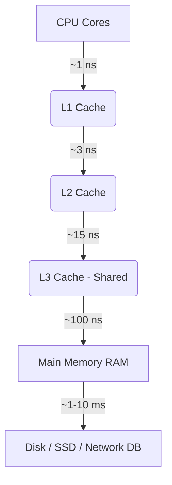

# 03 - Cache Optimization in Python: A Textbook Deep Dive

## 1. Introduction
In the realm of software performance, few techniques offer as dramatic an improvement as caching. Caching is the practice of storing the results of expensive operations—whether they be CPU-intensive computations, slow disk reads, or high-latency network requests—so that subsequent requests for the same data can be served orders of magnitude faster. In Python, a language often critiqued for its execution speed, mastering caching is not just an optimization technique; it is a fundamental requirement for writing production-grade, scalable systems. This comprehensive guide will take you from the fundamental principles of hardware-level caching to the nuances of CPython's internal caching mechanisms, distributed caching architectures, and memory profiling.

## 2. Why This Matters
Performance bottlenecks in Python typically stem from I/O bound operations (like database queries and API calls) or CPU-bound operations (like complex mathematical transformations). Caching mitigates both. By intercepting a request and serving it from a fast-access memory layer, you eliminate the latency of the underlying operation. Understanding how to implement this effectively means the difference between an application that crumbles under load and one that scales elegantly. Furthermore, a deep understanding of hardware caches (L1/L2/L3) allows you to write Python code that plays nicely with the CPU, exploiting data locality to achieve C-like performance using libraries like NumPy.

## 3. Prerequisites
To fully grasp the concepts in this chapter, you should have:
- A solid understanding of Python's execution model and dynamic typing.
- Familiarity with decorators and closures in Python.
- Basic knowledge of computer architecture (CPU, RAM, Disk).
- An understanding of Big O notation and time-space complexity trade-offs.
- Exposure to multi-threading and Python's Global Interpreter Lock (GIL).

## 4. The Problem Solved
Imagine a web application that calculates the nth Fibonacci number or generates a complex cryptographic hash for a given user input. If the same input is requested a thousand times a second, computing it from scratch every time is a catastrophic waste of CPU cycles. Caching solves this by transforming the problem from a computation problem into a memory-retrieval problem. We trade space (RAM) for time (CPU cycles), leveraging the fact that memory retrieval is extraordinarily fast compared to recalculation.

## 5. Mental Model
Think of caching like a librarian in a massive, labyrinthine library. 
- **No Cache:** Every time you ask for a book, the librarian has to walk into the depths of the library, find the book, bring it to you, and then return it immediately after you finish. This takes a long time.
- **With a Cache (The Desk):** The librarian keeps a small desk at the front. When you return a book, they keep it on the desk. The next time someone asks for that book, they just hand it over from the desk. 
- **Cache Eviction (LRU):** The desk has limited space. When the desk is full and a new book needs to be placed there, the librarian removes the book that hasn't been requested in the longest time (Least Recently Used) and puts it back in the main library.

## 6. Visual Explanation: The Caching Hierarchy

As you move further down the hierarchy, storage capacity increases exponentially, but so does latency. Effective caching aims to keep frequently accessed data as high up in this tree as possible. In Python, our application-level caches live in Main Memory (RAM), but our data structures dictate how effectively the CPU utilizes L1/L2/L3 caches.

## 7. Hardware Caches: CPU Cache Lines and Data Locality
Before discussing software caches like dictionaries and Redis, we must understand the hardware. Modern CPUs do not read memory one byte at a time. They fetch memory in chunks called **Cache Lines**, typically 64 bytes in size. 

When your CPU needs a variable, it pulls the entire 64-byte cache line containing that variable into the L1 cache. If your program subsequently asks for the *next* variable in memory, the CPU already has it in the L1 cache. This is called a **Cache Hit**, and it's practically instantaneous. If the data is not in the cache, the CPU halts execution to wait for the data to be fetched from RAM. This is a **Cache Miss**, which costs hundreds of CPU cycles.

## 8. Data Locality: Python Lists vs. Arrays
This hardware reality explains why native Python lists can be slow for numeric crunching. A Python `list` is an array of *pointers* to objects scattered arbitrarily across the heap. 
- **Python List Iteration:** The CPU fetches a cache line containing pointers. It then has to dereference a pointer, causing a cache miss as it fetches the actual integer object from some random location in RAM. It repeats this for every element. This destroys spatial locality.
- **Python `array.array` or NumPy Arrays:** These structures store the actual unboxed C-level integers sequentially in a single contiguous block of memory. When the CPU fetches a cache line, it gets 8 (for 64-bit integers) elements at once. Iterating through this array results in 1 cache miss followed by 7 cache hits, resulting in massive performance gains.

## 9. Memoization Basics
Memoization is a specific type of caching used in software design. It involves wrapping a deterministic function (a pure function that always returns the same output for a given input) with a cache. Before computing the function, the cache is checked. If the result exists, it is returned. Otherwise, the function computes the result, stores it in the cache, and then returns it.

```python
# A simple manual memoization implementation
_fib_cache = {}

def fibonacci(n):
    if n in _fib_cache:
        return _fib_cache[n]
    if n <= 1:
        return n
    result = fibonacci(n - 1) + fibonacci(n - 2)
    _fib_cache[n] = result
    return result
```
While functional, manual memoization clutters the business logic. Python provides elegant decorators to abstract this away.

## 10. Python Implementation: `functools.lru_cache` and `cache`
The `functools` module in the standard library provides battle-tested caching decorators.

- `@functools.cache`: Introduced in Python 3.9, this is an unbounded cache. It stores every result indefinitely. It is fast but dangerous if the input space is large, as it will lead to memory exhaustion (OOM errors).
- `@functools.lru_cache(maxsize=128)`: This is a Least Recently Used cache. It stores up to `maxsize` items. When the cache is full, the least recently accessed item is evicted.

```python
from functools import lru_cache

@lru_cache(maxsize=256)
def expensive_api_call(user_id: int, query: str):
    # Simulating a slow operation
    print(f"Fetching data for {user_id}...")
    return {"user": user_id, "data": query.upper()}

# First call: cache miss, prints "Fetching...", takes time
result1 = expensive_api_call(1, "hello") 

# Second call: cache hit, instantaneous, no print
result2 = expensive_api_call(1, "hello") 
```

## 11. Deep Dive into `functools` LRU Cache
The magic of `lru_cache` lies in its dual data structure architecture. To achieve O(1) time complexity for both access and eviction, it combines a **Hash Map (Dictionary)** and a **Doubly Linked List**.

1. **The Hash Map:** Maps the function arguments (which must be hashable) to a node in the linked list. This provides O(1) lookup.
2. **The Doubly Linked List:** Maintains the usage order. The most recently used item is at the "head", and the least recently used is at the "tail".
   - **On Access (Hit):** The item is found via the hash map. Its node is spliced out of its current position in the linked list and moved to the head.
   - **On Miss (Insert):** If the cache is full, the tail node is removed (both from the list and the hash map). The new item is then inserted at the head.

## 12. CPython Internals of Caching
In CPython, the `lru_cache` is implemented in C for maximum performance (`Modules/_functoolsmodule.c`). 
When you call a decorated function, CPython creates a `key` by combining positional `args` and keyword `kwargs`. It essentially does `key = make_key(args, kwargs, typed)`. 
The `make_key` function is highly optimized. If there are no kwargs and only simple positional args, it often just returns the `args` tuple directly, avoiding the overhead of creating a new tuple object.

Furthermore, CPython uses its own internal caches for things like small integers (integers between -5 and 256 are pre-allocated and cached) and interned strings. This means that if your `lru_cache` returns the number `42`, it isn't allocating new memory for that integer; it's just pointing to the singleton `42` in the CPython runtime.

## 13. Caching and Garbage Collection
A cache, by definition, holds onto objects. In Python, as long as an object has a reference pointing to it, the Garbage Collector (GC) will not destroy it. 
If you cache large objects (like ORM models or large Pandas DataFrames) in an unbounded `@cache`, you create strong references to them. The GC cannot reclaim this memory, leading to what is effectively a memory leak.
This is why `lru_cache` with a strict `maxsize` is critical for long-running processes. When an item falls off the tail of the LRU cache, the cache drops its reference. If no other part of the program is referencing that object, its reference count drops to zero, and the memory is immediately reclaimed.

## 14. Reference Counting Implications
Python uses Reference Counting as its primary memory management strategy. 
Every time you insert an item into a cache, the reference count of the key and the value increases by 1 (via `Py_INCREF` at the C level). 
When evicting an item, the cache decrements the reference count (`Py_DECREF`). 
**Warning:** Be cautious when caching objects that hold references back to the cache or to the function itself. This creates Reference Cycles. While Python's generational garbage collector can eventually clean up cycles, it is an expensive process that pauses execution. 
For advanced caching of large graphs, consider using the `weakref` module. `weakref.WeakValueDictionary` allows you to cache objects without increasing their reference count, meaning they can be garbage collected when the rest of the application forgets about them.

## 15. GIL Interactions with Caches
The Global Interpreter Lock (GIL) is Python's notorious mutex that prevents multiple native threads from executing Python bytecodes at once.
However, is `functools.lru_cache` thread-safe? **Yes.**
In CPython, the C implementation of `lru_cache` internally uses a lightweight lock to protect the mutation of the doubly linked list and the dictionary. When thread A accesses the cache, it briefly acquires the lock, moves the node to the head, and releases it. Thread B will block for a microscopic fraction of a second.
This makes `lru_cache` safe to use in multi-threaded web servers (like threaded Gunicorn/WSGI workers). However, understand that this internal locking introduces slight contention. In heavily parallel systems doing purely cached lookups, the lock contention can become a bottleneck.

## 16. Redis Integration Concepts for Distributed Caching
In a modern microservices architecture, in-memory caching like `lru_cache` has a fatal flaw: it is local to the process. If you have 10 Gunicorn workers running your Django app, you have 10 separate, disjointed caches. If worker A computes a result, worker B still experiences a cache miss for the same input.
This is where **Redis** or Memcached comes in. Redis acts as a centralized, distributed cache accessible via the network.

**Key Concepts:**
- **Serialization:** You cannot store a native Python object in Redis. You must serialize it to bytes (usually JSON or Pickle). Pickle is fast and supports complex Python types but is a massive security risk if you don't fully trust the Redis store. JSON is safer but limited to primitives.
- **Cache Invalidations:** "There are only two hard things in Computer Science: cache invalidation and naming things." When the underlying database changes, you must delete or update the Redis key.
- **Eviction Policies:** Redis handles memory limits exactly like `lru_cache`. You can configure Redis with `maxmemory` and policies like `allkeys-lru` (evict the least recently used key globally) or `volatile-lru` (only evict keys with a set Time-To-Live expiration).

## 17. Memory Profiling Caches
How do you know if your cache is consuming too much memory?
Using `sys.getsizeof()` is dangerously misleading. `sys.getsizeof({})` only returns the memory of the dictionary struct itself, not the memory of the keys and values inside it.

To profile cache memory accurately, you need tools like `pympler` or `objgraph`.
```python
from pympler import asizeof
from functools import lru_cache

@lru_cache(maxsize=1000)
def load_large_data(n):
    return [x for x in range(n)]

load_large_data(100000)
# This will calculate the deep size of the entire cache, traversing all objects
print(f"Cache size: {asizeof.asizeof(load_large_data.cache_info())} bytes")
```

## 18. Tracemalloc for Cache Memory Leaks
If your Python backend is slowly running out of RAM (OOM killing by Docker/Kubernetes), unbounded caches or improper eviction are the usual suspects.
Python's built-in `tracemalloc` module is the gold standard for tracking this down.

```python
import tracemalloc

tracemalloc.start()
# ... run your application under load, hitting cached endpoints ...

snapshot = tracemalloc.take_snapshot()
top_stats = snapshot.statistics('lineno')

print("[ Top 10 memory blocks ]")
for stat in top_stats[:10]:
    print(stat)
```
If you see file paths pointing to `functools.py` or your decorators file consistently growing in memory over time, your `maxsize` is too high, or you accidentally used `@cache` instead of `@lru_cache`.

## 19. Edge Cases and Pitfalls
- **Unhashable Arguments:** `lru_cache` uses a dictionary under the hood. Therefore, all arguments to the cached function *must* be hashable. Passing a `list` or a `dict` will raise a `TypeError`. You must use `tuple` or `frozenset`.
- **Cache Poisoning by State:** If a cached function relies on global variables or class instance state (e.g., `self.db_connection`), the cache will return stale data if the underlying state changes. Caches should strictly wrap pure functions.
- **The `typed` argument:** `@lru_cache(typed=True)` treats `3` (int) and `3.0` (float) as distinct keys. By default, they are treated as the same key, which can lead to subtle bugs if your application requires strict typing.

## 20. Eviction Policies Compared
- **LRU (Least Recently Used):** Good general-purpose heuristic. Assumes data accessed recently will be accessed again soon.
- **LFU (Least Frequently Used):** Tracks the *number* of accesses. Useful for static assets (like a logo image) that are always popular. Harder to implement efficiently in software than LRU.
- **FIFO (First In, First Out):** Simple queue. Flawed because a highly popular item inserted early will be evicted, causing unnecessary recalculation.
- **TTL (Time to Live):** Not technically an eviction policy by space, but by time. Highly recommended for data that becomes stale (like stock prices). You can combine TTL with LRU by writing a custom decorator.

## 21. Real-World Caching Strategies
- **Cache-Aside (Lazy Loading):** The application checks the cache. If a miss, it queries the database, puts it in the cache, and returns. This is the most common pattern in Python apps.
- **Write-Through:** The application writes data to the cache AND the database simultaneously. Ensures cache is never stale, but slows down write operations.
- **Write-Back:** The application writes data ONLY to the cache, returning immediately. An asynchronous background worker syncs the cache to the database. Extremely fast writes, but high risk of data loss if the cache server crashes before syncing.

## 22. Active Recall Questions
1. Why does a native Python list cause CPU cache misses during sequential processing?
2. What two data structures does `functools.lru_cache` combine to achieve O(1) performance?
3. What happens to the reference count of an object when it is evicted from an LRU cache?
4. Why is `sys.getsizeof()` insufficient for profiling the memory usage of a cache?
5. In a multi-worker WSGI setup (like Gunicorn), why is `functools.lru_cache` insufficient for caching database queries?

## 23. Interview Questions
- **Junior:** "Explain what `@lru_cache` does and when you would use it."
- **Mid-Level:** "You decorated a function with `@cache` and passed it a dictionary. It throws an error. Why? How do you fix it?"
- **Senior:** "Design a thread-safe LRU Cache from scratch in Python. Explain how you would prevent it from creating memory leaks if the cached values hold references back to the keys. Discuss the GIL implications of your locking strategy."

## 24. Designing a Custom TTL Cache
Sometimes `lru_cache` isn't enough because you need data to expire after N seconds, regardless of how often it's accessed.

```python
import time
from functools import wraps

def ttl_cache(ttl_seconds):
    def decorator(func):
        cache = {}
        @wraps(func)
        def wrapper(*args):
            now = time.time()
            if args in cache:
                result, timestamp = cache[args]
                if now - timestamp < ttl_seconds:
                    return result
            result = func(*args)
            cache[args] = (result, now)
            return result
        return wrapper
    return decorator
```
*Note: This simple implementation lacks a thread-lock and a cleanup mechanism for expired keys, making it prone to unbounded memory growth in production.*

## 25. Advanced: The Thundering Herd Problem
Imagine a heavily trafficked web page caching an expensive DB query in Redis. The cache expires at 12:00:00. At 12:00:01, 5,000 concurrent requests hit the server. They all check Redis, see a cache miss, and all 5,000 simultaneously hit the database to compute the result. The database immediately crashes. This is the **Thundering Herd Problem** (also known as Cache Stampede).
**Solution:** 
- **Locking/Mutex:** When a cache miss occurs, the worker must acquire a distributed lock (e.g., Redis SETNX) before hitting the DB. The other 4,999 workers fail to acquire the lock and enter a brief polling sleep until the first worker populates the cache.
- **Probabilistic Early Expiration (XFetch):** A complex algorithm where workers probabilistically decide to recompute and update the cache *before* it actually expires, smoothing out the load.

## 26. Data Serialization Costs
When using Redis or Memcached, developers often overlook the CPU cost of serialization. 
Pickling a 10MB dictionary takes significant CPU time. If your network is fast but your CPU is pegged, you might find that fetching from Redis and unpickling is actually *slower* than just querying the database natively.
**Optimization:** Cache smaller, pre-computed chunks of data (like rendered HTML fragments) rather than massive raw data objects. Consider faster serialization protocols like MessagePack or Protocol Buffers instead of JSON or Pickle.

## 27. Caching with Asyncio (async_lru)
Python's standard `@lru_cache` does not work well with `async def` functions because it caches the coroutine object, not the result of the coroutine. Awaiting the cached coroutine a second time will raise a `RuntimeError: cannot reuse already awaited coroutine`.
**Solution:** Use third-party libraries like `async_lru`.
```python
from async_lru import alru_cache
import asyncio

@alru_cache(maxsize=32)
async def fetch_data(url):
    await asyncio.sleep(1) # Simulate I/O
    return f"Data from {url}"
```

## 28. Caching in Web Frameworks (Django/FastAPI)
- **Django:** Provides a robust caching framework (`django.core.cache`) that abstracts away the backend (Memcached, Redis, Database, File-based). You can cache entire views using `@cache_page(60 * 15)`, template fragments, or low-level API queries.
- **FastAPI:** Often utilizes `fastapi-cache2` or standard `lru_cache` for synchronous dependencies. Since FastAPI is highly concurrent, integrating Redis via `aioredis` for dependency caching is common.

## 29. Cache Invalidation Strategies in Practice
Invalidation is famously difficult. Strategies include:
- **Time-based Invalidation (TTL):** The simplest approach. Data expires after a fixed duration.
- **Event-driven Invalidation:** A publish/subscribe model where modifying a database record emits an event that triggers cache deletion.
- **Versioned Keys:** Instead of deleting keys, append a version number to the key (`user:1:v2`). When the user updates their profile, increment the version in the database, effectively isolating the old cache entries until they are evicted by LRU.

## 30. HTTP Caching Headers (ETag, Cache-Control)
Application-level caching is good, but preventing the request from reaching your Python server is better.
- **Cache-Control:** Instructs the client's browser or intermediate proxies (like Varnish) to cache the response.
- **ETag:** A hash of the response body. The client sends `If-None-Match: <ETag>`. If the hash hasn't changed, the Python server returns a `304 Not Modified` with an empty body, saving bandwidth and serialization time.

## 31. CDN Caching vs Application Caching
- **CDN (Content Delivery Network):** Cloudflare or AWS CloudFront caches HTTP responses at the edge, physically closer to the user. This bypasses your Python backend entirely.
- **Application Caching:** Redis or Memcached sits behind your Python backend. Required for personalized, dynamic data that cannot be cached globally by a CDN.

## 32. The WeakRef module and Caching
As mentioned earlier, `weakref` allows you to reference objects without increasing their reference count. `weakref.WeakKeyDictionary` is extremely useful for caching metadata about objects where the cache entry should disappear when the object itself is deleted from the rest of the application.

## 33. Metaclasses for Class-Level Caching
You can use metaclasses or `__new__` to implement the Singleton pattern or a class-level cache (e.g., the Flyweight pattern), ensuring only one instance of a class exists for a given set of parameters.
```python
class FlyweightMeta(type):
    _instances = {}
    def __call__(cls, *args, **kwargs):
        key = (cls, args, frozenset(kwargs.items()))
        if key not in cls._instances:
            cls._instances[key] = super().__call__(*args, **kwargs)
        return cls._instances[key]
```

## 34. Caching Database Queries (SQLAlchemy/Django ORM)
ORMs often have their own internal caching. SQLAlchemy has an Identity Map that caches objects by their primary key within a single session. This prevents fetching the same row multiple times in one transaction. However, this is not a cross-request cache. For cross-request caching, you must integrate Redis caching layers on top of your ORM repositories.

## 35. Security Implications of Caching (Pickle, Data leaks)
- **Pickle:** Never unpickle data from an untrusted source, as it can execute arbitrary Python code. If your Redis instance is exposed or compromised, an attacker can overwrite cached objects with malicious Pickles.
- **Data Leaks:** Caching multi-tenant data requires extreme care with cache keys. If your cache key is just `query_result`, User A might see User B's data. Keys must always include the tenant/user ID: `tenant_id:user_id:query`.

## 36. Caching Machine Learning Models
Loading a PyTorch or TensorFlow model into memory takes seconds and consumes gigabytes of RAM. In production (like a Flask or FastAPI app), models must be loaded *once* at startup and cached in memory (usually globally). Using `@lru_cache` for model inference results is also standard practice for identical inputs.

## 37. Future of Caching in Python (Subinterpreters / PEP 684)
With the advent of PEP 684 (Per-Interpreter GIL) in Python 3.12+, Python can run multiple isolated interpreters in the same process, each with its own GIL. This complicates local caching because `lru_cache` in one interpreter will not be visible to another. Shared memory structures (like `multiprocessing.shared_memory`) or external caches (Redis) will become even more critical.

## 38. Best Practices for Distributed Caching
- Avoid hot keys (keys accessed by all requests simultaneously) by adding jitter or splitting the data.
- Use connection pooling (like `redis.ConnectionPool`) to prevent overwhelming the cache server with TCP handshakes.
- Monitor cache hit/miss ratios. A cache with a 5% hit rate is just overhead; it's slowing your application down.

## 39. Summary Checklist for Production
- [ ] Are all cached function arguments immutable and hashable?
- [ ] Is `maxsize` explicitly set on all `@lru_cache` decorators?
- [ ] Have you verified that cached objects do not create reference cycles?
- [ ] Are cache keys namespaced properly to prevent collisions?
- [ ] Is there a clear invalidation strategy for mutable data?

## 40. Conclusion
Caching is a multifaceted discipline. It requires an understanding of hardware mechanics (CPU cache lines), Python runtime internals (reference counting, the GIL), and distributed systems architecture (Redis, Thundering Herd). By methodically applying the correct caching layer—whether it's swapping lists for NumPy arrays for L1 cache hits, using `lru_cache` for pure algorithmic functions, or deploying Redis for database query caching—you can scale Python applications to handle massive enterprise workloads.
