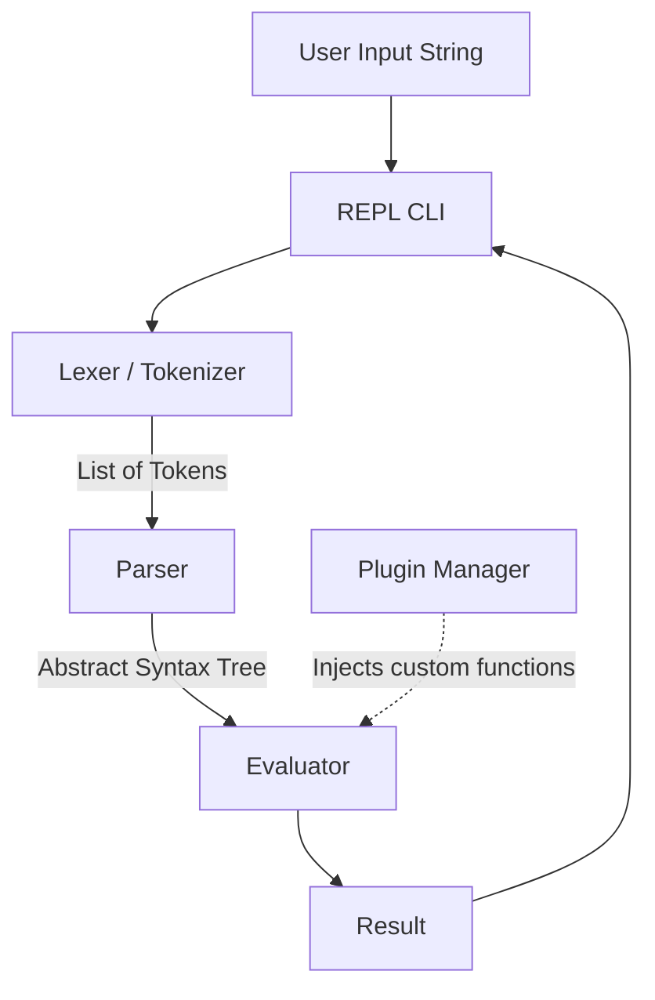

# Advanced Calculator

## Problem Statement
In modern software engineering, evaluating mathematical expressions and string parsing are foundational concepts seen everywhere—from simple data processing pipelines to complex rule engines and compiler design. Building a robust calculator from scratch solves the problem of understanding how raw text input is tokenized, parsed into a structured hierarchy, and evaluated safely without relying on dangerous built-in functions like `eval()`. A production-ready calculator must handle standard arithmetic, variables, and gracefully handle errors while providing an extensible architecture for future functionality.

## Learning Objectives
- **Lexical Analysis and Parsing**: Understand how to convert raw string input into semantic tokens and build an Abstract Syntax Tree (AST) using Recursive Descent Parsing.
- **Object-Oriented Design**: Apply design patterns such as the Command or Strategy pattern to encapsulate mathematical operations.
- **Security Best Practices**: Learn the severe security implications of using `eval()` in Python and how building custom parsers eliminates code injection vulnerabilities.
- **Dynamic Extensibility**: Master the use of Python's `importlib` to create a plug-and-play architecture for loading external modules dynamically.
- **Error Handling and Logging**: Develop robust error-handling mechanisms to ensure the application never crashes unexpectedly and maintains comprehensive logs for debugging.

## Functional Requirements
- **Core Arithmetic**: Must support addition (`+`), subtraction (`-`), multiplication (`*`), division (`/`), and exponentiation (`^`).
- **Precedence & Grouping**: Must strictly adhere to the mathematical order of operations (PEMDAS/BODMAS) and correctly evaluate nested parentheses.
- **Variable Storage**: Users must be able to assign expressions to variables and reuse them in subsequent calculations (e.g., `x = 5`, `y = x * 2`).
- **Plugin Architecture**: The system must allow users to drop new Python scripts (plugins) into a designated folder to instantly add new functions (e.g., trigonometric functions, logarithmic functions) without modifying core code.
- **Interactive REPL**: A Read-Eval-Print Loop command-line interface that allows continuous user interaction, maintains calculation history, and supports commands like `history` or `clear`.

## Suggested Architecture / Data Flow
The application follows a classic compiler pipeline architecture.

### Components
1. **Lexer**: Scans the input character by character, yielding tokens like `NUMBER`, `PLUS`, `LPAREN`, etc.
2. **Parser**: Consumes tokens and constructs an AST using mutually recursive functions like `parse_expression`, `parse_term`, and `parse_factor`.
3. **Evaluator**: Recursively traverses the AST to compute the final mathematical result.
4. **Plugin Manager**: Scans the plugins directory at startup, dynamically importing compliant modules and registering them with the Evaluator.

## Step-by-Step Implementation Guide

### Step 1: Lexical Analysis (The Tokenizer)
- Define a `Token` class containing a `type` (e.g., `NUMBER`, `OPERATOR`) and `value`.
- Create a `Lexer` class that takes a string and iterates over it, ignoring whitespace, identifying continuous digits (and decimals) as numbers, and mapping symbols to operators.

### Step 2: The Abstract Syntax Tree (AST)
- Define AST node classes such as `NumberNode`, `BinOpNode` (Binary Operation), and `UnaryOpNode`.
- Each node should ideally have an `evaluate()` method, or be evaluated by a central `Visitor` class.

### Step 3: Recursive Descent Parsing
- Implement a `Parser` class that takes the list of tokens.
- Write methods for mathematical precedence: `factor()` handles numbers and parentheses, `term()` handles `*` and `/`, and `expr()` handles `+` and `-`.

### Step 4: Evaluator and Variables
- Implement an `Environment` or context dictionary to store variable assignments.
- Ensure the Evaluator can look up variables when traversing the AST.

### Step 5: Plugin System
- Create a `plugins/` directory.
- Use `os.listdir()` to find `.py` files and `importlib.import_module()` to load them.
- Ensure plugins inherit from a base `PluginInterface` to guarantee they implement the required methods.

### Step 6: The REPL
- Write a `while True:` loop that prompts the user for input.
- Wrap the execution in `try/except` blocks to catch parsing errors or division by zero, logging the errors instead of crashing.

## Expected Edge Cases & Challenges
- **Malformed Expressions**: Inputs like `2 + * 3` or `(4 + 5` (unclosed parentheses) must be caught during parsing with descriptive error messages.
- **Division by Zero**: Needs explicit checks in the Evaluator to prevent Python's built-in `ZeroDivisionError` from taking down the REPL.
- **Unary Operators**: Handling negative numbers correctly, such as `-5 + 3` or `5 * -2`, requiring a specific `UnaryOpNode` in the AST.
- **Float Precision**: Standard floating-point arithmetic inaccuracies (e.g., `0.1 + 0.2`). Consider using Python's `decimal` module for high-precision scenarios.

## Testing Strategy
- **Unit Testing the Lexer**: Provide raw strings and assert that the exact sequence of expected Tokens is returned.
- **Unit Testing the Parser**: Provide mock token lists and assert that the resulting AST structure represents the correct mathematical hierarchy.
- **Integration Testing**: Pass complex strings (e.g., `3 + 4 * 2 / ( 1 - 5 ) ^ 2`) to the full pipeline and assert the mathematical result.
- **Error Testing**: Assert that invalid syntax correctly raises custom exceptions (e.g., `SyntaxError`, `MathError`).

## Extension Ideas
- **Boolean Logic**: Extend the lexer and parser to handle boolean operators (`AND`, `OR`, `==`, `>`) to evaluate conditions.
- **Complex Numbers**: Allow inputs like `3 + 4i` and ensure the evaluator can perform complex arithmetic.
- **Matrix Operations**: Add support for matrix definitions and operations, significantly increasing the complexity of the AST.
- **Web Interface**: Wrap the core parsing logic in a FastAPI or Flask backend, creating a web-based calculator.
