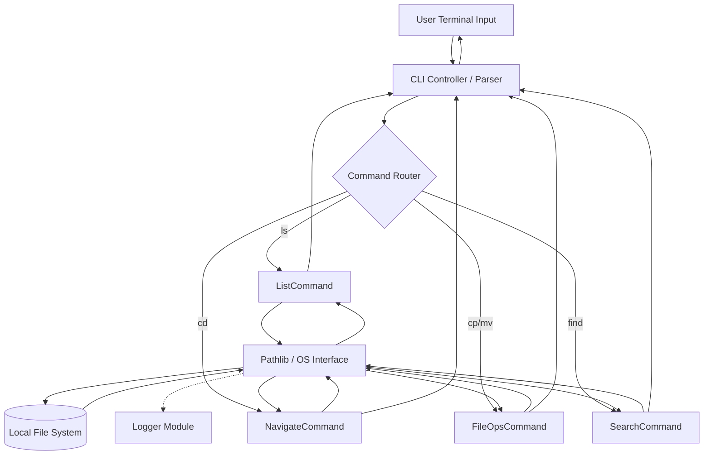

# Professional File Manager

## Problem Statement
Navigating and manipulating the file system programmatically is a critical skill for any software engineer. Often, developers rely on OS-specific shell commands, which leads to fragile, platform-dependent scripts. This project aims to build a robust, cross-platform command-line file manager in Python. It solves the problem of automating complex file system tasks—such as batch renaming, recursive searching, and safe deletion—while addressing the intricacies of modern file system architecture, edge cases, and permission handling.

## Learning Objectives
- **System Programming Interfaces**: Deeply understand Python's modern `pathlib` module as an object-oriented approach to file system manipulation, replacing legacy `os.path` practices.
- **Error and Exception Management**: Learn to gracefully handle common and complex OS-level errors, such as `PermissionError`, `FileNotFoundError`, and recursive directory loops.
- **Memory Efficiency**: Understand how to process massive directories using iterators (e.g., `os.scandir()`) rather than blocking memory-heavy list comprehensions.
- **Application Architecture**: Apply Object-Oriented principles to structure CLI commands, ensuring modularity, testability, and a clear separation between core logic and user interface.
- **Security Awareness**: Recognize and mitigate path traversal vulnerabilities and Time-Of-Check to Time-Of-Use (TOCTOU) race conditions.

## Functional Requirements
- **Directory Listing (`ls`)**: Display files and directories, including metadata such as file sizes and modification dates, in a readable format.
- **Navigation (`cd`)**: Allow users to change the current working directory, supporting both absolute and relative paths.
- **File Operations (`cp`, `mv`, `rm`)**: Safely copy, move, rename, and delete files and entirely nested directory structures.
- **Advanced Search (`find`)**: Recursively search for files matching specific regex patterns or extensions across deep directory hierarchies.
- **Safe Mode**: Implement interactive prompts for destructive actions (like deleting directories) to prevent accidental data loss.

## Suggested Architecture / Data Flow
The application should use a Command Pattern to encapsulate individual commands, routed through a central CLI controller.

### Core Components
1. **CLI Controller**: The entry point that reads standard input, tokenizes the command and arguments, and routes them.
2. **Command Classes**: Discrete classes for each operation (e.g., `ListCommand`, `CopyCommand`) that execute the business logic.
3. **Logger**: A centralized logging service that records all operations and errors to a file, separate from console output.

## Step-by-Step Implementation Guide

### Step 1: Foundation and Path Handling
- Establish the project structure and configure the `logging` module to output to both console (for info) and file (for debug/errors).
- Implement a state object to hold the "Current Working Directory" (CWD), initialized to `pathlib.Path.cwd()`.

### Step 2: Implementing Basic Navigation and Listing
- Create the `ls` logic using `pathlib.Path.iterdir()`. Format the output to show human-readable file sizes and timestamps.
- Create the `cd` logic. Ensure to resolve the path using `.resolve()` and verify it `.is_dir()` before updating the CWD state.

### Step 3: File Manipulation Core
- Implement `cp` (copy) and `mv` (move) using `shutil.copy2` and `shutil.move`.
- Implement `rm` (delete). Use `path.unlink()` for files and `shutil.rmtree()` for directories. **Crucial:** Add a confirmation prompt for directories.

### Step 4: Advanced Searching
- Implement a search algorithm utilizing recursive generators (e.g., `path.rglob()`) to find files matching a user-provided pattern without loading the entire directory tree into memory.

### Step 5: Robust Error Handling
- Wrap all OS-level calls in comprehensive `try/except` blocks.
- Specifically catch `PermissionError` (when trying to access protected files) and `FileNotFoundError` (to handle race conditions where a file might be deleted by another process).

## Expected Edge Cases & Challenges
- **Race Conditions (TOCTOU)**: Checking if a file exists and then opening it leaves a tiny window where the file could be deleted by the OS. Use `try/except` when opening instead of pre-checking.
- **Symlink Loops**: Recursive operations can get trapped in infinite loops if a symlink points back to its parent directory. You must track visited paths or handle `shutil` symlink flags carefully.
- **Cross-Platform Pathing**: Windows uses `\` and POSIX uses `/`. Strictly using `pathlib` objects instead of string concatenation is mandatory to avoid cross-platform bugs.
- **Massive Directories**: Running `ls` on a folder with a million files will hang the application if not paginated or streamed using iterators.

## Testing Strategy
- **Mocking the File System**: Use `pytest` alongside libraries like `pyfakefs` or Python's built-in `tempfile` module to create temporary, isolated directory structures for testing.
- **Unit Testing Operations**: Verify that copying actually duplicates the file, moving changes the path, and deleting removes the entity.
- **Permission Testing**: Create read-only files in the test suite and verify that the application correctly catches and logs `PermissionError` without crashing.
- **Path Traversal Security**: Write tests that attempt to `cd` into `../../../etc/passwd` to ensure the application either handles it securely or correctly restricts it if a "jail" is implemented.

## Extension Ideas
- **Directory Size Calculation**: Add a command that recursively calculates and visually graphs the total size of directories, similar to `ncdu`.
- **Auto-Organizer**: Implement a macro that scans a target directory (like a Downloads folder) and automatically categorizes files into subfolders based on extensions (Images, Documents, Videos).
- **Dry-Run Mode**: Add a `--dry-run` flag to file operations that prints what *would* happen without actually touching the disk, crucial for safe scripting.
- **Archive Management**: Add built-in support to zip and unzip directories directly via commands like `compress` and `extract`.
