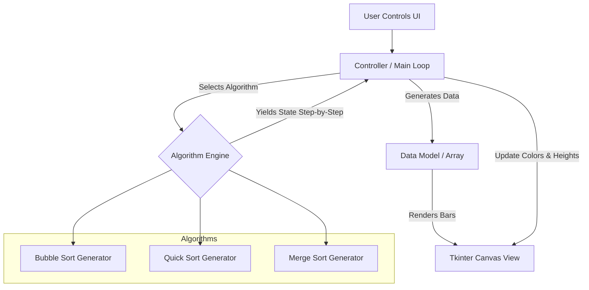

# Sorting Algorithm Visualizer

## Problem Statement
Understanding the mechanics and time complexities of sorting algorithms is notoriously difficult when strictly studying text-based code or mathematical Big-O notation. Students often struggle to conceptualize how arrays are manipulated in real-time, how swaps occur, and why some algorithms vastly outperform others. This project solves this educational gap by building a graphical application that animates the execution of sorting algorithms step-by-step, providing an intuitive, visual representation of algorithmic efficiency and mechanics.

## Learning Objectives
- **Algorithmic Comprehension**: Gain a deep, visual understanding of how fundamental sorting algorithms (Bubble, Insertion, Merge, Quick Sort) actually operate on data structures.
- **Graphical User Interfaces (GUI)**: Master the development of desktop applications using Python's standard `tkinter` library, managing windows, canvases, and event-driven programming.
- **Concurrency & Animation Loops**: Understand how to animate processes without blocking the main UI thread. Learn to use Python Generators (`yield`) to pause algorithm execution and hand control back to the UI loop.
- **Software Architecture**: Apply the Model-View-Controller (MVC) design pattern to strictly separate the mathematical sorting logic from the graphical rendering logic.

## Functional Requirements
- **Algorithm Implementations**: Must support at minimum Bubble Sort, Selection Sort, Insertion Sort, Merge Sort, and Quick Sort.
- **Dynamic Array Generation**: Users must be able to generate randomized arrays of variable sizes (e.g., 10 to 500 elements).
- **Speed Control**: The application must include a slider or control to adjust the playback speed of the animation in real-time.
- **Visual Feedback**: Elements currently being compared or swapped must be highlighted in distinct colors (e.g., Red for compare, Blue for swap, Green for fully sorted).
- **Control Interface**: Provide buttons for 'Start', 'Stop/Reset', and a dropdown menu for selecting the algorithm.

## Suggested Architecture / Data Flow
The application requires a non-blocking architecture to ensure the GUI remains responsive while the algorithms calculate.

### The Generator Pattern
Standard sorting algorithms use loops that complete in milliseconds, blocking the UI. By rewriting algorithms as generators, they `yield` their state after every array access or swap. The UI controller calls `next(algorithm)` on a timer (`tkinter.after()`), redraws the canvas, and then waits, creating smooth animation.

## Step-by-Step Implementation Guide

### Step 1: Setting up the GUI Foundation
- Initialize a `tkinter` window.
- Create a layout with a top control panel (Buttons, Sliders, Dropdowns) and a large bottom `Canvas` for drawing the visualization.

### Step 2: Data Representation
- Write a function to generate a list of random integers.
- Write a `draw_data` function that clears the canvas and draws vertical rectangles (bars) corresponding to the array values. The width of bars must scale dynamically based on the array size, and height based on the maximum value.

### Step 3: Implementing the First Algorithm (Bubble Sort)
- Implement Bubble Sort as a generator function. Instead of just swapping, `yield` a tuple containing the current array state and a list of color codes for the bars (highlighting the indices currently being compared).

### Step 4: The Animation Loop
- Connect the 'Start' button to a function that initializes the chosen algorithm generator.
- Write a recursive `tick()` function using `root.after(speed, tick)`. Inside `tick()`, try to get the `next()` state from the generator and call `draw_data()`. Catch `StopIteration` to know when sorting is complete.

### Step 5: Advanced Algorithms (Divide and Conquer)
- Implement Merge Sort and Quick Sort. Because these are recursive, converting them to yield states step-by-step is significantly more challenging than iterative sorts. You will need to use `yield from` to delegate yielding to recursive calls.

## Expected Edge Cases & Challenges
- **UI Freezing**: The most common mistake is using `time.sleep()` inside a loop. This completely freezes the Tkinter event loop. You *must* use `.after()` or a separate thread.
- **Recursive Generator Complexity**: Adapting Quick Sort and Merge Sort to `yield` state correctly requires a deep understanding of recursion and the `yield from` syntax to ensure the animation states bubble up to the main loop correctly.
- **Canvas Scaling**: If a user selects an array size of 500 on a small monitor, the bars might overlap or render incorrectly. Precise mathematical mapping of array size to canvas width is required.
- **Recursion Limits**: For Quick Sort on a heavily unbalanced array, Python's default recursion limit may be hit.

## Testing Strategy
- **Correctness Testing**: Before attaching them to the GUI, write unit tests for the sorting algorithms to ensure they successfully sort `[3, 1, 4, 1, 5, 9]` into `[1, 1, 3, 4, 5, 9]`.
- **Generator Testing**: Write tests that iterate over the generator and assert that the final yielded state matches Python's built-in `sorted()` output.
- **Edge Cases**: Test algorithms against already sorted arrays, reverse-sorted arrays, and arrays with all identical elements to ensure they handle all edge cases efficiently.

## Extension Ideas
- **Audio Representation**: Map the numerical value of the array elements to sound frequencies using a library like `pygame` or `pyaudio`. Play a tone every time an element is accessed, creating an auditory representation of the algorithm.
- **Real-Time Statistics**: Add a UI panel that updates in real-time to show the total number of comparisons and array accesses, providing numerical proof of Time Complexity differences.
- **Custom Input Data**: Add a text entry field allowing users to input a custom comma-separated list of numbers to sort instead of always using random generation.
- **Simultaneous Racing**: Split the canvas in half and run two different algorithms concurrently on identical datasets to visually race them against each other.
