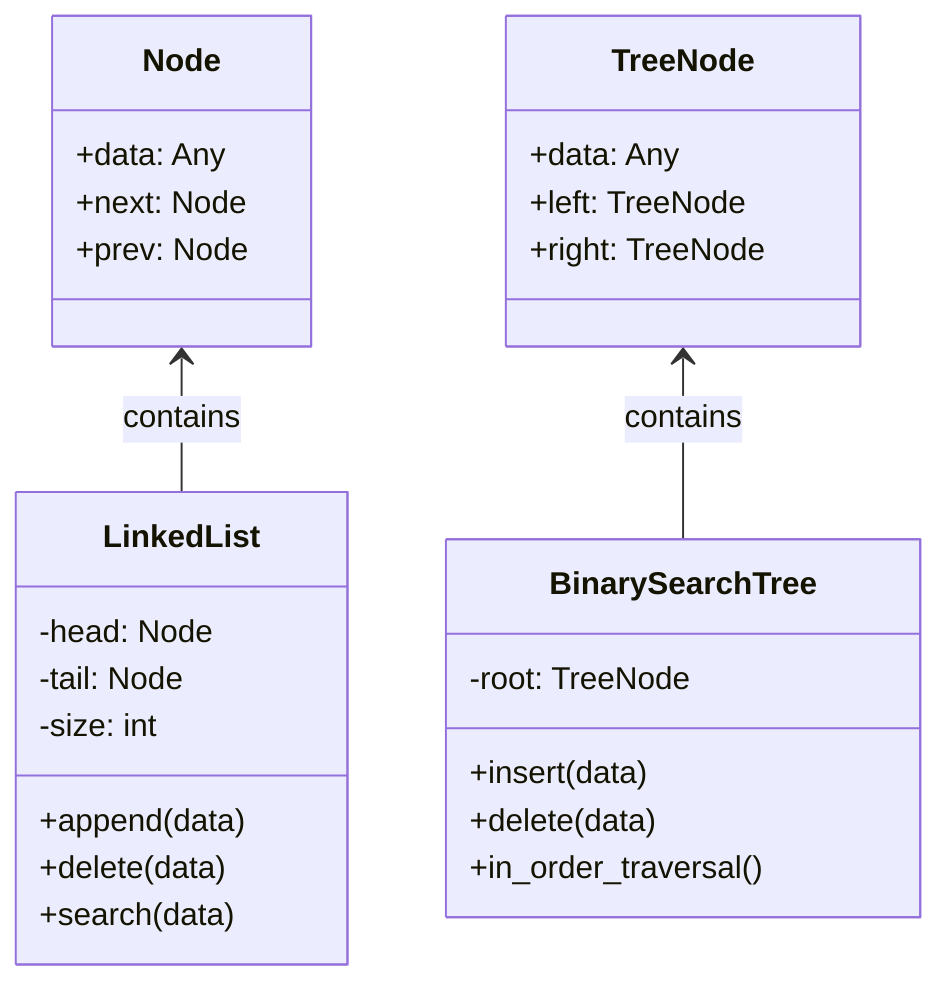

# Fundamental Data Structures Library

## Problem Statement
While high-level languages like Python provide excellent built-in data structures (lists, dictionaries, sets), relying solely on them abstracts away the fundamental mechanics of computer science. This lack of low-level understanding becomes a significant liability during technical interviews, algorithm optimization, and complex systems architecture. This project involves building a production-grade library of fundamental data structures from scratch. It solves the problem of understanding *how* memory is managed, how pointers work, and why certain structures provide \(O(1)\) vs \(O(N)\) time complexities under the hood.

## Learning Objectives
- **Memory & Pointers**: Grasp how nodes reference each other in memory to form dynamic structures, replacing static array-based thinking.
- **Big-O Trade-offs**: Understand the intrinsic time and space complexity trade-offs. Learn exactly why inserting into the middle of a Linked List is faster than an Array, but searching is slower.
- **Object-Oriented Architecture**: Master the use of classes, inheritance, encapsulation, and Python's magic (dunder) methods to create elegant, reusable APIs.
- **Algorithmic Rigor**: Develop precise, edge-case-resistant logic. Managing pointers during a deletion in a Doubly Linked List or balancing a tree requires extreme attention to detail.
- **Test-Driven Development (TDD)**: Learn to write exhaustive unit tests to guarantee structural integrity after complex operations.

## Functional Requirements
The library must implement the following structures, each with a full suite of standard operations (Insert, Delete, Search, Traverse):
- **Linked Lists**: Both Singly and Doubly Linked Lists with dynamic sizing.
- **Stacks & Queues**: LIFO and FIFO structures built using both array-backing and linked-list-backing for comparison.
- **Binary Search Tree (BST)**: A hierarchical tree ensuring \(O(\log N)\) operations for balanced datasets, including pre-order, in-order, and post-order traversals.
- **Heaps / Priority Queues**: Min-Heap and Max-Heap implemented via array representation.
- **Hash Tables**: Custom dictionary implementations demonstrating collision resolution (Chaining and Linear Probing).
- **Graphs**: Both Adjacency List and Adjacency Matrix representations with BFS and DFS traversal algorithms.

## Suggested Architecture / Data Flow
Each data structure should exist in an isolated module, presenting a clean public API while hiding internal node management.

## Step-by-Step Implementation Guide

### Step 1: Linear Structures (Linked Lists)
- Define a `Node` class.
- Implement the `SinglyLinkedList`. Start with `append()` and `display()`.
- Tackle the most complex part: `delete(value)`. Ensure you handle deleting the head, deleting the tail, and deleting a non-existent value.
- Extend this to a `DoublyLinkedList`, carefully managing the `prev` pointers.

### Step 2: Stacks and Queues
- Implement a `Stack` class utilizing your `SinglyLinkedList` as the underlying storage (push/pop at the head for \(O(1)\) time).
- Implement a `Queue` utilizing a `DoublyLinkedList` (enqueue at tail, dequeue at head).

### Step 3: Hierarchical Structures (Trees)
- Define a `TreeNode`.
- Implement `insert` iteratively or recursively.
- Implement `delete` (The hardest operation). Handle the three cases: leaf node, one child, and two children (finding the in-order successor).

### Step 4: Priority Queues (Heaps)
- Implement a `MinHeap` using a standard Python list.
- Write the `heapify_up` (sift up) method for insertion.
- Write the `heapify_down` (sift down) method for deletion/extracting the minimum.

### Step 5: Hash Tables
- Create an array of a fixed size.
- Write a hashing function to convert strings/objects to array indices.
- Implement collision resolution. For chaining, use your `LinkedList` class at each array index.

### Step 6: Graphs
- Implement a `Graph` class using a dictionary for an Adjacency List.
- Write `add_vertex` and `add_edge`.
- Implement `BFS` (using your Queue class) and `DFS` (using your Stack class or recursion).

## Expected Edge Cases & Challenges
- **Pointer Loss**: In linked lists, accidentally overwriting a `next` pointer before saving its reference will result in losing the rest of the list (memory leaks).
- **Tree Deletion**: Deleting a node with two children in a BST is notoriously difficult. You must correctly find the successor, swap values, and delete the successor.
- **Hash Collisions**: Ensuring your Hash Table does not overwrite data when two keys hash to the same index.
- **Graph Cycles**: When traversing graphs, failing to track a `visited` set will result in infinite loops during BFS/DFS on cyclic graphs.

## Testing Strategy
- **Isolation**: Every data structure must have its own test file (e.g., `test_bst.py`).
- **Boundary Conditions**: Test operations on empty structures (e.g., popping from an empty stack must raise a specific exception). Test operations on structures with exactly one element.
- **Voluminous Data**: Insert 10,000 random elements into the BST and assert that an in-order traversal yields a perfectly sorted list.
- **Exception Verification**: Use `pytest.raises` to ensure custom errors (like `EmptyStructureException` or `KeyNotFound`) are thrown correctly.

## Extension Ideas
- **Self-Balancing Trees**: Upgrade the BST to an AVL Tree or Red-Black Tree to guarantee \(O(\log N)\) performance by implementing tree rotations.
- **Trie (Prefix Tree)**: Add a Trie structure specifically optimized for string searches, autocomplete, and spell-checking functionalities.
- **Advanced Graph Algorithms**: Add methods to your Graph class for Dijkstra's Shortest Path algorithm and Kruskal's Minimum Spanning Tree.
- **Pythonic Integration**: Ensure all structures implement Python's magic methods fully (e.g., `__len__`, `__iter__`, `__contains__`, `__getitem__`) so they feel exactly like native Python objects.
