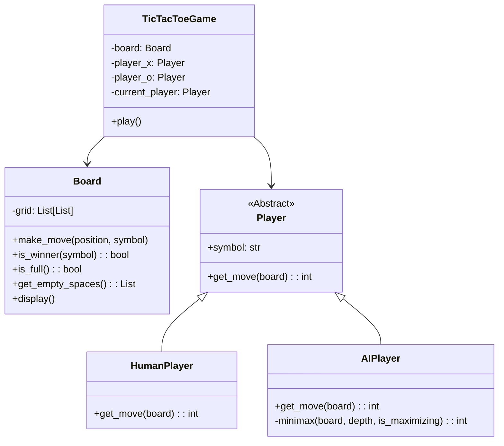

# Professional Tic-Tac-Toe with AI

## Problem Statement
Building a basic Tic-Tac-Toe game is a common beginner exercise. However, a simple procedural script with hardcoded `if` statements fails to teach professional software engineering standards. The problem lies in scaling: if asked to change the board size, add an unbeatable AI, or swap the terminal interface for a GUI, a basic script collapses. This project solves this by elevating a simple game into a production-grade application featuring rigorous Object-Oriented Design, state management, and the implementation of a complex Artificial Intelligence algorithm (Minimax).

## Learning Objectives
- **Object-Oriented Programming (OOP)**: Master the separation of concerns by decoupling the game logic (Model), user input/display (View), and game loop (Controller).
- **Artificial Intelligence**: Understand and implement the Minimax algorithm, a foundational concept in game theory and AI decision-making.
- **State Management**: Learn how to manage discrete application states (ongoing, player 1 win, draw) and validate transitions safely.
- **Defensive Programming**: Build unbreakable input validation mechanisms that gracefully handle incorrect, malformed, or malicious user input without crashing the application.
- **Extensibility**: Design abstract base classes and interfaces that allow swapping out human players for AI players seamlessly.

## Functional Requirements
- **Game Engine**: A robust 3x3 grid system that tracks empty spaces, validates legal moves, and efficiently calculates win or draw conditions.
- **Human Player Interface**: Command-line interface allowing a user to input their move coordinates, featuring extreme input validation (preventing letters, out-of-bounds numbers, or choosing occupied spaces).
- **Unbeatable AI Player**: An AI opponent powered by the Minimax algorithm that will never lose. It will always force a draw or win if the human makes a mistake.
- **Game Loop**: A central orchestrator that alternates turns, updates the board display, and ends the game with the appropriate victory or draw message.

## Suggested Architecture / Data Flow
The architecture relies on polymorphism. The game loop doesn't care if a player is human or AI; it simply calls `player.get_move()`.

## Step-by-Step Implementation Guide

### Step 1: The Board Model
- Create the `Board` class initialized with an empty list representing the 9 squares (or a 3x3 matrix).
- Write pure functions for the board: `available_moves()`, `make_move(square, letter)`, and `undo_move(square)` (crucial for the AI).
- Write an efficient `check_winner()` function that evaluates rows, columns, and diagonals.

### Step 2: The Player Base and Human Implementation
- Define an abstract `Player` class requiring a `get_move(board)` method.
- Implement `HumanPlayer`. Its `get_move()` must loop continuously, asking for `input()`, wrapping the conversion to an integer in a `try/except ValueError` block, and ensuring the chosen square is in `board.available_moves()`.

### Step 3: The Game Loop Orchestrator
- Create the `TicTacToeGame` class. It initializes a Board and two Players.
- The `play()` method consists of a `while not board.is_full() and not board.check_winner():` loop.
- Inside the loop, clear the terminal, display the board, request a move from the current player, apply it, and swap the current player.

### Step 4: The Minimax AI
- Implement the `AIPlayer`.
- The `minimax` function is recursive. It takes a simulated board state.
- **Base Case**: If the simulated board is a win for the AI, return `+1`. If a win for the Human, return `-1`. If a draw, return `0`.
- **Recursive Step**: Iterate through all available moves. Make the move. Recursively call `minimax()`. Undo the move.
- If it's the AI's turn (maximizing), it picks the highest score. If the Human's turn (minimizing), it assumes the human plays optimally and picks the lowest score.

## Expected Edge Cases & Challenges
- **Infinite Recursion in Minimax**: Forgetting to write a base case (checking for wins/draws) or forgetting to undo a move during the simulation loop will cause a recursion crash or corrupt the board state.
- **Input Validation**: Users will type "five", press Enter with no input, or type "99". `HumanPlayer` must trap all these inside a validation loop without crashing the game.
- **Performance**: Minimax evaluates hundreds of thousands of board states. While instant on a 3x3 board, understanding the sheer volume of calculations is a challenge.

## Testing Strategy
- **Board Logic Testing**: Write tests explicitly verifying horizontal, vertical, and diagonal win conditions. Test that `is_full()` returns True only when exactly 9 moves are made.
- **AI Verification**: Create a test where the board is set up so the human is one move away from winning. Assert that the AI *always* blocks the win. Set up a board where the AI is one move from winning and assert it takes the win.
- **Mocking Input**: Use Python's `unittest.mock.patch` to simulate a user typing bad inputs to ensure the `HumanPlayer` validation loop functions correctly and eventually accepts a good input.

## Extension Ideas
- **Dynamic Board Sizing (Connect 4)**: Expand the architecture to support an `N x N` board. Be warned: Minimax on a 4x4 board will be incredibly slow without optimization.
- **Alpha-Beta Pruning**: Optimize the Minimax algorithm by passing `alpha` and `beta` parameters to prune branches of the decision tree that are mathematically proven to be worse than a previously explored path, vastly speeding up the AI.
- **Graphical User Interface (GUI)**: Because the logic is decoupled, completely replace the terminal interaction by importing the backend into a PySide6, PyQt, or Tkinter graphical window.
- **Network Multiplayer**: Implement Python `sockets` to allow two players to connect over a LAN and play against each other, separating the application into Client and Server scripts.
