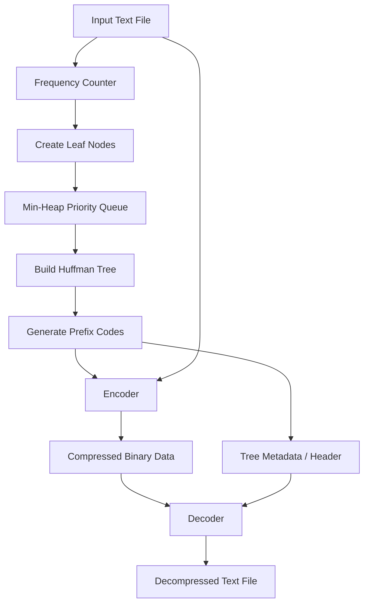

# Text Compression Algorithm (Huffman Coding)

## Problem Statement
In the digital age, data storage and transmission are continuous bottlenecks for large-scale systems. While standard character encodings like ASCII assign a fixed length (e.g., 8 bits) to every character, real-world text data exhibits significant variability in character frequencies. For instance, in English, vowels like 'e' and 'a' appear far more frequently than consonants like 'z' or 'q'. The problem is that fixed-length encoding is inherently inefficient, wasting considerable space by using the same number of bits for common and rare characters alike. 

This project tackles this inefficiency by implementing a lossless data compression algorithm using Huffman Coding. The goal is to develop a tool that analyzes an input text, generates an optimal variable-length prefix code based on character frequencies, and compresses the data by replacing fixed-length characters with their shorter binary representations. Furthermore, the algorithm must include a reliable decompression mechanism that precisely reconstructs the original text without any data loss.

## Learning Objectives
By completing this project, you will deeply understand and master:
- **Advanced Data Structures:** Gain hands-on experience using Priority Queues (Min-Heaps) to maintain dynamic sets of elements ordered by frequency.
- **Tree Traversals and Operations:** Understand how to dynamically build Binary Trees from bottom to top and traverse them (e.g., Depth-First Search) to generate prefix codes.
- **Prefix-Free Codes (Shannon-Fano & Huffman):** Learn the theoretical foundations of Information Theory, specifically why prefix-free codes are necessary for unambiguous decoding without delimiters.
- **Bitwise Operations & Binary I/O:** Learn how to manipulate bits in memory and read/write binary data files rather than raw text, reducing the actual footprint on disk.
- **Algorithm Complexity Analysis:** Analyze the Time and Space complexity of Huffman coding, particularly the $O(N \log N)$ tree construction phase.

## Functional Requirements
1. **Frequency Analysis Module:** The system must read input data (string or text file) and compute the exact frequency of every unique character.
2. **Huffman Tree Builder:** The system must use a Min-Heap to dynamically construct the optimal Huffman Tree based on the character frequencies.
3. **Prefix Code Generator:** The system must generate a mapping (dictionary) of characters to their respective binary string codes via tree traversal.
4. **Encoder:** The system must convert the original text into a compressed binary sequence using the generated prefix codes.
5. **Metadata Serializer:** The system must serialize and store the Huffman Tree (or frequency table) alongside the compressed data to ensure decompression is possible.
6. **Decoder:** The system must read the compressed binary sequence and the metadata, reconstruct the Huffman Tree, and perfectly decode the binary sequence back to the original text.

## Suggested Architecture / Data Flow



1. **Input Stage:** Raw text is provided to the system.
2. **Analysis Stage:** A frequency map is built.
3. **Tree Construction:** Leaf nodes are pushed into a Min-Heap. The two least frequent nodes are continually extracted, merged into an internal node, and pushed back until one root node remains.
4. **Encoding Stage:** The tree is traversed to create a code table. The original text is mapped to a bitstream.
5. **Storage/Transmission:** The bitstream and necessary tree metadata are saved/transmitted.
6. **Decoding Stage:** The metadata rebuilds the tree, and the bitstream is traversed bit-by-bit from the root to leaves to retrieve the original characters.

## Step-by-Step Implementation Guide

### Step 1: Character Frequency Analysis
Begin by writing a function that iterates through the input string and counts the occurrences of each character using a Hash Map (dictionary in Python).
```python
from collections import Counter

def get_frequencies(text):
    return Counter(text)
```

### Step 2: Define the Node Class
Create a class representing a node in the Huffman tree. It should hold the character, frequency, and references to left and right children. Furthermore, implement comparison operators (e.g., `__lt__`) so the Priority Queue can sort nodes by frequency.
```python
class Node:
    def __init__(self, char, freq):
        self.char = char
        self.freq = freq
        self.left = None
        self.right = None
        
    def __lt__(self, other):
        return self.freq < other.freq
```

### Step 3: Build the Huffman Tree using a Min-Heap
Use Python's `heapq` module. Push all leaf nodes into the heap. Loop while the heap has more than one node: pop the two smallest nodes, create a parent node with a combined frequency, and push it back.
```python
import heapq

def build_huffman_tree(frequencies):
    heap = [Node(char, freq) for char, freq in frequencies.items()]
    heapq.heapify(heap)
    
    while len(heap) > 1:
        left = heapq.heappop(heap)
        right = heapq.heappop(heap)
        
        merged = Node(None, left.freq + right.freq)
        merged.left = left
        merged.right = right
        
        heapq.heappush(heap, merged)
        
    return heap[0] if heap else None
```

### Step 4: Generate the Prefix Codes
Perform a Depth-First Search (DFS) on the tree. Append '0' when moving left and '1' when moving right. Store the results in a dictionary when a leaf node is reached.
```python
def generate_codes(node, current_code="", codes={}):
    if node is None:
        return
    
    if node.char is not None:
        codes[node.char] = current_code
        return
        
    generate_codes(node.left, current_code + "0", codes)
    generate_codes(node.right, current_code + "1", codes)
    return codes
```

### Step 5: Encode the Data
Iterate through the original text and replace each character with its corresponding prefix code.
```python
def encode_text(text, codes):
    return "".join(codes[char] for char in text)
```

### Step 6: Decode the Data
Iterate through the encoded bitstream. Start at the root of the tree. For each bit, move left if '0', right if '1'. If a leaf node is reached, append its character to the output and reset to the root.
```python
def decode_text(encoded_text, root):
    decoded = []
    current = root
    for bit in encoded_text:
        if bit == '0':
            current = current.left
        else:
            current = current.right
            
        if current.char is not None:
            decoded.append(current.char)
            current = root
            
    return "".join(decoded)
```

## Expected Edge Cases & Challenges
1. **Single Unique Character Input:** If the input text consists of only one repeating character (e.g., "aaaaa"), the tree will have only one node, and the standard traversal might assign an empty string or crash. *Solution:* Manually handle the single-character case by assigning a default code like '0'.
2. **Empty Input String:** The system should gracefully handle empty inputs without throwing exceptions.
3. **Padding for Binary I/O:** The encoded string is just a sequence of '0' and '1' characters. To save to disk, this must be converted into actual bytes. Since 8 bits make a byte, the encoded string length might not be a multiple of 8. *Challenge:* Implement bit-padding to complete the final byte and store the padding length in the metadata so the decoder knows where to stop.
4. **Metadata Overhead:** If the text is very short, the metadata (saving the frequency table or tree structure) might be larger than the compressed data itself, resulting in a larger file size. 

## Testing Strategy
1. **Unit Testing:** Write assertions to ensure that `decode(encode(text)) == text` holds true for various inputs.
2. **Boundary Testing:** Test with an empty string, a string with one character, and strings with extreme repetitive patterns.
3. **Randomized Stress Testing:** Generate massive random strings (e.g., 10MB of text) containing a mix of alphanumeric characters, symbols, and Unicode characters to ensure memory safety and performance.
4. **Compression Ratio Validation:** Verify that the output byte size (including metadata) is smaller than the input byte size for sufficiently large, natural-language files. Compare the ratio to generic tools like `gzip` in Python.

## Extension Ideas
1. **File I/O Integration:** Upgrade the script into a CLI tool that accepts a file path (e.g., `compressor.py -c input.txt output.bin`), handling bit manipulation using Python's `bitarray` or `struct` modules.
2. **Adaptive/Dynamic Huffman Coding:** Implement the Vitter algorithm or FGK algorithm where the tree updates dynamically on the fly as data is read, avoiding the need to pass the frequency table in the file header.
3. **LZ77/LZ78 Integration:** Create a fully functional "Deflate" clone by running an LZ77 dictionary compression pass before passing the results to the Huffman encoder, mimicking how ZIP and GZIP work in the real world.
4. **Visualizer:** Create a frontend using a library like `matplotlib`, `graphviz`, or a web framework to visually render the generated Huffman Tree and frequency distribution graph for educational purposes.
