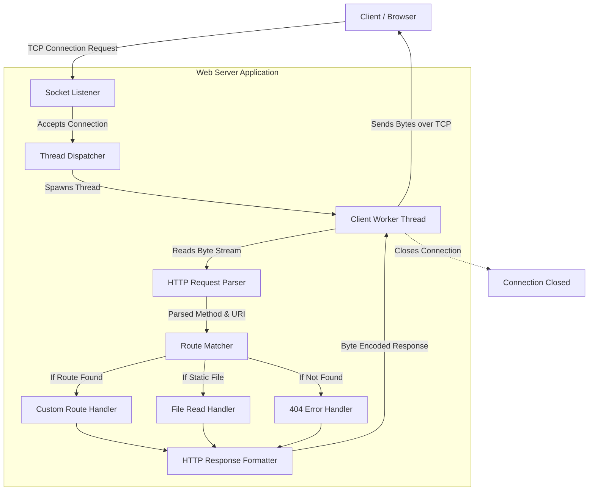

# Build Your Own HTTP Web Server from Scratch

## Problem Statement
Modern web frameworks such as Django, Flask, FastAPI, and Express abstract away the fundamental networking processes required to serve web content. While these tools drastically increase developer productivity, they often obscure how the internet actually works under the hood. As a result, developers may struggle to diagnose network bottlenecks, handle custom communication protocols, or understand critical vulnerabilities like HTTP Header Injection or Slowloris attacks. 

The objective of this project is to demystify the magic of backend web development by building a low-level, multithreaded HTTP server from scratch using raw TCP sockets in Python. Instead of relying on a pre-built web framework, we will intercept raw byte streams, manually parse the HTTP request components according to the RFC specifications, map the extracted routing data, and formulate strict HTTP-compliant byte responses to send back to clients.

## Learning Objectives
By completing this project, you will achieve the following:
- **Network Socket Programming:** Understand how to utilize the `socket` API to bind to IP addresses and ports, listen for connections, and transmit byte streams over TCP/IP.
- **HTTP Protocol Deep-Dive:** Learn the exact structure of HTTP/1.1 Requests and Responses, including the Request Line, Status Line, HTTP Headers, CRLF (`\r\n`) line endings, and message bodies.
- **Concurrency & Multithreading:** Implement the `threading` module to spawn separate threads for each incoming client connection, effectively bypassing blocking I/O and increasing throughput.
- **Parsing Algorithms:** Write custom string and byte manipulation logic to safely parse structured raw text into usable Python objects.
- **Systems Architecture:** Understand the foundational mechanics used by industry-standard tools like Nginx, Apache, and Gunicorn to handle routing, file serving, and connection lifecycle management.

## Functional Requirements
1. **TCP Connection Handling:** The server must establish a listening TCP socket on a specified host (e.g., `127.0.0.1`) and port (e.g., `8080`).
2. **Concurrent Client Support:** The server must support multiple simultaneous client connections without hanging or blocking.
3. **HTTP Parsing:** The system must accurately parse raw incoming byte data into an `HTTPRequest` object, containing the Method (e.g., GET), URI (e.g., `/about`), HTTP Version, and a dictionary of Headers.
4. **Request Routing:** The server must match parsed URIs against a set of registered endpoints and execute the corresponding handler function.
5. **Static File Serving:** The server must be capable of reading files from the disk (e.g., `.html`, `.css`, `.json`) and returning their contents.
6. **Response Generation:** The server must formulate a structurally valid HTTP Response string, including standard Status Codes (e.g., `200 OK`, `404 Not Found`), `Content-Type` headers, `Content-Length`, and the response payload.
7. **Error Handling:** The server must safely catch malformed requests, unsupported methods, or missing routes, gracefully returning `400 Bad Request` or `404 Not Found` responses.

## Suggested Architecture / Data Flow



## Step-by-Step Implementation Guide

### Step 1: Socket Setup and Connection Loop
First, initialize a raw TCP socket and bind it to a local address. We use a continuous `while True:` loop to keep the server running indefinitely, accepting incoming connections.

```python
import socket
import threading

HOST = '127.0.0.1'
PORT = 8080

def start_server():
    server_socket = socket.socket(socket.AF_INET, socket.SOCK_STREAM)
    server_socket.setsockopt(socket.SOL_SOCKET, socket.SO_REUSEADDR, 1)
    server_socket.bind((HOST, PORT))
    server_socket.listen(5)
    print(f"Listening on http://{HOST}:{PORT}")

    while True:
        client_conn, client_addr = server_socket.accept()
        # Offload handling to a new thread
        client_thread = threading.Thread(target=handle_client, args=(client_conn, client_addr))
        client_thread.start()
```

### Step 2: Reading and Parsing the HTTP Request
Once a thread is spun up, it must read the raw data from the client connection. Remember that HTTP headers are separated by `\r\n` (CRLF), and the header section is separated from the body by a double CRLF (`\r\n\r\n`).

```python
def handle_client(conn, addr):
    try:
        # Read raw data (for simplicity, assuming request is < 1024 bytes)
        raw_request = conn.recv(1024).decode('utf-8')
        if not raw_request:
            return

        # Split request line and headers
        lines = raw_request.split('\r\n')
        request_line = lines[0]
        method, uri, http_version = request_line.split(' ')

        headers = {}
        for line in lines[1:]:
            if line == '':
                break
            key, value = line.split(': ', 1)
            headers[key] = value

        # Pass parsed data to the router
        response = route_request(method, uri)
        
        # Send back to client
        conn.sendall(response.encode('utf-8'))
    finally:
        conn.close()
```

### Step 3: Routing the Request
The router determines what data to send back based on the requested `URI`.

```python
def route_request(method, uri):
    if method == "GET" and uri == "/":
        return build_response(200, "OK", "<h1>Welcome to my Python Web Server!</h1>", "text/html")
    elif method == "GET" and uri == "/api/data":
        return build_response(200, "OK", '{"status": "success", "message": "Data loaded."}', "application/json")
    else:
        return build_response(404, "Not Found", "<h1>404: Page Not Found</h1>", "text/html")
```

### Step 4: Formulating the HTTP Response
The HTTP specification dictates a very strict format for responses. If the format is wrong, the browser will refuse to load the page.

```python
def build_response(status_code, status_text, body, content_type):
    # Standard HTTP/1.1 Response line
    response_line = f"HTTP/1.1 {status_code} {status_text}\r\n"
    
    # Headers
    headers = f"Content-Type: {content_type}\r\n"
    headers += f"Content-Length: {len(body)}\r\n"
    headers += "Connection: close\r\n"
    
    # The blank line is mandatory to separate headers from the body
    blank_line = "\r\n"
    
    return response_line + headers + blank_line + body
```

## Expected Edge Cases & Challenges
- **Large Payloads & Chunking:** `conn.recv(1024)` assumes the request is small. Real servers continuously read chunks from the socket buffer until they reach `\r\n\r\n`, and then read the body based on the `Content-Length` header.
- **Port Conflicts:** If your server crashes unexpectedly without closing the socket, the OS may keep the port reserved. Using `socket.SO_REUSEADDR` helps mitigate the "Address already in use" error.
- **Malicious/Malformed Requests:** Attackers may send incomplete packets or non-HTTP protocols to your port. The parser must wrap reading logic in `try-except` blocks to prevent the server thread from throwing unhandled exceptions.
- **The Python GIL:** Due to the Global Interpreter Lock in Python, pure threading only yields concurrency, not true parallelism for CPU-bound tasks. For heavy IO (like networking), threading works brilliantly, but heavy computations would require `multiprocessing`.
- **Binary Data:** Serving images (`.jpg`, `.png`) requires reading files in binary mode (`'rb'`) and formatting the HTTP body in raw bytes rather than `utf-8` encoded strings.

## Testing Strategy
To ensure your Web Server is robust and compliant, employ the following testing phases:
1. **Manual Browser Testing:** Open `http://localhost:8080` in Chrome/Firefox. Inspect the Network Tab to verify that Status Codes, `Content-Type`, and `Content-Length` headers are correctly interpreted by the browser.
2. **cURL CLI Testing:** Use raw network tools to verify payload exactness.
   - `curl -i http://localhost:8080/` to view raw response headers.
   - `curl -X POST -d "param=value" http://localhost:8080/` to test handling of unallowed or newly-implemented methods.
3. **Automated Unit Testing:** Write Python `unittest` or `pytest` scripts targeting the `parse_request()` and `build_response()` functions to ensure string manipulation handles edge cases (like trailing slashes or empty headers).
4. **Load & Stress Testing:** Run tools like `wrk` or Apache Benchmark (`ab`) to throw 10,000+ requests at your server to ensure your Multithreading implementation holds up without causing socket exhaustion.
   - Example: `ab -n 1000 -c 50 http://127.0.0.1:8080/`

## Extension Ideas
Once the core TCP server is operational, try extending its capabilities to match production web servers:
- **Implement a Router Class:** Refactor the hardcoded `if/else` statements into a Flask-like `@app.route('/path')` decorator system.
- **Add POST Support:** Modify the request parser to read the body payload based on the `Content-Length` header and parse JSON or URL-encoded form data.
- **Static File Serving:** Write a specialized handler that reads the requested `URI`, checks if the file exists in a `/public` or `/static` folder, and returns the file bytes with the dynamically mapped Mime/Content-Type (e.g., mapping `.css` to `text/css`).
- **Connection Keep-Alive:** Instead of terminating the socket immediately after one request, parse the `Connection: keep-alive` header and enter a loop to reuse the same TCP connection for subsequent HTTP requests.
- **Thread Pooling:** Replace manual `threading.Thread` spawning with Python's `concurrent.futures.ThreadPoolExecutor` to cap the maximum number of threads (e.g., 100) to prevent OS resource exhaustion under heavy load.
