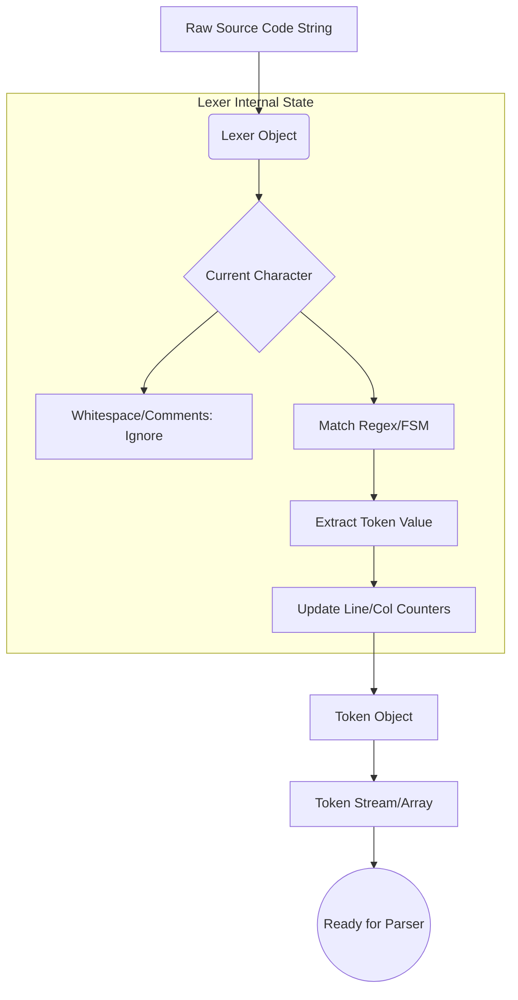

# Compiler Lexer

## Problem Statement

When building compilers, interpreters, syntax highlighters, or even complex data parsers (like JSON or YAML), the software must process raw source code. To a computer, source code is merely an unstructured sequence of characters. Attempting to deduce the syntactic and semantic structure directly from an array of characters is incredibly complex and inefficient. 

The **Lexical Analyzer** (or **Lexer** / **Tokenizer**) solves this fundamental problem. It acts as the first phase of the compilation pipeline, translating the raw character stream into a sequence of meaningful semantic units called **Tokens**. By abstracting away whitespace, comments, and character-level operations, the lexer significantly simplifies the task of the subsequent parsing phase. The challenge lies in efficiently and accurately grouping these characters—handling keywords versus arbitrary identifiers, managing "maximal munch" (e.g., distinguishing `=` from `==`), tracking line and column numbers for error reporting, and failing gracefully upon encountering invalid characters.

## Learning Objectives

By completing this project, you will achieve the following core competencies:

1. **Fundamental Compiler Theory**: Understand the multi-stage architecture of modern compilers and interpreters, focusing specifically on lexical analysis.
2. **Automata Theory in Practice**: Apply Finite State Machines (FSM) and Regular Expressions (Regex) concepts to categorize string inputs.
3. **Advanced String Manipulation**: Master text traversal, index tracking, and lookahead techniques without relying on inefficient string copying or splitting.
4. **Data Modeling**: Design robust data structures (using classes or Dataclasses) to represent tokens with associated metadata (type, value, line, column).
5. **Robust Error Handling**: Implement graceful degradation and precise error reporting mechanisms for invalid syntax.
6. **Performance Optimization**: Learn how to write high-performance tokenization loops that avoid common pitfalls like Regular Expression Denial of Service (ReDoS) or excessive memory allocation.

## Functional Requirements

The lexer must satisfy the following strict requirements:

1. **Token Identification**: Successfully identify and categorize the following token families:
   - **Keywords**: `if`, `else`, `while`, `return`, `def`, `true`, `false`
   - **Identifiers**: Variable and function names (e.g., `my_var_1`)
   - **Literals**: Integers (e.g., `42`), Floats (e.g., `3.14`), and Strings (e.g., `"hello world"`)
   - **Operators**: `+`, `-`, `*`, `/`, `=`, `==`, `<`, `>`, `<=`, `>=`
   - **Punctuation**: `(`, `)`, `{`, `}`, `[`, `]`, `,`, `;`, `:`
2. **Whitespace & Comment Handling**: Ignore all standard whitespace (spaces, tabs) unless part of a string literal. Completely ignore single-line comments (starting with `#` or `//`).
3. **Positional Tracking**: Every generated token must contain its exact `line` and `column` number.
4. **Maximal Munch Rule**: The lexer must always match the longest possible token. For example, `<= ` must be tokenized as a single `LESS_THAN_OR_EQUAL` token, not `LESS_THAN` followed by `ASSIGN`.
5. **Error Reporting**: If an unrecognized character is encountered, the lexer must raise a descriptive `LexerError` detailing the invalid character and its exact line and column location.
6. **End of File (EOF)**: The lexer must produce a final `EOF` token to signal the end of the input stream.

## Suggested Architecture / Data Flow

The architecture follows a pipeline design where the `Lexer` object maintains internal state as it processes the `Source Code`.



### Core Components:

1. **`TokenType` (Enum)**: Enumerates all possible token classifications (e.g., `NUMBER`, `IDENTIFIER`, `PLUS`, `EOF`).
2. **`Token` (Data Class)**: Represents an individual token. Fields: `type`, `value`, `line`, `column`.
3. **`LexerError` (Exception)**: Custom exception class for invalid characters.
4. **`Lexer` (Main Class)**: 
   - State variables: `text` (source code), `pos` (current index), `current_char`, `line`, `column`.
   - Methods: `advance()`, `peek()`, `skip_whitespace()`, `get_next_token()`, `tokenize()`.

## Step-by-Step Implementation Guide

### Step 1: Define the Token Specifications
Begin by defining an enumeration for your token types and a class to represent the tokens.

```python
from enum import Enum, auto
from dataclasses import dataclass

class TokenType(Enum):
    # Literals & Identifiers
    INTEGER = auto()
    FLOAT = auto()
    STRING = auto()
    IDENTIFIER = auto()
    
    # Keywords
    IF = auto()
    ELSE = auto()
    WHILE = auto()
    
    # Operators
    PLUS = auto()
    MINUS = auto()
    ASSIGN = auto()
    EQ = auto() # ==
    
    # Structural
    LPAREN = auto()
    RPAREN = auto()
    EOF = auto()
    # Add other types as per requirements...

@dataclass
class Token:
    type: TokenType
    value: str
    line: int
    column: int
```

### Step 2: Initialize the Lexer
Create the Lexer class to hold the source code and tracking pointers.

```python
class Lexer:
    def __init__(self, text: str):
        self.text = text
        self.pos = 0
        self.line = 1
        self.column = 1
        self.current_char = self.text[self.pos] if len(self.text) > 0 else None

    def advance(self):
        """Advance the position pointer and update line/column counters."""
        if self.current_char == '\n':
            self.line += 1
            self.column = 0
            
        self.pos += 1
        self.column += 1
        
        if self.pos >= len(self.text):
            self.current_char = None  # Indicates EOF
        else:
            self.current_char = self.text[self.pos]
            
    def peek(self) -> str:
        """Look ahead one character without consuming it."""
        peek_pos = self.pos + 1
        if peek_pos >= len(self.text):
            return None
        return self.text[peek_pos]
```

### Step 3: Implement Token Consumers
Write helper methods to consume specific types of tokens, utilizing the `advance()` method.

```python
    def skip_whitespace(self):
        while self.current_char is not None and self.current_char.isspace():
            self.advance()

    def number(self) -> Token:
        """Consume characters to build an INTEGER or FLOAT token."""
        start_col = self.column
        result = ''
        is_float = False
        
        while self.current_char is not None and (self.current_char.isdigit() or self.current_char == '.'):
            if self.current_char == '.':
                if is_float:
                    break # Two dots = invalid or end of number
                is_float = True
            result += self.current_char
            self.advance()
            
        token_type = TokenType.FLOAT if is_float else TokenType.INTEGER
        return Token(token_type, result, self.line, start_col)
```

### Step 4: The Main Lexical Loop
The core of the lexer is the `get_next_token()` method, which orchestrates the consuming methods.

```python
    def get_next_token(self) -> Token:
        while self.current_char is not None:
            if self.current_char.isspace():
                self.skip_whitespace()
                continue
                
            if self.current_char.isalpha() or self.current_char == '_':
                return self.identifier_or_keyword()
                
            if self.current_char.isdigit():
                return self.number()
                
            # Handle Maximal Munch for Operators
            if self.current_char == '=':
                start_col = self.column
                if self.peek() == '=':
                    self.advance()
                    self.advance()
                    return Token(TokenType.EQ, "==", self.line, start_col)
                else:
                    self.advance()
                    return Token(TokenType.ASSIGN, "=", self.line, start_col)
            
            # Unrecognized Character
            raise Exception(f"Lexical Error at line {self.line}, col {self.column}: '{self.current_char}'")
            
        return Token(TokenType.EOF, "", self.line, self.column)
        
    def tokenize(self) -> list[Token]:
        tokens = []
        while True:
            tok = self.get_next_token()
            tokens.append(tok)
            if tok.type == TokenType.EOF:
                break
        return tokens
```

## Expected Edge Cases & Challenges

- **Maximal Munch Violations**: When parsing `>`, `<`, `=`, you must always check the *next* character using `peek()` before concluding it's a single-character operator, to avoid missing `>=` or `==`.
- **String Escaping**: Parsing `"Hello \"World\""` requires careful state management. The lexer must ignore the literal quote ending if it is immediately preceded by an escape character `\`.
- **Dangling Decimals**: Numbers like `10.` or `.5` require special handling depending on your language rules. Will `.5` be interpreted as a float `0.5`, or as a dot operator followed by an integer `5`?
- **Unterminated Constructs**: A string that opens with `"` but reaches the `EOF` without closing must throw a specific, descriptive error (e.g., `Unterminated string literal on line X`).

## Testing Strategy

To ensure your lexer is robust, use parameterized unit testing with `pytest`. 

1. **Basic Tokens**: Test individual operators, integers, and keywords in isolation.
2. **Combined Logic**: Test realistic snippets like `x = 10 + 5.5;`.
3. **Position Tracking Validation**: Assure that line numbers increment correctly across multiple `\n` characters and column numbers reset.
4. **Error Handling Tests**: Intentionally pass invalid characters (like `@` or `$`) and assert that a `LexerError` is raised with the correct line and column properties.

```python
def test_lexer_assignment():
    lexer = Lexer("val = 42")
    tokens = lexer.tokenize()
    assert tokens[0].type == TokenType.IDENTIFIER
    assert tokens[0].value == "val"
    assert tokens[1].type == TokenType.ASSIGN
    assert tokens[2].type == TokenType.INTEGER
    assert tokens[2].value == "42"
```

## Extension Ideas

Once the base lexer is operational, consider adding these advanced features:

1. **Regex-Based Lexer Framework**: Refactor the lexer to use a list of compiled Regular Expressions (`re` module). Instead of manually advancing characters, match regex patterns at the current string index. This introduces you to standard production lexer design.
2. **String Interpolation**: Add support for Python-style f-strings or JavaScript-style template literals (e.g., `f"Hello {name}"`). This requires recursive lexing or state stacking.
3. **Multi-line Comments**: Implement support for block comments (e.g., `/* ... */`) that span multiple lines, ensuring line counts continue to update correctly within the block.
4. **REPL Implementation**: Build a small Read-Eval-Print Loop terminal interface that takes user input continuously and outputs the generated tokens visually in the console.
