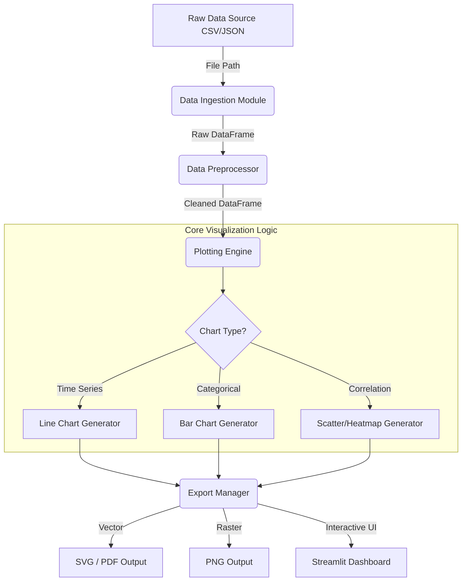

# Interactive Data Visualization Tool

## Problem Statement
In the modern digital era, organizations and individuals generate immense volumes of raw data, typically stored in tabular formats like CSV, JSON, or SQL databases. While data is abundant, insights are not. Raw numbers and dense spreadsheets are notoriously difficult for the human brain to process, making it challenging to spot trends, outliers, or seasonal patterns. 
A Data Visualization Tool addresses this bottleneck by transforming raw datasets into intuitive, visual representations. The problem this project solves is the repetitive, boilerplate-heavy process of manually loading data, cleaning it, and writing complex plotting code for every new dataset. We need an automated, reusable, and extensible Python-based tool that can seamlessly ingest data, handle basic preprocessing, generate a variety of statistical charts (both static and interactive), and export the results for reporting or web integration.

## Learning Objectives
By completing this project, you will gain deep, practical knowledge in the following areas:
- **Data Wrangling & Preprocessing:** Mastering `pandas` to ingest datasets, handle missing values (NaN), filter outliers, and perform group-by aggregations.
- **Object-Oriented Plotting:** Understanding the difference between Matplotlib's state-machine interface (`plt.plot()`) and its professional object-oriented API (`fig, ax = plt.subplots()`).
- **Statistical Visualization:** Utilizing `seaborn` for high-level statistical graphics like correlation heatmaps, violin plots, and pair plots.
- **Interactive Dashboards (Optional but Recommended):** Transitioning from static rendering to interactive web applications using tools like `Streamlit`, `Dash`, or `Plotly`.
- **Memory Management & Performance:** Learning how to prevent memory leaks by properly closing figure objects (`plt.close(fig)`) and optimizing rendering for large datasets.
- **Software Architecture:** Designing a modular pipeline where data ingestion, processing, visualization, and exporting are decoupled into distinct Python classes.

## Functional Requirements
The Data Visualization Tool must satisfy the following core requirements:
1. **Data Ingestion Module:**
   - Support loading data from standard `.csv` and `.json` files.
   - Automatically detect and parse date/datetime columns.
2. **Data Cleaning Pipeline:**
   - Provide an option to drop columns with more than a specified threshold of missing data (e.g., >50%).
   - Fill or drop NaN values in critical numeric columns.
3. **Core Plotting Engine:**
   - Support at least four fundamental chart types: Line Chart (trends), Bar Chart (categorical comparisons), Scatter Plot (correlations), and Heatmap (data density/correlation).
   - Automatically apply colorblind-friendly palettes (e.g., `viridis`).
4. **Export & Reporting:**
   - Save generated plots to disk in both raster (`.png`, `.jpg`) and vector (`.svg`, `.pdf`) formats.
5. **User Interface:**
   - Offer a Command Line Interface (CLI) leveraging `argparse` for automated batch processing, OR an interactive web UI using `Streamlit`.

## Suggested Architecture / Data Flow

The system should be designed with modularity in mind. Instead of a single monolithic script, separate the responsibilities into distinct modules.



### Component Breakdown
- **Data Ingestion Module:** Uses `pandas.read_csv()` or `pandas.read_json()`. Wraps this in a `try-except` block to handle file-not-found or parsing errors gracefully.
- **Data Preprocessor:** Contains methods like `drop_high_nan_columns()` and `parse_dates()`. 
- **Plotting Engine:** A class containing methods like `generate_bar_chart(df, x_col, y_col)`. This module uses Matplotlib's Object-Oriented API exclusively to ensure thread safety and prevent global state pollution.
- **Export Manager:** Responsible for calling `fig.savefig()` with appropriate DPI and bbox settings, and crucially, calling `plt.close(fig)` to free memory.

## Step-by-Step Implementation Guide

### Phase 1: Environment Setup
Start by creating a virtual environment and installing the required libraries.
```bash
python -m venv venv
source venv/bin/activate  # On Windows use `venv\Scripts\activate`
pip install pandas matplotlib seaborn streamlit argparse
```

### Phase 2: Data Ingestion & Preprocessing (`data_handler.py`)
Create a robust data loader that validates the incoming data.
```python
import pandas as pd
import logging

class DataHandler:
    def __init__(self, filepath):
        self.filepath = filepath
        self.df = None

    def load_data(self):
        try:
            if self.filepath.endswith('.csv'):
                self.df = pd.read_csv(self.filepath)
            elif self.filepath.endswith('.json'):
                self.df = pd.read_json(self.filepath)
            else:
                raise ValueError("Unsupported file format. Please provide CSV or JSON.")
            logging.info(f"Data loaded successfully: {self.df.shape[0]} rows.")
        except Exception as e:
            logging.error(f"Error loading data: {e}")
            raise

    def clean_data(self, missing_threshold=0.5):
        if self.df is None:
            raise ValueError("Data not loaded yet.")
        # Drop columns with too many missing values
        thresh = int((1 - missing_threshold) * len(self.df))
        self.df = self.df.dropna(axis=1, thresh=thresh)
        # Drop rows where critical data is NaN (example logic)
        self.df = self.df.dropna()
        return self.df
```

### Phase 3: Object-Oriented Plotting Engine (`plotter.py`)
Implement the visualization logic using `fig, ax`.
```python
import matplotlib.pyplot as plt
import seaborn as sns

class Plotter:
    def __init__(self, style="whitegrid", palette="viridis"):
        sns.set_style(style)
        sns.set_palette(palette)

    def plot_bar(self, df, x_col, y_col, output_path, title="Bar Chart"):
        fig, ax = plt.subplots(figsize=(10, 6))
        sns.barplot(data=df, x=x_col, y=y_col, ax=ax)
        
        ax.set_title(title, fontsize=16, fontweight='bold')
        ax.set_xlabel(x_col, fontsize=12)
        ax.set_ylabel(y_col, fontsize=12)
        plt.xticks(rotation=45, ha='right')
        
        # Save and close to prevent memory leaks
        fig.tight_layout()
        fig.savefig(output_path, dpi=300, bbox_inches='tight')
        plt.close(fig)
```

### Phase 4: User Interface (Streamlit)
To make this highly interactive, wrap your logic in a Streamlit app (`app.py`).
```python
import streamlit as st
from data_handler import DataHandler
from plotter import Plotter

st.title("Interactive Data Visualization Tool")

uploaded_file = st.file_uploader("Upload a CSV file", type="csv")
if uploaded_file is not None:
    # Read data directly from uploaded file buffer
    import pandas as pd
    df = pd.read_csv(uploaded_file)
    st.write("Data Preview:", df.head())
    
    columns = df.columns.tolist()
    x_axis = st.selectbox("Select X-axis", columns)
    y_axis = st.selectbox("Select Y-axis", columns)
    
    if st.button("Generate Chart"):
        # We can dynamically generate a matplotlib fig and pass it to st.pyplot()
        import matplotlib.pyplot as plt
        import seaborn as sns
        fig, ax = plt.subplots()
        sns.barplot(data=df, x=x_axis, y=y_axis, ax=ax)
        plt.xticks(rotation=45)
        st.pyplot(fig)
```

## Expected Edge Cases & Challenges

1. **Memory Leaks in Background Processes:**
   - *Challenge:* If running as a batch processing script that loops over hundreds of datasets, generating plots can consume all system RAM. Matplotlib retains figures in memory until explicitly closed.
   - *Solution:* Always use `fig, ax = plt.subplots()` and ensure `plt.close(fig)` is called at the end of the plotting function.

2. **Categorical X-Axis Crowding:**
   - *Challenge:* Plotting a bar chart with 100 unique categories makes the X-axis labels unreadable (the "black smudge" effect).
   - *Solution:* Implement logic to rotate labels (`plt.xticks(rotation=45)`), or aggregate/filter the top N categories before plotting.

3. **Data Type Mismatches:**
   - *Challenge:* A numeric column might contain strings like `"1,000"` or `"$50"`, which `pandas` loads as `object` rather than `float`. Plotting this will fail or yield bizarre results.
   - *Solution:* In the Data Preprocessor, implement regex-based string cleaning and explicit `.astype(float)` casting for suspected numeric columns.

4. **Security Vulnerabilities (Path Traversal):**
   - *Challenge:* If taking command-line arguments for output paths, a malicious user could pass `../../etc/passwd` to overwrite system files.
   - *Solution:* Sanitize output paths using `os.path.basename()` or restrict saving to a dedicated `./outputs` directory.

## Testing Strategy

To ensure enterprise-grade reliability, implement a test suite using `pytest`.

- **Unit Testing Preprocessing:** Create a mock DataFrame with known NaN distributions. Pass it through the `DataHandler.clean_data()` method and assert that columns exceeding the threshold are correctly removed.
- **Memory Testing:** Write a loop that generates 1,000 charts using the `Plotter` class. Monitor the process memory usage using the `memory_profiler` library to ensure `plt.close(fig)` is functioning correctly and memory remains stable.
- **File I/O Mocking:** When testing the `save_plot` functionality, use `unittest.mock.patch` to intercept the `fig.savefig` call so you don't clutter the test environment disk with hundreds of test images.

## Extension Ideas

Once the core tool is operational, consider these massive enhancements:
- **Interactive Dashboards with Plotly:** Replace Matplotlib with Plotly (`plotly.express`) to allow end-users to hover over data points, zoom into time series, and pan across charts directly in the browser.
- **Automated Exploratory Data Analysis (EDA):** Implement a "one-click report" feature that automatically iterates through all columns, detecting their types (categorical vs. continuous) and generating a comprehensive PDF report containing histograms and correlation matrices for everything.
- **Out-of-Core Processing with Dask:** If standard Pandas fails on 10GB+ CSV files, integrate `Dask DataFrames` to process data in chunks (out-of-core computation), feeding aggregated results into the plotting engine.
- **Database Integration:** Add a SQLAlchemy connector to query data directly from PostgreSQL or MySQL, bypassing static CSV files entirely.
