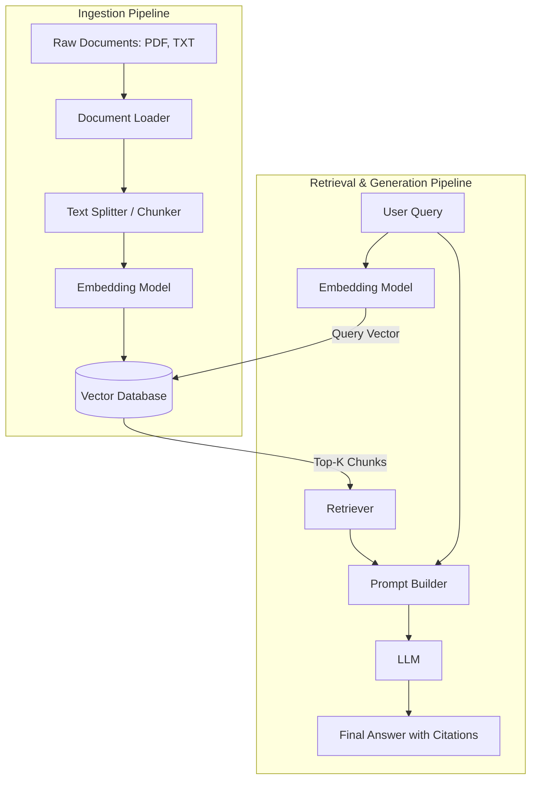

# Retrieval-Augmented Generation (RAG) System

## Problem Statement
Large Language Models (LLMs) like GPT-4 and Claude are highly capable but suffer from two major limitations: hallucination (making up facts) and knowledge cutoffs (lacking access to recent or private, domain-specific data). Fine-tuning an LLM to inject new knowledge is computationally expensive, slow, and requires massive amounts of curated data. The problem is: how can we allow an LLM to dynamically answer questions based on private, real-time, or domain-specific documents without the cost and complexity of retraining the model? 

## Learning Objectives
By completing this project, you will:
- Understand the core principles of vector representations and embeddings.
- Learn how to chunk large documents for optimal semantic retrieval.
- Gain hands-on experience with Vector Databases (e.g., FAISS, Chroma) for fast similarity searches.
- Master the design of a full RAG pipeline: Ingestion, Retrieval, and Generation.
- Develop skills in prompt engineering to force an LLM to rely strictly on retrieved context.
- Learn to evaluate the relevance of retrieved chunks and the accuracy of the generated answers.

## Functional Requirements
1. **Document Ingestion:** The system must accept raw text, PDF, and Markdown files as input.
2. **Text Chunking:** The system must split long documents into overlapping segments of a specified token length to maintain context.
3. **Embedding Generation:** The system must convert text chunks into dense high-dimensional vectors using an embedding model (e.g., OpenAI `text-embedding-ada-002` or HuggingFace `all-MiniLM-L6-v2`).
4. **Vector Storage:** The system must store and index embeddings in a scalable vector database.
5. **Similarity Search:** The system must retrieve the top-K most semantically similar chunks for any given user query.
6. **Contextual Generation:** The system must construct a prompt that includes the retrieved chunks and the user's query, and then call an LLM to generate a factual response based *only* on that context.
7. **Source Attribution:** The system should return the source documents and page numbers used to generate the answer.

## Suggested Architecture / Data Flow



## Step-by-Step Implementation Guide

### Step 1: Set Up the Environment
Install required libraries: `langchain`, `faiss-cpu`, `sentence-transformers`, `openai`, `PyPDF2`, `tiktoken`.
```bash
pip install langchain faiss-cpu sentence-transformers openai PyPDF2 tiktoken
```

### Step 2: Document Ingestion and Chunking
Create an `ingest.py` script. Use a library like `PyPDF2` to read PDFs. Use LangChain's `RecursiveCharacterTextSplitter` to chunk the text.
```python
from langchain.text_splitter import RecursiveCharacterTextSplitter

text_splitter = RecursiveCharacterTextSplitter(
    chunk_size=1000,
    chunk_overlap=200,
    length_function=len
)
chunks = text_splitter.split_text(raw_text)
```

### Step 3: Generating Embeddings and Storing
Use an embedding model to convert the chunks into vectors. Store them in FAISS.
```python
from langchain.embeddings import HuggingFaceEmbeddings
from langchain.vectorstores import FAISS

embeddings = HuggingFaceEmbeddings(model_name="all-MiniLM-L6-v2")
vectorstore = FAISS.from_texts(chunks, embeddings)
vectorstore.save_local("faiss_index")
```

### Step 4: The Retrieval System
Load the FAISS index and create a retriever function that takes a query and returns the closest chunks.
```python
vectorstore = FAISS.load_local("faiss_index", embeddings)
retriever = vectorstore.as_retriever(search_kwargs={"k": 4})
docs = retriever.get_relevant_documents("What is the company policy on remote work?")
```

### Step 5: The Generation System
Build the prompt and call the LLM.
```python
from langchain.chat_models import ChatOpenAI
from langchain.prompts import PromptTemplate
from langchain.chains import RetrievalQA

llm = ChatOpenAI(model_name="gpt-3.5-turbo", temperature=0)
qa_chain = RetrievalQA.from_chain_type(
    llm=llm,
    chain_type="stuff",
    retriever=retriever
)
answer = qa_chain.run("What is the company policy on remote work?")
print(answer)
```

## Expected Edge Cases & Challenges
- **Lost in the Middle:** LLMs often ignore information situated in the middle of long prompts. Ensure your chunks are concise and ordered by relevance.
- **Stale Data:** If source documents are updated or deleted, the vector database must be synchronized. This requires implementing CRUD operations on the vector store.
- **Bad Chunking Boundaries:** If a chunk splits a crucial sentence in half, the meaning is lost. Overlapping chunks (`chunk_overlap`) mitigates this but increases storage costs.
- **Hallucinations despite Context:** The LLM might still use its internal knowledge if the provided context doesn't explicitly answer the question. Your system prompt must heavily penalize answering outside the context.

## Testing Strategy
- **Unit Testing:** Write tests for the `TextSplitter` to ensure chunks never exceed the specified size.
- **Retrieval Evaluation:** Create a dataset of 50 questions and their known correct source chunks. Measure the **Recall@K** (does the correct chunk appear in the top K results?).
- **Generation Evaluation:** Use a larger LLM (like GPT-4) as an evaluator to score the final answers on metrics like **Faithfulness** (is the answer derived from the context?) and **Answer Relevance** (does it answer the specific question asked?).

## Extension Ideas
1. **Conversational RAG:** Add memory so the user can ask follow-up questions ("Can you explain paragraph 3 of that policy?").
2. **Hybrid Search:** Combine dense vector search with sparse keyword search (BM25) to improve retrieval of specific terms and acronyms.
3. **Multi-Modal RAG:** Extend the system to extract and embed images/graphs from PDFs alongside text.
