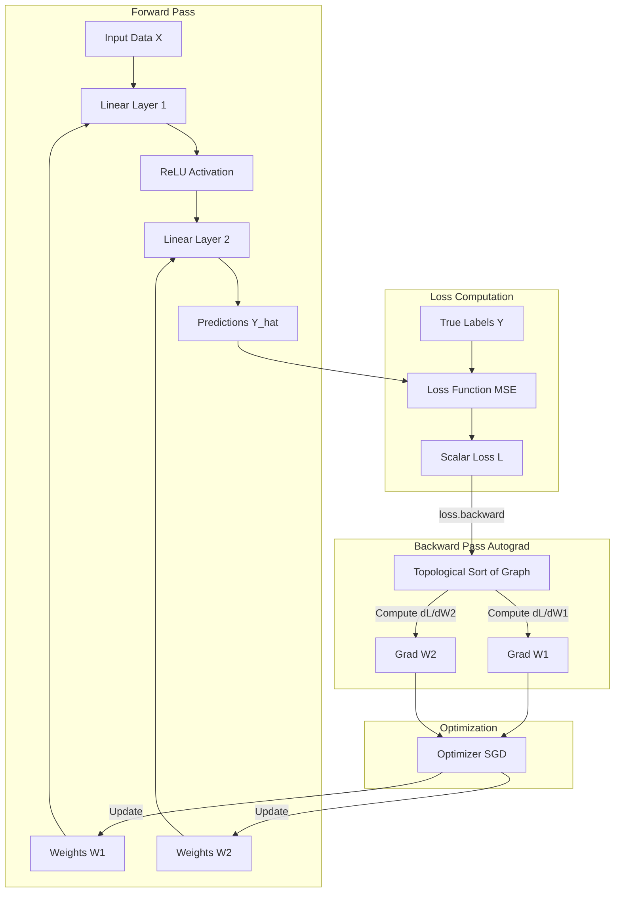

# Custom Machine Learning Framework

## Problem Statement
Modern Machine Learning and Deep Learning frameworks like PyTorch, TensorFlow, and Scikit-Learn provide incredible abstractions that allow engineers to build powerful models in just a few lines of code. However, these high-level APIs abstract away the underlying mathematical reality: backpropagation, the chain rule, gradient descent, and tensor operations. This black-box approach limits an engineer's ability to debug complex architectural issues, optimize memory usage, or develop novel, non-standard neural architectures. The problem is: how can developers deeply internalize the foundational mechanics of deep learning and automatic differentiation?

## Learning Objectives
By completing this project, you will:
- Implement a functioning Automatic Differentiation (Autograd) engine from scratch.
- Understand how computation graphs (Directed Acyclic Graphs) track mathematical operations.
- Manually implement the forward and backward passes of standard neural network layers (Linear, ReLU, Sigmoid).
- Build loss functions (MSE, Cross-Entropy) and optimization algorithms (SGD, Adam).
- Master vectorization and matrix calculus using pure NumPy to ensure high performance.

## Functional Requirements
1. **Tensor Class:** A core data structure that wraps NumPy arrays and tracks gradients and operation history.
2. **Autograd Engine:** A system that dynamically builds a computation graph during the forward pass and executes a topological sort to compute gradients during the backward pass.
3. **Module System:** Base classes for creating composable neural network layers with trackable parameters (weights and biases).
4. **Basic Layers:** Implementation of fully connected (`Linear`) layers and activation functions (`ReLU`, `Sigmoid`, `Tanh`).
5. **Loss Functions:** Implementation of standard objective functions like Mean Squared Error (MSE) and Binary Cross Entropy (BCE).
6. **Optimizers:** An optimization module (like Stochastic Gradient Descent) that iterates over parameters and updates them based on computed gradients and a learning rate.
7. **Training Loop:** The ability to train a Multi-Layer Perceptron (MLP) on a synthetic dataset to demonstrate the framework's validity.

## Suggested Architecture / Data Flow



## Step-by-Step Implementation Guide

### Step 1: The Tensor Class
The foundation of the framework. It holds data and a gradient array of the same shape.
```python
import numpy as np

class Tensor:
    def __init__(self, data, requires_grad=False, _children=(), _op=''):
        self.data = np.array(data)
        self.requires_grad = requires_grad
        self.grad = np.zeros_like(self.data, dtype=np.float64)
        self._backward = lambda: None
        self._prev = set(_children)
        self._op = _op

    def backward(self):
        # Topological order all of the children in the graph
        topo = []
        visited = set()
        def build_topo(v):
            if v not in visited:
                visited.add(v)
                for child in v._prev:
                    build_topo(child)
                topo.append(v)
        build_topo(self)

        self.grad = np.ones_like(self.data)
        for v in reversed(topo):
            v._backward()
```

### Step 2: Implement Operations
Implement basic arithmetic and activation functions, ensuring the `_backward` function correctly applies the chain rule.
```python
    def __add__(self, other):
        other = other if isinstance(other, Tensor) else Tensor(other)
        out = Tensor(self.data + other.data, _children=(self, other), _op='+')
        
        def _backward():
            if self.requires_grad:
                self.grad += out.grad
            if other.requires_grad:
                other.grad += out.grad
        out._backward = _backward
        return out
```

### Step 3: Neural Network Modules
Create a base `Module` and a `Linear` layer.
```python
class Linear:
    def __init__(self, in_features, out_features):
        self.weight = Tensor(np.random.randn(in_features, out_features) * 0.1, requires_grad=True)
        self.bias = Tensor(np.zeros(out_features), requires_grad=True)
        
    def __call__(self, x):
        # Requires implementing matrix multiplication in the Tensor class!
        return x.matmul(self.weight) + self.bias
        
    def parameters(self):
        return [self.weight, self.bias]
```

### Step 4: Loss and Optimizer
Implement MSE and an SGD optimizer.
```python
class SGD:
    def __init__(self, parameters, lr=0.01):
        self.parameters = parameters
        self.lr = lr
        
    def step(self):
        for p in self.parameters:
            if p.requires_grad:
                p.data -= self.lr * p.grad
                
    def zero_grad(self):
        for p in self.parameters:
            p.grad = np.zeros_like(p.grad)
```

## Expected Edge Cases & Challenges
- **Broadcasting during Backpropagation:** When adding a bias vector (shape `(out_features,)`) to a batch of activations (shape `(batch_size, out_features)`), NumPy automatically broadcasts. During the backward pass, you must explicitly `sum` the gradients over the batch dimension to match the shape of the bias.
- **Memory Leaks:** If you do not clear gradients (`zero_grad`) or if you keep historical computation graphs in memory across epochs, your framework will quickly run out of RAM.
- **Numerical Instability:** Functions like Softmax or Cross-Entropy involve exponentials and logarithms. Without careful implementation (e.g., subtracting the maximum value before exponentiation), these will result in `NaN`s (Not a Number) or `Inf`s.

## Testing Strategy
- **Gradient Checking:** The most critical test. Compare your analytical gradients (computed by the autograd engine) against numerical gradients computed using the finite difference method: $f'(x) \approx \frac{f(x + \epsilon) - f(x - \epsilon)}{2\epsilon}$.
- **Overfitting a small batch:** Test if your framework can memorize a single batch of data (achieve near-zero loss). If it can't, there is a fundamental bug in the forward/backward logic.
- **Parity with PyTorch:** Initialize a PyTorch network and your custom network with the exact same weights. Feed them the same data and assert that the outputs and computed gradients are identical up to floating-point precision.

## Extension Ideas
1. **Convolutional Layers:** Implement 2D Convolutions (`Conv2d`) and Max Pooling layers to support image classification tasks.
2. **GPU Support:** Integrate with libraries like CuPy to seamlessly transition operations from CPU to GPU arrays.
3. **Advanced Optimizers:** Implement the Adam optimizer, handling moving averages of first and second moments of the gradients.
