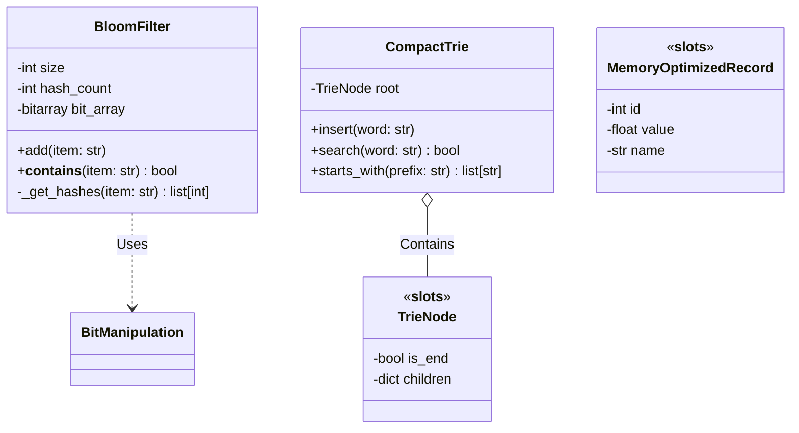

# High-Performance Data Structures in Python

## Problem Statement
Standard Python data structures (`dict`, `list`, `set`) are heavily optimized in C, making them highly versatile and fast for everyday programming. However, because Python is dynamically typed and uses objects with significant overhead (reference counts, type pointers, dynamic dictionaries), these structures consume massive amounts of memory. When processing Big Data, building search engines, or developing high-frequency systems, fitting millions of records into RAM and accessing them with minimal cache misses becomes impossible using standard Python objects. The problem is: how can we implement custom, memory-efficient, high-performance data structures in pure Python while minimizing the interpreter's overhead?

## Learning Objectives
By completing this project, you will:
- Understand the internal memory layout of Python objects and the Global Interpreter Lock (GIL).
- Learn how to bypass `__dict__` overhead using `__slots__` and memory-mapped files.
- Implement Probabilistic Data Structures (Bloom Filters, Count-Min Sketch) that trade accuracy for massive space efficiency.
- Build advanced tree structures (Tries, Prefix Trees) for high-speed text search and auto-completion.
- Master bitwise operations and the `array` module for compact numerical storage.

## Functional Requirements
1. **Bloom Filter:** Implement a probabilistic set membership data structure that supports `add(item)` and `__contains__(item)` with O(1) time complexity and minimal memory footprint.
2. **Compact Trie:** Implement a space-optimized prefix tree that supports rapid insertion and prefix-matching for strings (auto-complete functionality).
3. **Memory-Optimized Classes:** Implement data containers using `__slots__` and compare their memory footprint against standard Python classes.
4. **Bit-Packed Arrays:** Implement a system to store multiple boolean or small integer values within a single 64-bit integer array using bitwise operators.
5. **Benchmarking Suite:** A comprehensive profiling script using `timeit`, `tracemalloc`, and `memory_profiler` to empirically prove the performance gains of the custom structures over standard Python types.

## Suggested Architecture / Data Flow



## Step-by-Step Implementation Guide

### Step 1: The Memory Benchmark Baseline
Before building, write a script to measure the problem. Use `tracemalloc` to show how much memory 1 million standard Python objects consume.
```python
import tracemalloc

class StandardRecord:
    def __init__(self, x, y):
        self.x = x
        self.y = y

tracemalloc.start()
records = [StandardRecord(i, i) for i in range(1_000_000)]
current, peak = tracemalloc.get_traced_memory()
print(f"Standard Memory Usage: {peak / 10**6} MB")
tracemalloc.stop()
```

### Step 2: Implementing `__slots__`
Refactor the class to use `__slots__` and run the benchmark again. The memory usage should drop drastically.
```python
class SlottedRecord:
    __slots__ = ['x', 'y']
    def __init__(self, x, y):
        self.x = x
        self.y = y
```

### Step 3: Implementing the Bloom Filter
Use Python's built-in `array` module or `bitarray` for the backing store. Implement a hashing strategy using `hashlib.md5` or `mmh3` (MurmurHash) to generate $K$ distinct hashes.
```python
import math
import mmh3
from bitarray import bitarray

class BloomFilter:
    def __init__(self, items_count, fp_prob):
        # Calculate optimal size of bit array (m) and number of hash functions (k)
        self.size = int(-(items_count * math.log(fp_prob)) / (math.log(2)**2))
        self.hash_count = int((self.size / items_count) * math.log(2))
        self.bit_array = bitarray(self.size)
        self.bit_array.setall(0)

    def add(self, item):
        for i in range(self.hash_count):
            index = mmh3.hash(item, i) % self.size
            self.bit_array[index] = 1
            
    def __contains__(self, item):
        for i in range(self.hash_count):
            index = mmh3.hash(item, i) % self.size
            if self.bit_array[index] == 0:
                return False
        return True # Might be a false positive
```

### Step 4: Implementing the Prefix Trie
Implement the nodes using `__slots__` to ensure memory efficiency.
```python
class TrieNode:
    __slots__ = ['children', 'is_end_of_word']
    def __init__(self):
        self.children = {}
        self.is_end_of_word = False

class Trie:
    def __init__(self):
        self.root = TrieNode()
        
    def insert(self, word):
        node = self.root
        for char in word:
            if char not in node.children:
                node.children[char] = TrieNode()
            node = node.children[char]
        node.is_end_of_word = True
```

## Expected Edge Cases & Challenges
- **Hash Collisions:** In probabilistic structures, poor hash function choices lead to clumped distributions, drastically increasing the false-positive rate. MurmurHash is preferred over MD5/SHA for non-cryptographic distribution.
- **Dynamic Resizing:** Data structures like Bloom Filters cannot be dynamically resized once created without losing data or requiring a complete rebuild. You must accurately estimate the maximum `items_count` upfront.
- **Python Overhead Constraints:** Even with `__slots__`, every object in Python still has base `PyObject` overhead. For absolute peak performance, pure Python hits a hard limit, necessitating the use of the `array` module for primitive C-types, or eventually migrating to Cython or Rust extensions.

## Testing Strategy
- **False Positive Rate Validation:** For the Bloom filter, insert 10,000 strings. Then query 10,000 *different* strings. Assert that the percentage of `True` returns closely matches the mathematical probability `fp_prob` specified at initialization.
- **Memory Profiling Assertions:** Write tests using `tracemalloc` that fail if the memory consumption of your Slotted classes exceeds a specific byte threshold.
- **Fuzz Testing:** For the Trie, insert thousands of random unicode strings (including emojis and zero-width characters) to ensure the `children` dictionary handles extreme edge-cases correctly.

## Extension Ideas
1. **LSM Tree:** Implement a basic Log-Structured Merge tree (the foundation of NoSQL databases like Cassandra) that writes to an append-only log and periodically compacts data on disk.
2. **Cuckoo Filter:** Implement a Cuckoo filter, which provides similar benefits to a Bloom filter but allows for *deletion* of items, which standard Bloom filters cannot do.
3. **Cython Integration:** Rewrite the critical path of your Trie traversal in Cython to bypass the Python interpreter entirely for a 100x speedup.
