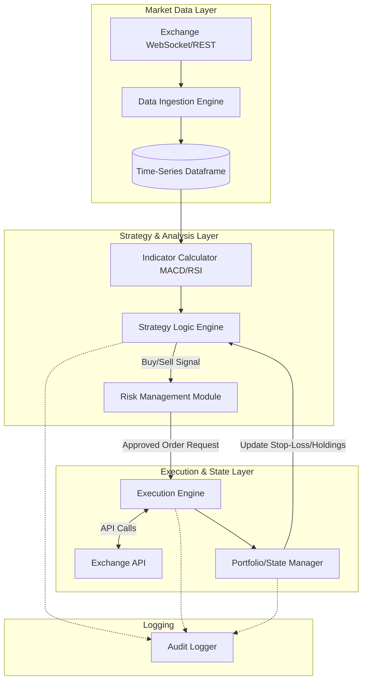

# Algorithmic Trading Bot

## Problem Statement
Human traders are inherently susceptible to emotions—fear and greed—which lead to inconsistent strategy execution, panic selling, and FOMO (Fear Of Missing Out) buying. Furthermore, humans cannot monitor dozens of markets simultaneously 24/7 or execute trades in milliseconds. The problem is: how do we build a robust, autonomous system that can ingest real-time market data, analyze technical indicators mathematically, execute trades without human intervention, and rigorously manage risk in a highly volatile environment?

## Learning Objectives
By completing this project, you will:
- Master asynchronous programming in Python (`asyncio`) for handling concurrent WebSocket data streams and REST API execution.
- Learn how to interact with financial exchange APIs using standardization libraries like `ccxt`.
- Understand how to calculate and interpret Technical Analysis indicators (e.g., Moving Averages, RSI, MACD) using `pandas` and `numpy`.
- Design a decoupled, event-driven architecture suitable for high-reliability systems.
- Implement robust risk management logic (stop-loss, take-profit, position sizing).
- Understand the critical differences between backtesting and live execution (slippage, latency, order types).

## Functional Requirements
1. **Data Ingestion:** The bot must connect to an exchange API and maintain a continuous stream of real-time market tick data or OHLCV (Open, High, Low, Close, Volume) candles.
2. **Strategy Engine:** The bot must evaluate incoming data against a predefined mathematical strategy (e.g., Dual Moving Average Crossover) to generate discrete Buy, Sell, or Hold signals.
3. **Risk Management:** Before execution, all signals must pass through a risk layer that verifies sufficient capital and calculates position sizes based on maximum risk thresholds.
4. **Order Execution:** The system must place Market or Limit orders via the exchange API, handling idempotency to prevent duplicate orders during network failures.
5. **State Management:** The bot must track open positions, monitor current PnL (Profit and Loss), and automatically trigger Stop-Loss or Take-Profit orders.
6. **Logging & Auditing:** Every decision, API call, and state change must be securely logged to a rotating file for post-mortem analysis.

## Suggested Architecture / Data Flow



## Step-by-Step Implementation Guide

### Step 1: Environment and Exchange Connection
Set up the `ccxt` library and authenticate with an exchange (preferably a Paper Trading / Testnet environment).
```python
import ccxt.async_support as ccxt
import asyncio
import os

async def initialize_exchange():
    exchange = ccxt.binance({
        'apiKey': os.getenv('BINANCE_API_KEY'),
        'secret': os.getenv('BINANCE_SECRET'),
        'enableRateLimit': True,
        'options': {'defaultType': 'future'} # Example for futures
    })
    exchange.set_sandbox_mode(True) # VERY IMPORTANT: Use testnet!
    return exchange
```

### Step 2: Data Ingestion and Pandas Formatting
Fetch historical OHLCV data and format it into a Pandas DataFrame for easy analysis.
```python
import pandas as pd

async def fetch_data(exchange, symbol, timeframe):
    ohlcv = await exchange.fetch_ohlcv(symbol, timeframe, limit=100)
    df = pd.DataFrame(ohlcv, columns=['timestamp', 'open', 'high', 'low', 'close', 'volume'])
    df['timestamp'] = pd.to_datetime(df['timestamp'], unit='ms')
    df.set_index('timestamp', inplace=True)
    return df
```

### Step 3: Strategy & Indicators
Calculate Moving Averages and generate signals.
```python
def apply_strategy(df):
    # Calculate Simple Moving Averages
    df['SMA_20'] = df['close'].rolling(window=20).mean()
    df['SMA_50'] = df['close'].rolling(window=50).mean()
    
    # Generate Signals
    df['Signal'] = 0
    # Buy when fast crosses above slow
    df.loc[df['SMA_20'] > df['SMA_50'], 'Signal'] = 1 
    # Sell when fast crosses below slow
    df.loc[df['SMA_20'] < df['SMA_50'], 'Signal'] = -1
    return df
```

### Step 4: Risk Management & Execution
Calculate position size and execute the trade asynchronously.
```python
async def execute_trade(exchange, symbol, side, amount, current_price):
    # Risk check: Ensure we have enough balance
    balance = await exchange.fetch_balance()
    usdt_free = balance['free'].get('USDT', 0)
    
    cost = amount * current_price
    if cost > usdt_free:
        print(f"Risk Alert: Insufficient funds for {side} order.")
        return None
        
    try:
        # Create Market Order
        order = await exchange.create_market_order(symbol, side, amount)
        print(f"Order Executed: {order['id']}")
        return order
    except Exception as e:
        print(f"Execution Error: {e}")
```

### Step 5: The Main Async Loop
Tie it all together in an `asyncio` event loop that runs continuously.

## Expected Edge Cases & Challenges
- **API Rate Limits:** Exchanges strictly limit requests per minute. If you poll REST APIs too aggressively, your IP will be banned. Utilizing WebSockets for data and `ccxt`'s built-in `enableRateLimit` is essential.
- **Partial Fills:** A large Limit order might only be partially executed. The Portfolio Manager must handle states where an order is 40% filled and the price moves away.
- **Network Partitions:** If the bot sends a Buy request but the internet drops before the response arrives, the bot won't know if the trade executed. Utilizing client-side order IDs ensures idempotency—if you resend the request with the same ID, the exchange will ignore it if it already executed.
- **Overfitting:** Tuning your SMA window sizes (e.g., 20 and 50) to make maximum profit on historical data will likely result in a strategy that loses money in live markets.

## Testing Strategy
- **Historical Backtesting:** Write an offline engine that iterates over a static CSV file of tick data row-by-row, simulating trades and calculating final PnL without making network calls.
- **Paper Trading:** Run the live bot architecture connected to an exchange's Testnet. It uses real live market data but fake money. This tests network latency, execution logic, and API stability.
- **Unit Testing Strategy Math:** Isolate the Pandas logic and write unit tests to ensure `df['Signal']` triggers exactly when expected on mock DataFrames.

## Extension Ideas
1. **Machine Learning Predictors:** Replace the SMA strategy with a pre-trained scikit-learn or PyTorch model that predicts the next price movement based on order book depth.
2. **Web Dashboard:** Build a Flask/FastAPI backend with a React frontend to visualize current positions, daily PnL charts, and active bot logs in a browser.
3. **Multi-Exchange Arbitrage:** Connect the bot to two different exchanges simultaneously, scanning for price discrepancies to execute risk-free arbitrage trades.
