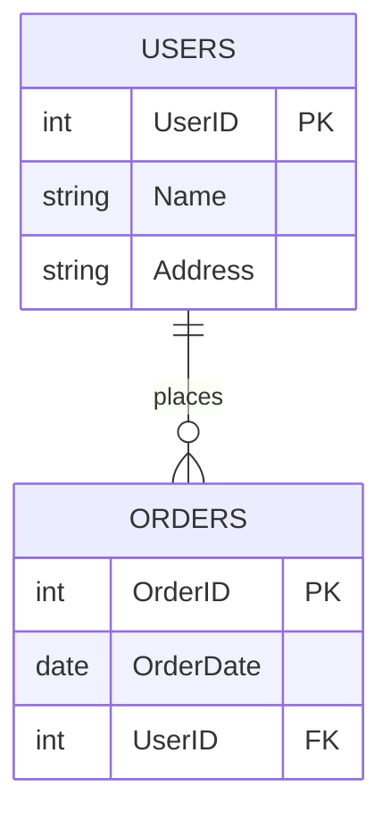

# Relational Databases Basics

## Learning Objectives
- Understand what a relational database and a Database Management System (DBMS) are.
- Identify the core components of a relational database (tables, rows, columns).
- Grasp the concepts of primary keys, foreign keys, and constraints.
- Learn the principles of database normalization (1NF, 2NF, 3NF).
- Understand the ACID properties of database transactions.

## Prerequisites
- Basic understanding of what data is and why we need to store it.
- Familiarity with the concept of tables and spreadsheets.

## Concept
A **Relational Database** organizes data into tables (or relations) which can be linked based on data common to each. This structure allows you to retrieve an entirely new table from data in one or more tables with a single query. A **Relational Database Management System (RDBMS)** (like PostgreSQL, MySQL, SQLite) is the software used to manage these databases.

## Intuition
Think of a relational database as a collection of well-organized spreadsheets. Instead of having one massive spreadsheet with duplicated information, you break the information into smaller, logical spreadsheets (tables). You then create "links" (relationships) between these spreadsheets using shared IDs. This reduces repetition and ensures that if a piece of information changes, you only have to update it in one place.

## Formal Explanation
A relational database models data using the relational model. 
- **Tables (Relations)**: A collection of related data entries consisting of rows and columns.
- **Rows (Records/Tuples)**: A single item or instance in a table.
- **Columns (Fields/Attributes)**: A specific property or type of data in a table.

**Keys and Constraints**:
- **Primary Key (PK)**: A column (or set of columns) that uniquely identifies each row in a table.
- **Foreign Key (FK)**: A column or group of columns that provides a link between data in two tables by referencing the primary key of another table.
- **Unique Constraint**: Ensures that all values in a column are distinct.
- **NOT NULL Constraint**: Ensures that a column cannot have a NULL value.

**Normalization** is the systematic process of organizing data to reduce redundancy and improve data integrity:
- **1NF (First Normal Form)**: Each table cell contains a single (atomic) value. Each record is unique.
- **2NF (Second Normal Form)**: Achieves 1NF and ensures every non-key column is fully dependent on the primary key.
- **3NF (Third Normal Form)**: Achieves 2NF and has no transitive functional dependencies (non-key columns do not depend on other non-key columns).

**ACID Properties** ensure reliable processing of database transactions:
- **Atomicity**: Transactions are all or nothing.
- **Consistency**: The database transitions from one valid state to another; only valid data is saved.
- **Isolation**: Concurrent transactions do not affect each other.
- **Durability**: Once committed, written data is permanent and will not be lost.

## Examples
Consider an e-commerce system. Instead of storing a user's address in every order record, you create a `Users` table and an `Orders` table.
- `Users` table has `UserID` (Primary Key), `Name`, `Address`.
- `Orders` table has `OrderID` (Primary Key), `OrderDate`, and `UserID` (Foreign Key referencing `Users` table).

## Visuals (use ascii or mermaid)


## Derivation (if applicable)
Not applicable for this conceptual topic.

## Code
```sql
-- Creating a simple table with a Primary Key
CREATE TABLE Users (
    UserID INT PRIMARY KEY,
    Name VARCHAR(100) NOT NULL,
    Address VARCHAR(255)
);

-- Creating a related table with a Foreign Key
CREATE TABLE Orders (
    OrderID INT PRIMARY KEY,
    OrderDate DATE NOT NULL,
    UserID INT,
    FOREIGN KEY (UserID) REFERENCES Users(UserID)
);
```

## Practice
1. Design a simple database schema for a library (Books and Borrowers).
2. Identify the Primary Keys and Foreign Keys in your library schema.
3. Determine if your schema satisfies 1NF, 2NF, and 3NF.

## Recall
- What is a Primary Key vs Foreign Key?
- What are the four ACID properties?
- What is the main goal of database normalization?

## Common Errors
- **Ignoring Normalization**: Creating "flat" tables with lots of redundant data leading to update anomalies.
- **Over-Normalization**: Breaking data into too many tables, requiring complex and slow JOIN operations to retrieve basic information.
- **Missing Foreign Keys**: Failing to enforce relationships at the database level, leading to orphaned records.

## Summary
Relational databases organize data into tables connected by relationships. Using Primary and Foreign keys, data integrity is maintained across these tables. The processes of normalization and the enforcement of ACID properties ensure that the database remains accurate, reliable, and efficient.

## Interview Questions
1. What is the difference between a DBMS and an RDBMS?
2. Explain the different forms of normalization (1NF, 2NF, 3NF) with examples.
3. What is a Foreign Key, and why is it important?
4. Can you explain the ACID properties and why they matter in a banking application?

## Further Reading
- PostgreSQL Official Documentation
- SQLite Official Documentation
- "Database System Concepts" by Abraham Silberschatz, Henry F. Korth, and S. Sudarshan
