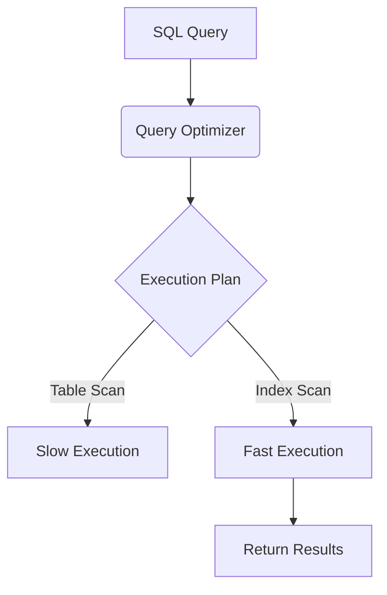

# SQL Query Optimization
## Learning Objectives
- Understand how database query optimizers execute queries.
- Learn how to analyze queries using EXPLAIN.
- Understand the role of indexing in query performance.
- Master writing SARGable queries.
- Identify and resolve the N+1 query problem.
- Apply advanced optimization techniques like cursor pagination.
## Prerequisites
- Basic understanding of SQL syntax (SELECT, WHERE, JOIN, GROUP BY).
- Familiarity with relational database concepts (tables, primary/foreign keys).
## Concept
SQL query optimization involves modifying database queries and structures (like indexes) to reduce execution time, CPU usage, and I/O operations. It ensures that databases can handle growing datasets and high traffic efficiently without crashing or slowing down.
## Intuition
Imagine looking for a specific word in a massive textbook. If the book has no index, you have to read every single page (a sequential scan). If you use the index at the back, you can jump straight to the correct page (an index scan). Query optimization is about giving the database the best possible "indexes" and writing requests in a way that the database can easily understand and look up, rather than forcing it to read the whole book.
## Formal Explanation
Relational databases use a Query Optimizer to determine the most efficient execution plan for a given SQL query. This plan is based on cost estimations (CPU, memory, disk I/O). Optimization involves analyzing this plan (via EXPLAIN), minimizing table scans by creating B-Tree or Hash indexes, ensuring queries are SARGable (Search Argument ABLE - allowing index usage), avoiding N+1 round trips, and reducing network payloads by fetching only required columns.
## Examples
**Non-optimized Query (N+1 Problem):**
Fetching 100 posts, then running 100 separate queries to fetch the author of each post. (101 queries total).

**Optimized Query (Using JOIN):**
```sql
SELECT p.*, a.name AS author_name
FROM posts p
JOIN authors a ON p.author_id = a.id;
```
(1 query total).
## Visuals (use ascii or mermaid)

## Derivation (if applicable)
Not applicable for this topic.
## Code
```sql
-- Creating an index
CREATE INDEX idx_employees_department ON employees(department_id);

-- Composite Index
CREATE INDEX idx_dept_hire ON employees(department_id, hire_date);

-- Using EXPLAIN to analyze a query
EXPLAIN ANALYZE
SELECT first_name, last_name 
FROM employees 
WHERE department_id = 5 AND hire_date > '2020-01-01';

-- SARGable vs Non-SARGable
-- BAD: Non-SARGable
SELECT * FROM orders WHERE YEAR(order_date) = 2023;
-- GOOD: SARGable
SELECT * FROM orders WHERE order_date >= '2023-01-01' AND order_date < '2024-01-01';
```
## Practice
1. Write a query to find all users whose email ends in '@gmail.com' and explain why it might be slow.
2. Given an `orders` table, create an appropriate index for a query that frequently filters by `status` and orders by `created_at`.
3. Rewrite the query `SELECT * FROM products WHERE price * 1.10 > 100;` to be SARGable.
## Recall
- What does SARGable mean?
- Why is `SELECT *` generally discouraged in production?
- What is the difference between a Sequential Scan and an Index Scan?
## Common Errors
- **Over-indexing:** Creating too many indexes, which slows down `INSERT`, `UPDATE`, and `DELETE` operations.
- **Functions on indexed columns:** Wrapping an indexed column in a function in the `WHERE` clause, negating the index (non-SARGable).
- **Pagination with large OFFSET:** Using `OFFSET 10000 LIMIT 50` requires the database to process and discard 10,000 rows. Use cursor pagination instead.
## Summary
Query optimization is essential for scaling applications. By analyzing query plans with `EXPLAIN`, thoughtfully applying single and composite indexes, writing SARGable queries, preventing N+1 problems, and selecting only necessary columns, you can drastically reduce query execution time and resource consumption.
## Interview Questions
1. How would you optimize a query that is taking too long to run?
2. What is an Execution Plan and how do you view it?
3. Explain the N+1 query problem and how to solve it.
4. What is a covering index?
5. Why might a query still do a full table scan even if an index exists on the column being filtered?
## Further Reading
- PostgreSQL Official Documentation on Performance
- "Use The Index, Luke!" (A Guide to Database Performance for Developers)
- High Performance MySQL by Baron Schwartz
