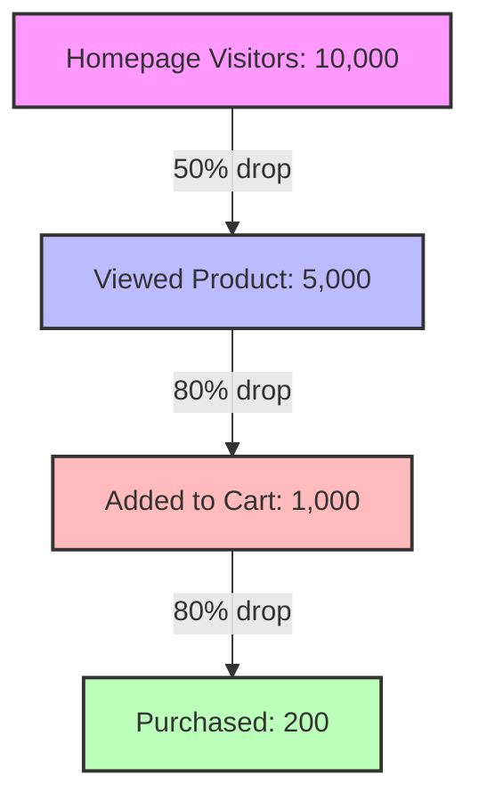

# Analytics & Business Intelligence (BI) Concepts

## Learning Objectives
* Understand the difference between Metrics and Key Performance Indicators (KPIs).
* Identify important business metrics across domains like E-Commerce, SaaS, and User Engagement.
* Comprehend Cohort Analysis and its importance in tracking retention.
* Analyze user journeys through Funnel Analysis to identify drop-off points.
* Differentiate between Strategic, Operational, and Analytical dashboards.

## Prerequisites
* Basic understanding of business operations.
* Familiarity with data analysis terminology (data, variables, trends).

## Concept
Business Intelligence (BI) and Analytics involve the strategies and technologies used by enterprises for the data analysis of business information. They provide historical, current, and predictive views of business operations, using metrics, KPIs, cohort analysis, funnel analysis, and dashboards to drive decision-making.

## Intuition
Imagine you are driving a car. The dashboard tells you your speed (a metric), your fuel level, and engine temperature. If your goal is to reach a destination in 2 hours, your average speed to achieve that becomes a KPI. If you notice your fuel dropping faster than usual, you analyze why (analytics). BI is like the dashboard and the GPS combined for a business—telling you how you are doing, where you are going, and where the problems are.

## Formal Explanation
**Metrics & KPIs:** A metric is a quantifiable measure to track a process (e.g., Total Users). A KPI (Key Performance Indicator) is a specific metric tied directly to a business objective (e.g., Customer Acquisition Cost). Good KPIs are SMART (Specific, Measurable, Actionable, Relevant, Time-bound).

**Important Metrics:**
*   *E-Commerce:* Conversion Rate (CVR), Average Order Value (AOV), Cart Abandonment Rate.
*   *SaaS:* Monthly Recurring Revenue (MRR), Annual Recurring Revenue (ARR), Churn Rate, Net Promoter Score (NPS).
*   *User Engagement:* DAU (Daily Active Users), MAU, DAU/MAU Ratio (Stickiness).

**Cohort Analysis:** Breaking data into related groups (cohorts) that share common characteristics over a timespan to identify trends independent of overall growth (e.g., Retention Cohort Analysis).

**Funnel Analysis:** Mapping user flow toward a goal to identify friction points and drop-offs.

**Dashboards:** Visual displays of KPIs. They can be Strategic (executives), Operational (day-to-day), or Analytical (drill-down).

## Examples
*   **KPI vs Metric:** Page views on a blog is a metric. If the blog's goal is lead generation, the number of newsletter sign-ups is a KPI.
*   **Cohort:** Users who signed up in January (Cohort 1) vs. users who signed up in February (Cohort 2). If Cohort 2 retains better in month 2, a product change in February might have been successful.
*   **Funnel:** Homepage (10k) -> Viewed Product (5k) -> Added to Cart (1k) -> Purchased (200). 

## Visuals (use ascii or mermaid)



## Derivation (if applicable)
*   **Conversion Rate (CVR):** $(Number of Purchases / Number of Sessions) * 100$
*   **Average Order Value (AOV):** $Total Revenue / Number of Orders$
*   **Cart Abandonment Rate:** $(1 - (Completed Purchases / Shopping Carts Created)) * 100$
*   **Churn Rate:** $(Customers lost during period / Total customers at start of period) * 100$

## Code
While BI concepts are often implemented in BI tools (Tableau, PowerBI), here is a simple Python example of calculating Churn Rate and CVR:

```python
def calculate_churn_rate(start_customers, lost_customers):
    if start_customers == 0:
        return 0.0
    return (lost_customers / start_customers) * 100

def calculate_cvr(purchases, sessions):
    if sessions == 0:
        return 0.0
    return (purchases / sessions) * 100

# Example usage
start_cust = 1000
lost_cust = 50
print(f"Churn Rate: {calculate_churn_rate(start_cust, lost_cust)}%")

purchases = 200
sessions = 10000
print(f"Conversion Rate: {calculate_cvr(purchases, sessions)}%")
```

## Practice
1.  Calculate the DAU/MAU ratio for a product with 5,000 DAU and 25,000 MAU. What does this number indicate?
2.  Design a funnel for a food delivery app. What are the key stages?
3.  Calculate the Cart Abandonment Rate if 500 carts were created and 150 purchases were completed.

## Recall
*   What makes a KPI 'SMART'?
*   What is the difference between MRR and ARR?
*   Why use cohort analysis instead of just looking at total active users?

## Common Errors
*   **Vanity Metrics:** Focusing on metrics that look good but don't translate to business results (e.g., total registered users instead of active users).
*   **Too Many KPIs:** Tracking too many indicators dilutes focus. A business should have a select few true KPIs.
*   **Ignoring Seasonality:** Not accounting for holidays or seasons when analyzing trends in dashboards.

## Summary
Business Intelligence relies on accurately defining and tracking metrics and KPIs to measure performance. Techniques like cohort and funnel analysis provide deep insights into user behavior and retention, helping businesses identify friction points. These metrics are continuously monitored via strategic, operational, and analytical dashboards.

## Interview Questions
1.  How would you define the difference between a metric and a KPI to a non-technical stakeholder?
2.  If our DAU is going up but our revenue is flat, how would you investigate the root cause?
3.  Explain how you would set up a cohort analysis for a new feature launch in a SaaS product.
4.  What is a vanity metric? Can you give an example?

## Further Reading
*   "Lean Analytics" by Alistair Croll and Benjamin Yoskovitz
*   Articles on Amplitude or Mixpanel blogs regarding Cohort and Funnel Analysis.
