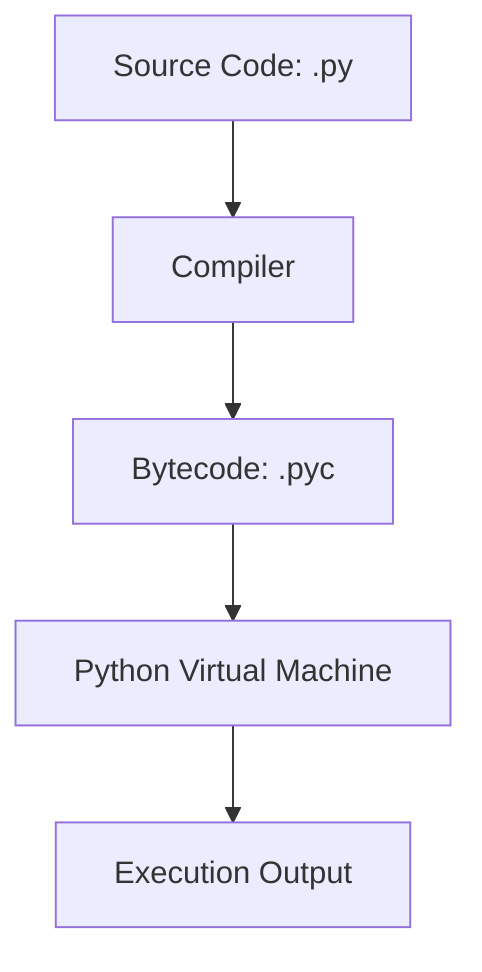

# Python Fundamentals: From Zero to Advanced

## Learning Objectives
- Understand why Python exists and its primary industry use cases.
- Set up a Python environment and run code using the REPL and virtual environments.
- Grasp basic syntax, semantics, variables, and control flow.
- Define, utilize, and extend functions using closures and decorators.
- Comprehend under-the-hood mechanisms like memory management, bytecode, and the Global Interpreter Lock (GIL).

## Prerequisites
- Basic computer literacy and ability to install software.
- Familiarity with using a terminal or command prompt is helpful but not strictly required.

## Concept
Python is a high-level, interpreted, dynamically typed, and multiparadigm programming language. Created by Guido van Rossum in 1991, it was designed with an emphasis on code readability, notably using significant whitespace (indentation) to delimit blocks of code rather than curly braces or keywords.

## Intuition
Imagine trying to instruct a computer to do a complex task. In low-level languages like C, you must micromanage every aspect, including memory allocation. In shell scripting (like Bash), it's easy to write quick commands but hard to manage complex data structures. Python sits right in the "Goldilocks zone"—it reads almost like plain English, hiding the complex memory management behind the scenes, so you can focus solely on problem-solving rather than wrestling with complex syntax.

## Formal Explanation
When you run a Python script, it is not executed directly by the CPU. The standard Python implementation (**CPython**) compiles the source code into **bytecode** (`.pyc` files in `__pycache__`). This bytecode is a lower-level set of instructions that is then interpreted by the **Python Virtual Machine (PVM)**. 

Memory management in Python is automatic. It primarily uses **Reference Counting** (when an object's reference count drops to zero, it is deleted) and a **Generational Garbage Collector** to detect and clean up circular references. 

Execution is constrained by the **Global Interpreter Lock (GIL)**, a mutex that prevents multiple native threads from executing Python bytecodes at once, making Python's C API thread-safe but preventing true parallel execution in CPU-bound multi-threading.

## Examples
Variables and data types in Python do not require explicit type declaration (dynamically typed):
```python
# Variables and basic types
user_age = 25          # int
temperature = 36.6     # float
name = "Alice"         # str
is_admin = True        # bool
empty_value = None     # NoneType

# Multiple assignment
x, y, z = 1, 2, 3
```

Variables as references (pointers):
```python
a = [1, 2, 3]
b = a
b.append(4)
print(a) # Output: [1, 2, 3, 4] 
# Both 'a' and 'b' refer to the exact same list in memory.
```

Control Flow (`match-case` in Python 3.10+):
```python
status_code = 404

match status_code:
    case 200:
        print("OK")
    case 404:
        print("Not Found")
    case 500:
        print("Internal Server Error")
    case _:
        print("Unknown Code")
```

## Visuals (use ascii or mermaid)


## Derivation (if applicable)
Not applicable to general language syntax, but Python derives its philosophy from the need to bridge the gap between Bash (quick automation, poor data structures) and C (high performance, slow development cycle).

## Code
Functions are first-class citizens in Python. Below is an example of defining a function, using type hints, `*args`/`**kwargs`, and a **Decorator**:

```python
import time
from functools import wraps

def timer_decorator(func):
    @wraps(func)
    def wrapper(*args, **kwargs):
        start_time = time.perf_counter()
        result = func(*args, **kwargs)
        end_time = time.perf_counter()
        print(f"Function '{func.__name__}' executed in {end_time - start_time:.4f} seconds")
        return result
    return wrapper

@timer_decorator
def slow_function(name: str, *args, **kwargs) -> str:
    """
    Simulates a slow function. (This is a docstring)
    """
    time.sleep(1)
    return f"Finished processing for {name}."

print(slow_function("Alice", active=True))
```

## Practice
1. **The Config Validator**: Write a function `validate_config(config: dict) -> bool` that takes a dictionary containing application configuration. It should return `True` if:
   - Key `"host"` exists and is a string.
   - Key `"port"` exists and is an integer between 1 and 65535.
   - Key `"debug_mode"` is a boolean.
2. **Retry Decorator**: Create a decorator `@retry(max_attempts=3)` that will catch any `Exception` thrown by the decorated function and retry it up to `max_attempts` times. If it fails on the final attempt, raise the exception.
3. **FizzBuzz with Match-Case**: Implement the classic FizzBuzz problem for numbers 1 to 100, but use the Python 3.10 `match-case` structural pattern matching syntax.

## Recall
- **What is the REPL?** Read-Eval-Print Loop. A prompt used for quick experiments and mathematical calculations.
- **Why use Virtual Environments?** To create an isolated Python installation for a specific project, avoiding dependency conflicts.
- **List Comprehensions vs Loops:** `[x*x for x in range(1000)]` is generally faster and more Pythonic than standard `for` loops appending to a list.

## Common Errors
**Default Mutable Arguments**
Because functions are evaluated once when the module loads, using a mutable object (like a list) as a default parameter leads to shared state.
```python
# WRONG
def add_item(item, basket=[]):
    basket.append(item)
    return basket

# RIGHT
def add_item_safe(item, basket=None):
    if basket is None:
        basket = []
    basket.append(item)
    return basket
```

**Security Vulnerabilities**
- `eval()` and `exec()`: NEVER use these functions on unsanitized user input. They execute arbitrary Python code and can lead to Remote Code Execution (RCE).
- Path Traversal: Be careful when opening files based on user input; always sanitize paths.

## Summary
Python is a versatile, readable, dynamically-typed programming language. It is powered by CPython under the hood, utilizing bytecode, a Virtual Machine, and automatic Garbage Collection. Thanks to its ease of use, extensive standard library, and powerful paradigms like closures and decorators, Python has become the undisputed standard for Web Development, Data Science, AI, and Automation.

## Interview Questions
**Q1: What is the difference between `==` and `is`?**
*Answer*: `==` checks for **value equality** (do these objects contain the same data?). `is` checks for **identity** (do these references point to the exact same object in memory?).

**Q2: How is memory managed in Python?**
*Answer*: Python uses a private heap for all objects. Memory management is handled by the Python memory manager. It primarily relies on Reference Counting, backed by a Generational Garbage Collector to handle circular references.

**Q3: Explain what `*args` and `**kwargs` do and give an example.**
*Answer*: `*args` allows a function to take an arbitrary number of positional arguments (packed into a tuple). `**kwargs` allows an arbitrary number of keyword arguments (packed into a dictionary). They provide flexibility in function signatures.

**Q4: What is a Decorator in Python and how does it work?**
*Answer*: A decorator is a function that takes another function as an argument and extends its behavior without explicitly modifying its code. It heavily relies on closures and the fact that functions are first-class citizens in Python.

## Further Reading
- [Official Python Documentation](https://docs.python.org/3/)
- PEP 8 – Style Guide for Python Code
- "Fluent Python" by Luciano Ramalho for deep dives into advanced features.
