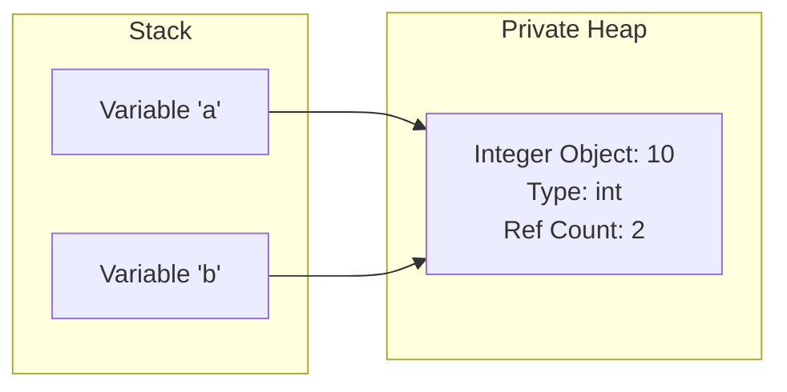

# Python Memory Model Guide

## Learning Objectives
- Understand how Python manages memory, including variables, objects, and references.
- Differentiate between mutable and immutable objects.
- Grasp how garbage collection and reference counting work in Python.
- Learn how to prevent common memory-related bugs like mutable default arguments and unintended aliasing.
- Optimize memory usage in Python applications using techniques like `__slots__` and interning.

## Prerequisites
- Basic understanding of Python syntax (variables, functions, classes).
- Familiarity with basic data structures (lists, dictionaries, strings, integers).

## Concept
The **Python Memory Model** dictates how Python manages data in memory. Unlike C or C++, where developers manually allocate and free memory, Python uses automatic memory management. Understanding the memory model is critical because it explains how variables relate to data, why some operations modify unexpected parts of your code, and how memory leaks can occur even in a garbage-collected language. 

By abstracting away manual memory management, Python lets developers focus on business logic rather than memory bookkeeping, and prevents common memory-related bugs like use-after-free or double-free errors. It is essential for avoiding Out-Of-Memory (OOM) crashes in Data Engineering/AI and reducing garbage collection pauses in backend web services.

## Intuition
In many languages (like C or Java), you can think of a variable as a "box" where data is stored. If you put a new value in the box, the old value is overwritten.
In Python, **variables are not boxes; they are name tags (or labels) attached to objects.** 
When you write `a = 10`, Python creates an integer object with the value `10` in memory, and attaches the name tag `a` to it. 
If you then write `b = a`, Python doesn't copy the value `10` into a new box. Instead, it takes a new name tag `b` and attaches it to the **exact same object** that `a` is attached to.

## Formal Explanation
### Everything is an Object
In Python, absolutely everything is an object—numbers, strings, functions, and even classes themselves. Every object in CPython contains at least three things:
1. **Value:** The actual data.
2. **Type:** A pointer to the type object (e.g., `int`, `str`).
3. **Reference Count:** The number of name tags currently pointing to this object.

### Memory Layout: Stack vs. Heap
Python's memory architecture is conceptually split:
- **The Stack:** Stores function call frames, local variable references (the name tags), and execution context. It is extremely fast but limited in size.
- **The Private Heap:** Stores the actual Python objects. The Python Memory Manager handles this heap exclusively. You cannot access it directly.

### Mutability vs. Immutability
- **Immutable Objects:** Objects whose state **cannot** be modified after they are created (e.g., `int`, `float`, `bool`, `str`, `tuple`, `frozenset`). Any operation that seems to modify them actually creates a new object.
- **Mutable Objects:** Objects whose state **can** be modified in place (e.g., `list`, `dict`, `set`, user-defined classes). 

### Garbage Collection & Memory Management
Python uses two mechanisms to reclaim memory:
1. **Reference Counting:** Every object keeps a running tally of how many references point to it. When the count reaches `0`, the object is immediately destroyed.
2. **Generational Garbage Collection:** Fixes reference cycles (where objects point to each other, keeping reference counts > 0). It periodically scans memory for cyclic references across three "generations" (Gen 0, 1, 2) and cleans them up.

## Examples
### Immutability Example
```python
x = 10
print(id(x))  # E.g., 140733857313864

x = x + 1
# 'x' now points to a completely NEW object in memory. 
print(id(x))  # E.g., 140733857313896 (Different!)
```

### Mutability Example
```python
my_list = [1, 2, 3]
print(id(my_list))  # E.g., 2056345091200

my_list.append(4)
# The list was modified in place. The memory address remains exactly the same.
print(id(my_list))  # E.g., 2056345091200
```

### The "Alias" Trap
```python
list_a = [10, 20]
list_b = list_a  # Both tags point to the same heap object!

list_b.append(30)
print(list_a)  # Output: [10, 20, 30] - list_a is modified too!
```

## Visuals (use ascii or mermaid)


```mermaid
graph LR
    subgraph Stack
        L1[Variable 'list_a']
        L2[Variable 'list_b']
    end
    subgraph Private Heap
        L[List Object: [10, 20, 30]<br/>Type: list<br/>Ref Count: 2]
    end
    L1 --> L
    L2 --> L
```

## Derivation (if applicable)
Not strictly applicable for this topic.

## Code
### Object Interning
```python
x = 100
y = 100
print(x is y)  # True! Same memory address due to interning.

a = 300
b = 300
print(a is b)  # False! Outside the interned range (-5 to 256).
```

### Reference Counting in Action
```python
import sys

# Create string. Ref count is 1 (the variable 'a')
a = "Hello World Memory"
# getrefcount returns count + 1 (because the function argument itself creates a temporary reference)
print(sys.getrefcount(a))  # Output: 2

b = a
print(sys.getrefcount(a))  # Output: 3

del b
print(sys.getrefcount(a))  # Output: 2
```

### Using `__slots__` for Memory Efficiency
```python
class Point:
    __slots__ = ['x', 'y']
    def __init__(self, x, y):
        self.x = x
        self.y = y
```

## Practice
### Exercise 1: Tracing Memory Aliases
Without running the code, predict the output of the following:
```python
a = [1, 2, [3, 4]]
b = a.copy()
c = a

a[0] = 99
a[2][0] = 100

print(b)
print(c)
```

### Exercise 2: Fix the Memory Leak
You have a caching mechanism that stores user sessions. Over time, the server runs out of memory.
```python
CACHE = {}
def cache_session(user_id, session_data):
    CACHE[user_id] = session_data
```
*Task:* How can you modify this so that inactive sessions don't keep memory alive indefinitely?

## Recall
**Exercise 1 Solution:**
- `b` is `[1, 2, [100, 4]]` (Shallow copy protects outer list, but inner list is shared).
- `c` is `[99, 2, [100, 4]]` (`c` is an exact alias of `a`).

**Exercise 2 Solution:**
Use the `weakref` module, or implement a Least-Recently-Used (LRU) eviction strategy. Using `weakref.WeakValueDictionary` allows values to be garbage collected if there are no other strong references to them elsewhere in the application.

## Common Errors
### Mutable Default Arguments
```python
def add_item(item, target_list=[]):
    target_list.append(item)
    return target_list

print(add_item(1))  # [1]
print(add_item(2))  # [1, 2] - Wait, what?
```
*Why?* The default argument `[]` is evaluated only **once** when the function is defined, not every time it is called. The same list object is reused!
*Fix:* Use `None` as the default and initialize the list inside the function body.
```python
def add_item(item, target_list=None):
    if target_list is None:
        target_list = []
    target_list.append(item)
    return target_list
```

### Shallow vs. Deep Copy Confusion
```python
import copy
original = [[1, 2], [3, 4]]
shallow = list(original) 
deep = copy.deepcopy(original)
```
Modifying inner nested mutable objects in `shallow` will affect `original`, whereas `deep` is completely independent.

## Summary
The Python Memory Model is built on the concept that everything is an object residing in a private heap, with variables acting merely as references (name tags) on the stack. Immutability vs mutability is a key distinction governing how operations affect shared references. Memory is managed primarily via reference counting, backed by a generational garbage collector to resolve reference cycles. Being mindful of mutable default arguments, object interning, and aliasing can prevent hard-to-track bugs and memory leaks.

## Interview Questions
1. **Q:** What is the difference between `==` and `is`?
   **A:** `==` compares the *values* of two objects. `is` compares their *memory addresses* (identities).

2. **Q:** How does Python's Garbage Collection work?
   **A:** Python uses Reference Counting as its primary mechanism. To handle cyclic references (where objects point to each other), it also uses a Generational Garbage Collector that periodically traces and sweeps unreferenced cycles.

3. **Q:** Why do strings behave like they are passed by value when Python uses pass-by-object-reference?
   **A:** Because strings are immutable. When you modify a string inside a function, Python creates a completely new string object and updates the local reference, leaving the original string intact outside the function.

4. **Q:** Explain the `del` keyword. Does it delete objects?
   **A:** No, `del name` simply deletes the *reference* (name tag) in the current namespace and decrements the object's reference count. The object is only deleted by the memory manager if its reference count drops to 0.

## Further Reading
- Python Official Documentation: Data Model
- Python `gc` (Garbage Collector) module documentation
- Python `sys.getrefcount` and `weakref` module documentation
- Articles on CPython object interning and memory management optimization.
