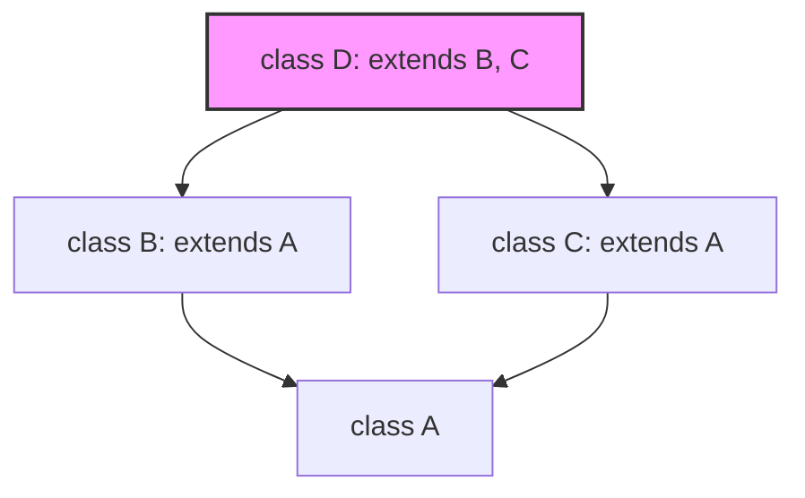

# Advanced Python Object-Oriented Programming (OOP)

## Learning Objectives
By the end of this module, you will be able to:
- Understand and trace Python's Method Resolution Order (MRO) in multiple inheritance using C3 Linearization.
- Utilize dunder (magic) methods to implement operator overloading and integrate objects with Python's Data Model.
- Implement the Descriptor Protocol to customize attribute access.
- Understand how classes are created and manipulate this process using metaclasses.
- Optimize memory usage in large-scale applications using `__slots__`.

## Prerequisites
- Proficiency with basic Python syntax and data structures.
- Solid understanding of fundamental OOP concepts: classes, objects, instantiation, basic inheritance, encapsulation, and polymorphism.

## Concept
Object-Oriented Programming (OOP) in Python is built around the concept that "everything is an object." While fundamental OOP handles the basics of organizing code, **Advanced Python OOP** exposes the internal machinery of Python's class model. It grants developers the hooks necessary to deeply customize object creation, intercept attribute access, generate classes dynamically, and overload operators. 

## Intuition
Imagine a class as a customizable factory, and instances as the products. Basic OOP lets you decide what the factory produces. Advanced OOP lets you re-engineer the factory's assembly line, redefine how products behave when they interact with each other (like adding two products together), and even build a "meta-factory" that builds the factories themselves. 

Industry frameworks heavily rely on these hooks. For example, web frameworks like Django use descriptors and metaclasses to map Python classes directly to database tables, while libraries like Pandas use operator overloading to allow intuitive mathematical operations on complex dataframes.

## Formal Explanation

### Classes, Instances, and `__slots__`
Normally, classes and instances in Python store their attributes in dictionaries (`__dict__`). While flexible, dictionaries have significant memory overhead. For classes that will be instantiated millions of times, you can use `__slots__` to explicitly declare data members, preventing the creation of `__dict__` and saving substantial memory.

### Method Resolution Order (MRO)
Python supports multiple inheritance. When resolving which method to call, Python relies on the **C3 Linearization Algorithm** to establish a Method Resolution Order (MRO). The MRO strictly guarantees that a base class is never searched before its derived class and preserves the declaration order of base classes. `super()` delegates to the next class in the MRO, not strictly the parent.

### Dunder Methods (The Data Model)
Methods surrounded by double underscores (like `__init__`, `__add__`) are automatically invoked by Python under certain syntactic conditions. By overriding them, your custom objects can seamlessly emulate built-in behavior.
- `__new__` allocates memory, while `__init__` initializes the allocated object.
- `__repr__` and `__str__` dictate how objects are converted to strings.
- `__add__`, `__eq__`, etc., allow operator overloading.

### The Descriptor Protocol
A descriptor is an object that governs how attributes on another object are accessed, set, or deleted by defining `__get__`, `__set__`, or `__delete__`. 
- **Data Descriptors** define both `__get__` and `__set__` and take precedence over instance dictionaries.
- **Non-Data Descriptors** define only `__get__` (e.g., normal methods), meaning instance dictionaries take precedence.

### Metaclasses
In Python, classes themselves are instances of a "metaclass." By default, this is the `type` metaclass. By defining a custom metaclass, you can intercept the creation of a class object, allowing you to inject attributes, register classes automatically, or strictly validate class definitions at import time.

## Examples

### 1. Memory Optimization with `__slots__`
```python
class Point:
    __slots__ = ['x', 'y']
    
    def __init__(self, x, y):
        self.x = x
        self.y = y

p = Point(1, 2)
# p.z = 3  # AttributeError: 'Point' object has no attribute 'z'
```

### 2. Dunder Methods for Operator Overloading
```python
class Vector:
    def __init__(self, x, y):
        self.x = x
        self.y = y

    def __add__(self, other):
        if not isinstance(other, Vector):
            return NotImplemented
        return Vector(self.x + other.x, self.y + other.y)

    def __repr__(self):
        return f"Vector({self.x}, {self.y})"

v1 = Vector(2, 4)
v2 = Vector(3, 1)
print(v1 + v2)  # Output: Vector(5, 5)
```

## Visuals

### MRO Diamond Problem Visualization

*MRO for class D: `D -> B -> C -> A -> object`*

## Derivation (Attribute Lookup Order)
When `instance.attr` is evaluated, Python searches in this strict order:
1. **Data descriptors** defined in the class dictionary (and base classes via MRO).
2. The instance's `__dict__`.
3. **Non-data descriptors** (e.g., normal methods) defined in the class dictionary.
4. `__getattr__()` if defined on the class as a fallback.
*(Note: `__getattribute__` is called unconditionally at the very beginning and handles this entire lookup logic).*

## Code

### ORM-like Field Mapping (Metaclasses and Descriptors)
```python
# 1. The Descriptor
class Field:
    def __set_name__(self, owner, name):
        self.name = name

    def __get__(self, instance, owner):
        if instance is None: return self
        return instance.__dict__.get(self.name)

    def __set__(self, instance, value):
        instance.__dict__[self.name] = value

# 2. The Metaclass
class ModelMeta(type):
    def __new__(mcs, name, bases, namespace):
        fields = {k: v for k, v in namespace.items() if isinstance(v, Field)}
        namespace['_fields'] = fields
        return super().__new__(mcs, name, bases, namespace)

# 3. The Base Class
class Model(metaclass=ModelMeta):
    def __init__(self, **kwargs):
        for key, value in kwargs.items():
            if key in self._fields:
                setattr(self, key, value)
            else:
                raise ValueError(f"Unknown field {key}")

    def save(self):
        data = {name: getattr(self, name) for name in self._fields}
        print(f"INSERT INTO {self.__class__.__name__} VALUES {data}")

# 4. Usage
class User(Model):
    username = Field()
    email = Field()

u = User(username="alice", email="alice@example.com")
u.save() # Output: INSERT INTO User VALUES {'username': 'alice', 'email': 'alice@example.com'}
```

## Practice

**Exercise 1: Implement a Data Descriptor**
Create a `BoundedInteger` descriptor that ensures an attribute is an integer and strictly falls between a `min_val` and `max_val`.
```python
class BoundedInteger:
    # Your code here
    pass

class Temperature:
    celsius = BoundedInteger("celsius", min_val=-273, max_val=1000)
```

**Exercise 2: Metaclass Registry**
Write a metaclass `PluginMeta` that automatically registers any class that uses it into a global dictionary `plugin_registry`, keyed by the class name.
```python
plugin_registry = {}

# Your task: Define PluginMeta here

class BasePlugin(metaclass=PluginMeta):
    pass
```

**Exercise 3: The Diamond Problem**
Create a class hierarchy: `Device`, `Scanner(Device)`, `Printer(Device)`, and `Copier(Scanner, Printer)`. Implement a `boot()` method in all using `super()` so that calling `Copier().boot()` prints the boot sequence correctly following the MRO.

## Recall
- **`__slots__`**: Disables `__dict__` for memory optimization.
- **MRO**: Dictates parent traversal using C3 Linearization. Use `super()` to follow it.
- **Dunder Methods**: Bridge custom objects and Python's built-in syntax.
- **Descriptors**: Manage attribute access (`__get__`, `__set__`).
- **Metaclasses**: Factories for classes, inheriting from `type`.

## Common Errors
- **Misunderstanding `super()`**: Assuming it explicitly calls the parent class rather than the *next class in the MRO*. This leads to bugs in multiple inheritance.
- **Mutable Default Arguments in Class Attributes**: Assigning `[]` or `{}` as a class attribute causes all instances to share the exact same mutable object.
- **Overusing Metaclasses**: Often, simple inheritance or class decorators can achieve the same goal with much less cognitive overhead.
- **Deserialization Risks**: Carelessly unpickling objects can lead to remote code execution.

## Summary
Advanced Python OOP empowers you to hook into the core logic of the language. By utilizing `__slots__`, MRO manipulation, the Data Model (dunders), descriptors, and metaclasses, you can write powerful, memory-efficient APIs that feel like native Python features. However, with great power comes great responsibility—these features should be used judiciously to maintain code readability.

## Interview Questions
1. **Explain the difference between `__new__` and `__init__`. When would you override `__new__`?**
   *Hint: Object creation vs initialization. `__new__` is heavily used for Singletons or subclassing immutable types.*
2. **What is the Method Resolution Order (MRO) and how does the C3 Linearization algorithm work?**
   *Hint: Order of base class search. Ensures monotonic order.*
3. **What is a descriptor in Python? Explain data vs. non-data descriptors.**
   *Hint: Objects with `__get__`/`__set__`. Data descriptors define `__set__` and take priority over instance `__dict__`.*
4. **How would you prevent a class from having dynamic attributes created at runtime?**
   *Hint: Define `__slots__`.*
5. **What is a metaclass? Give a practical usecase.**
   *Hint: A class that creates classes (e.g., ORM schema generation, automatic plugin registration).*

## Further Reading
- [Python Official Data Model Documentation](https://docs.python.org/3/reference/datamodel.html)
- [Descriptor HowTo Guide](https://docs.python.org/3/howto/descriptor.html)
- Python's `super()` considered super! (Raymond Hettinger)
