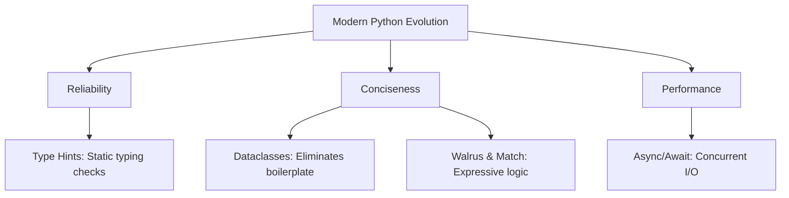

# Modern Python Features: The Comprehensive Guide

## Learning Objectives
- Master **Type Hints** for robust, self-documenting code.
- Understand **Dataclasses** to eliminate repetitive boilerplate logic.
- Use **Structural Pattern Matching** to simplify complex data extraction and logic.
- Apply the **Walrus Operator** to optimize expressions and variable assignments.
- Grasp **Async / Await** basics for high-concurrency I/O operations.

## Prerequisites
- Basic Python syntax and core data structures.
- Understanding of classes, functions, and standard control flow.
- Familiarity with running Python scripts and basic error handling.

## Concept
Modern Python (versions 3.5 through 3.10+) has evolved from a simple scripting language into an enterprise-grade ecosystem. Crucial features like Type Hints, Dataclasses, Pattern Matching, Assignment Expressions, and Async/Await empower developers to build massive codebases, high-throughput applications, and resilient AI pipelines with confidence and efficiency.

## Intuition
- **Type Hints**: Like labels on moving boxes; they tell you exactly what is inside without having to open them, helping tools ensure everything goes in the right place.
- **Dataclasses**: A factory that instantly stamps out the repetitive parts of creating data-holding objects, saving you from writing boring initialization code.
- **Pattern Matching**: An intelligent sorting machine that not only checks the shape of a data structure but extracts its contents perfectly in one swift step.
- **Walrus Operator**: Catching a thrown ball and immediately throwing it to someone else in one continuous motion—assigning and using a value simultaneously.
- **Async/Await**: Cooking in a kitchen. You don't stare at a pot waiting for the water to boil; you chop vegetables in the meantime. It lets a single thread juggle many waiting tasks.

## Formal Explanation

### 1. Type Hints (Type Annotations)
Python is fundamentally dynamically typed, resolving types at runtime. Type hints statically indicate expected types of variables, arguments, and return values. While they do not enforce types at runtime, they allow static type checkers (like `mypy` or `pyright`) to catch bugs before execution.

### 2. Dataclasses
Introduced via the `@dataclass` decorator, this feature automatically generates boilerplate dunder methods (like `__init__`, `__repr__`, `__eq__`) for classes that primarily store data. It supports immutability, default factories, and post-initialization hooks.

### 3. Structural Pattern Matching
Using `match` and `case` statements, pattern matching allows for expressive extraction of information from complex data structures. It acts as an advanced `switch` statement that can unpack sequences, match mappings, and evaluate conditional "guards".

### 4. The Walrus Operator (`:=`)
Also known as the Assignment Expression, it allows you to assign a value to a variable and return that value in the same expression. It reduces redundant function calls and variable initializations in loops or conditionals.

### 5. Async / Await Basics
`async` and `await` are keywords to write concurrent code (via the `asyncio` library). `async def` defines a coroutine, and `await` yields control back to the event loop while waiting for an I/O operation to complete, allowing a single thread to handle thousands of concurrent operations.

## Examples

**Type Hints:**
```python
def process_data(
    data: list[dict[str, int | float]],
    callback: callable,
    allow_missing: bool = False
) -> list[str]:
    # Processing logic
    pass
```

**Dataclasses:**
```python
from dataclasses import dataclass, field

@dataclass
class Employee:
    name: str
    base_salary: float
    bonus: float = 0.0
    tags: list[str] = field(default_factory=list)
```

**Pattern Matching:**
```python
def http_status(status_code: int) -> str:
    match status_code:
        case 200:
            return "OK"
        case 404:
            return "Not Found"
        case 500 | 502 | 503:
            return "Server Error"
        case _:
            return "Unknown Status"
```

**Walrus Operator:**
```python
import re
text = "Error: Invalid user input on line 42"

if match := re.search(r'Error: (.+)', text):
    print(f"Found error: {match.group(1)}")
```

**Async/Await:**
```python
import asyncio

async def fetch_data(id: int):
    await asyncio.sleep(1) # Simulate I/O
    return f"Data {id}"
```

## Visuals (use ascii or mermaid)



## Derivation (if applicable)
Modern features are formalized through Python Enhancement Proposals (PEPs):
- **Type Hints:** PEP 484
- **Dataclasses:** PEP 557
- **Walrus Operator:** PEP 572
- **Pattern Matching:** PEP 634
- **Async/Await:** PEP 492

## Code

```python
# A complete modern Python script combining these features
import asyncio
from dataclasses import dataclass, field
from typing import Callable, Any

@dataclass(frozen=True)
class TaskResult:
    id: int
    status: str
    data: dict[str, Any] = field(default_factory=dict)

async def process_task(task_id: int) -> TaskResult:
    # Async I/O Simulation
    await asyncio.sleep(0.5)
    
    # Pattern matching for simulated HTTP response codes
    status_code = 200 if task_id % 2 == 0 else 404
    
    match status_code:
        case 200:
            return TaskResult(task_id, "Success", {"info": "Data found"})
        case 404 | 500 as code:
            return TaskResult(task_id, "Failed", {"error": f"Code {code}"})
        case _:
            return TaskResult(task_id, "Unknown")

async def main():
    # Concurrent execution
    tasks = [process_task(i) for i in range(5)]
    results: list[TaskResult] = await asyncio.gather(*tasks)
    
    # Walrus operator for filtering
    for r in results:
        if (msg := r.data.get("error")) is not None:
            print(f"Task {r.id} failed with: {msg}")
        else:
            print(f"Task {r.id} succeeded.")

if __name__ == "__main__":
    asyncio.run(main())
```

## Practice
1. **Type Hints & Dataclasses:** Create a frozen dataclass `Product` with `id` (int), `name` (str), and `price` (float). Write a purely type-hinted function `filter_expensive(products: list[Product], threshold: float) -> list[Product]` that returns products costing more than `threshold`.
2. **Pattern Matching:** Write a function `parse_command(cmd: str | list[str])` using `match/case` that accepts either a string (and splits it) or a list. Match the patterns: `["move", "up" | "down" | "left" | "right"]`, `["attack", weapon]`, and `["quit"]`. Print appropriate actions.
3. **Asyncio:** Write an async function `download_page(url: str)` that sleeps for a random time between 1 and 3 seconds, then returns the URL. Write a `main()` function that uses `asyncio.gather` to concurrently download 5 URLs and print the total time taken.

## Recall
- What does `frozen=True` do in a `@dataclass`?
- Does Python enforce Type Hints when the program is running?
- What is the difference between CPU-bound threading and I/O-bound `asyncio`?
- What problem does the `:=` operator solve in a `while` loop that reads from a file?

## Common Errors
- **Type Hints:** Assuming they enforce types at runtime. They do not. `def greet(n: str): print(n + 1)` will still execute and crash at runtime. Over-annotating with `Any` defeats the purpose.
- **Dataclasses:** Using mutable default arguments like `tags: list = []`. This creates a shared reference across all instances. Always use `field(default_factory=list)`.
- **Walrus Operator:** Overusing it to the point where code readability suffers. If simple assignment works better visually, stick to `=`.
- **Async/Await:** Blocking the event loop. If you put a synchronous, blocking function (like `time.sleep()`) inside an `async def`, it freezes all other async tasks. Forgetting to `await` a coroutine is another common mistake.

## Summary
Python's modern features streamline development and prevent bugs in large codebases. Type hints provide safety and clarity, dataclasses remove boilerplate, structural pattern matching simplifies complex routing, the walrus operator tightens conditional assignments, and asyncio enables robust concurrency. Mastering these is essential for professional Python engineering.

## Interview Questions
1. **What is the difference between a `dataclass` and a regular class? What does `frozen=True` do?**
   *Answer:* Dataclasses auto-generate boilerplate methods (`__init__`, `__repr__`, `__eq__`). `frozen=True` makes the instance immutable and hashable, allowing it to be used as dictionary keys or in sets.
   
2. **Explain the difference between Multi-threading and `asyncio` in Python.**
   *Answer:* Threading uses OS threads pre-emptively scheduled by the OS, subject to race conditions and GIL overhead. `asyncio` is cooperative multitasking running in a single thread with an event loop; tasks explicitly yield control using `await`.

3. **How does Python enforce Type Hints at runtime?**
   *Answer:* It doesn't. Type hints are ignored by the Python interpreter during execution. They exist in `__annotations__` for third-party static analyzers (like mypy) or runtime validation frameworks (like Pydantic).

4. **Rewrite the following using the walrus operator:**
   ```python
   length = len(data)
   if length > 10:
       print(f"Data is too long: {length} items")
   ```
   *Answer:* 
   ```python
   if (length := len(data)) > 10:
       print(f"Data is too long: {length} items")
   ```

## Further Reading
- [Python Typing Documentation](https://docs.python.org/3/library/typing.html)
- [Python Dataclasses Documentation](https://docs.python.org/3/library/dataclasses.html)
- [PEP 636 - Structural Pattern Matching Tutorial](https://peps.python.org/pep-0636/)
- [Asyncio Official Documentation](https://docs.python.org/3/library/asyncio.html)
