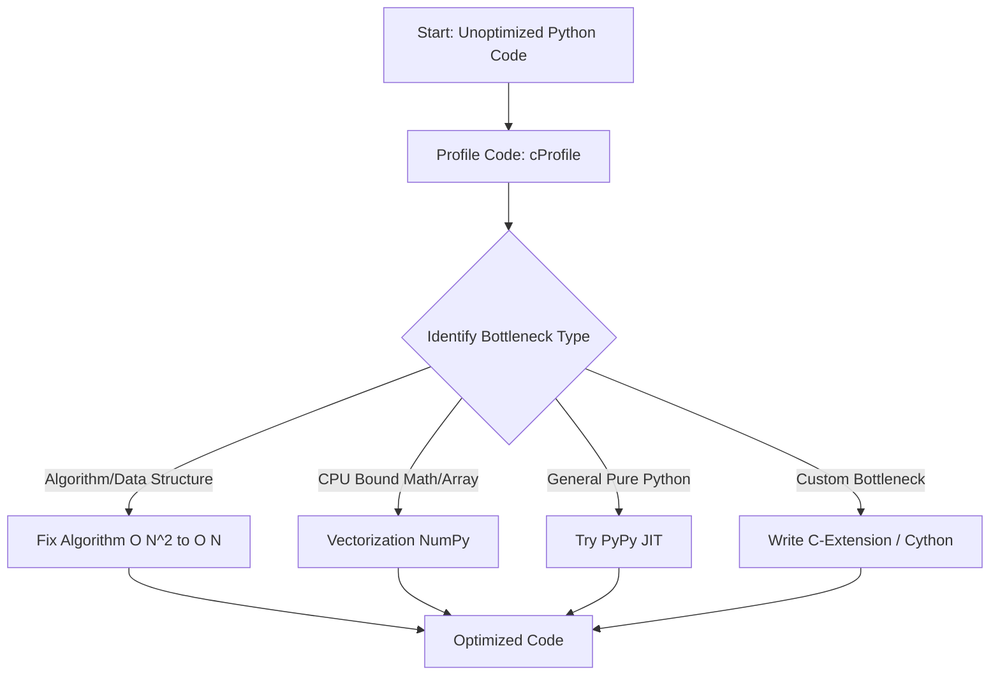

# Python Performance Optimization: From Profiling to C-Extensions

## Learning Objectives
- Understand why Python is often slower than compiled languages like C++ or Rust.
- Learn how to profile Python code to identify performance bottlenecks.
- Grasp the concepts of vectorization, JIT compilation, and C-extensions for speeding up code.
- Understand the Global Interpreter Lock (GIL) and its impact on multi-threading.
- Learn when to apply different optimization strategies to real-world problems.

## Prerequisites
- Basic understanding of Python syntax and standard data structures.
- Familiarity with the difference between interpreted and compiled languages.
- Basic understanding of time and space complexity (Big O notation).

## Concept
Performance optimization in Python involves identifying bottlenecks (profiling) and applying techniques to speed up execution or reduce memory consumption. These techniques range from using better algorithms and data structures to leveraging external C libraries, JIT compilers, or vectorization. Python's dynamic typing, interpreted nature, and the Global Interpreter Lock (GIL) inherently add overhead, making optimization an essential skill for high-performance applications.

## Intuition
Imagine you are reading instructions to build a LEGO set. If you are a C++ program, you have memorized the entire manual beforehand and assemble it blindly at lightning speed. If you are Python, you read one instruction, figure out what blocks it refers to (type checking), find the blocks, assemble them, and then move to the next instruction. Optimization is about helping Python do less work—either by rewriting the rules (JIT compilers), doing many things at once (vectorization), or handing the hard work to a faster builder (C-extensions).

## Formal Explanation
Python is dynamically typed and interpreted. When executing, the CPython interpreter translates code into bytecode and runs it in an evaluation loop (`ceval.c`). Every operation requires type checking and object unboxing at runtime. Furthermore, the GIL (Global Interpreter Lock) ensures only one OS thread executes Python bytecode at a time, preventing data races in CPython's memory management but severely limiting multi-core CPU utilization.

To optimize, developers use:
1. **Profiling**: Tools like `cProfile` and `memory_profiler` measure time and space to target optimization.
2. **Vectorization**: Libraries like NumPy apply operations across arrays in highly optimized C routines using CPU SIMD (Single Instruction, Multiple Data) instructions, bypassing Python loops.
3. **JIT Compilation**: Alternative interpreters like PyPy trace execution and compile "hot" loops directly into machine code.
4. **C-Extensions**: Bottlenecks are rewritten in C/C++ or Cython (a Python superset that compiles to C), completely removing interpreter overhead.

## Examples
- **Data Science & Machine Learning:** Using vectorization (NumPy, Pandas) to process millions of records in milliseconds instead of hours.
- **High-Frequency Trading (HFT):** Writing ultra-low-latency execution paths in C/C++ and wrapping them in Python using C-extensions (like Cython or pybind11).
- **Backend Web Services:** Identifying slow database queries or inefficient JSON serialization via profiling to improve API response times and throughput.

## Visuals (use ascii or mermaid)


## Derivation (if applicable)
While not a strict mathematical derivation, performance optimization is governed by **Amdahl's Law**. The overall speedup of a system is limited by the fraction of the code that can be optimized.
$$ \text{Speedup} = \frac{1}{(1 - P) + \frac{P}{S}} $$
Where $P$ is the proportion of execution time that the part benefiting from improved resources originally occupied, and $S$ is the speedup factor of that part. Thus, optimizing a function taking 1% of runtime yields negligible overall benefit.

## Code

```python
import time
import numpy as np
import cProfile
import pstats

# 1. Profiling with cProfile
def slow_computation():
    total = 0
    # A highly inefficient way to compute sum of squares
    for i in range(10_000_000):
        total += i * i
    return total

def profile_example():
    profiler = cProfile.Profile()
    profiler.enable()
    slow_computation()
    profiler.disable()
    
    stats = pstats.Stats(profiler)
    stats.sort_stats(pstats.SortKey.TIME)
    print("--- Profiling Output ---")
    stats.print_stats(3)

# 2. Vectorization vs Pure Python
def vectorization_example():
    print("\n--- Vectorization Comparison ---")
    data_list = list(range(10_000_000))
    start = time.perf_counter()
    squared_list = [x * x for x in data_list] 
    py_time = time.perf_counter() - start
    print(f"Pure Python Time: {py_time:.4f} seconds")

    data_array = np.arange(10_000_000)
    start = time.perf_counter()
    squared_array = data_array * data_array 
    np_time = time.perf_counter() - start
    print(f"NumPy Time: {np_time:.4f} seconds")
    print(f"Speedup: {py_time / np_time:.2f}x")

if __name__ == "__main__":
    profile_example()
    vectorization_example()
```

## Practice
1. **The Profiling Hunt:** Write a script that reads a large text file and counts word frequency inefficiently (e.g., using `list.count()`). Profile it with `cProfile`. Then, rewrite using `collections.Counter` and calculate the speedup.
2. **Vectorization Challenge:** Given a list of 1 million points `[{"x": 10, "y": 20}, ...]`, calculate the Euclidean distance using a pure Python loop, then convert it to a NumPy array and calculate distances using vectorized operations. Compare execution times.
3. **Cython Basics:** Install Cython. Write a pure Python function to generate a Mandelbrot set. Then, move the core logic to a `.pyx` file, add static types (`cdef int`, `cdef double`), compile, and benchmark it against the pure Python version.

## Recall
- **What tool should you use before attempting any optimization?** `cProfile` (or another profiler) to identify exactly what is slow.
- **What is the GIL?** The Global Interpreter Lock ensures only one thread executes Python bytecode at once, limiting multi-core CPU-bound tasks.
- **How does NumPy achieve performance?** By dropping into C/Fortran routines and using vectorization / SIMD instructions on arrays.

## Common Errors
- **Premature Optimization:** Wasting days optimizing a function that accounts for 1% of total runtime. Always profile first.
- **Using the Wrong Data Structure:** Searching in a `list` (`if x in my_list`) is $O(N)$. Searching in a `set` or `dict` is $O(1)$. Choosing the right structure is often better than micro-optimizing a bad one.
- **String Concatenation in Loops:** Using `s += new_string` in a loop creates a new string object every time. Use `''.join(list_of_strings)` instead.
- **Ignoring Generator Expressions:** Loading large datasets into memory with lists can cause memory swapping. Use generators (`(x for x in data)`) to yield items lazily.

## Summary
Optimizing Python requires a strategic approach: measure first with tools like `cProfile` to find bottlenecks. For algorithmic inefficiencies, ensure correct data structures are used. For numerical data, utilize NumPy's vectorization to leverage C-level speeds and SIMD. For CPU-bound pure Python code, consider PyPy for JIT compilation, or drop down to Cython/C-extensions to bypass the interpreter and the GIL entirely.

## Interview Questions
1. **Your pure-Python data processing script is CPU-bound and taking too long. Walking through your thought process, how would you optimize it?**
   *Answer:* First, I would use `cProfile` to identify the bottleneck. If it's a specific mathematical or array operation, I'd try replacing pure Python loops with vectorized NumPy operations. If the logic is highly custom and can't be vectorized, I might try running the script with PyPy. If specific functions are still too slow, I would write them in Cython, adding static typing to bypass interpreter overhead.

2. **Explain the GIL. How does it affect multi-threading in Python?**
   *Answer:* The Global Interpreter Lock is a mutex in CPython that protects access to Python objects, preventing multiple threads from executing Python bytecodes at once. This means multi-threading cannot speed up CPU-bound pure Python code. However, I/O bound code still benefits from threading, and C-extensions (like NumPy) can release the GIL during intense computation to utilize multiple cores.

3. **What is the difference between PyPy and CPython?**
   *Answer:* CPython is the standard, reference implementation of Python that interprets bytecode. PyPy is an alternative implementation that uses a Just-In-Time (JIT) compiler. PyPy identifies frequently executed code paths and compiles them down to machine code at runtime, often resulting in significant speedups for pure Python code without needing C-extensions.

## Further Reading
- Python Official Documentation: Profiling and Optimizing
- *High Performance Python* by Micha Gorelick and Ian Ozsvald
- Cython Documentation and Tutorials
- NumPy Vectorization Guides
