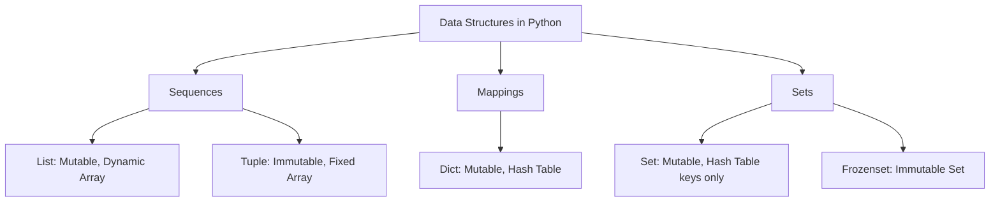

# Data Structures Fundamentals in Python

## Learning Objectives
- Understand the definition and importance of data structures in software engineering.
- Distinguish between Abstract Data Types (ADTs) and concrete Data Structures.
- Learn Python's core built-in data structures and their underlying characteristics.
- Recognize when to use lists, tuples, dictionaries, and sets for optimal performance.

## Prerequisites
- Basic familiarity with Python syntax.
- Understanding of variables, functions, and control flow in Python.

## Concept
Data structures are specialized formats for organizing, processing, retrieving, and storing data. Python provides built-in, highly optimized data structures (lists, tuples, dictionaries, and sets) that abstract away raw memory management. Choosing the correct data structure is critical for algorithm efficiency and system scalability.

## Intuition
Imagine your data is a collection of books.
- Stacking them in a box randomly makes finding a book tedious; you must check each one. This is akin to an unsorted **List**.
- Sorting them alphabetically on a shelf allows faster searching, like a **Sorted Array** or **Binary Search Tree**.
- Having an index card that maps a title exactly to a shelf position lets you find it instantly. This represents a **Dictionary (Hash Table)**.

## Formal Explanation
In computer science, we differentiate between an **Abstract Data Type (ADT)** and a **Data Structure**:
- **ADT**: A theoretical concept defining behavior and operations (e.g., a "Queue" must support `push` and `pop`).
- **Data Structure**: The concrete implementation in memory.

Python's built-ins are dynamically typed arrays of pointers to `PyObject` structures in C.
- **List**: A dynamic array. Highly optimized for appending and random access, but slow ($O(n)$) for inserting/deleting at the beginning.
- **Tuple**: An immutable array. Fixed in size, leading to memory and performance optimizations over lists.
- **Dictionary (`dict`)**: A hash table. Provides $O(1)$ average time complexity for lookups, insertions, and deletions. (Maintains insertion order as of Python 3.7+).
- **Set**: A hash table without values. Ensures uniqueness and supports fast mathematical set operations.

## Examples
- **Web Servers**: Queues to manage incoming user requests.
- **Databases**: B-Trees and hash tables for indexing.
- **Social Networks**: Graphs for user connections.
- **Python Text Editor**: Lists for a stack-based undo history.
- **Caching**: Dictionaries for memoizing expensive function calls.

## Visuals


## Derivation (if applicable)
*N/A for general fundamentals.*

## Code
```python
# 1. List: Managing a Stack of Operations (Undo functionality)
class TextEditor:
    def __init__(self):
        self.text = ""
        self.history = []  # List used as a stack

    def type_text(self, new_text):
        self.history.append(self.text)  # O(1) append
        self.text += new_text

    def undo(self):
        if self.history:
            self.text = self.history.pop() # O(1) pop from end

editor = TextEditor()
editor.type_text("Hello ")
editor.type_text("World!")
editor.undo()
print(editor.text)  # Output: Hello 

# 2. Dictionary: Fast Lookups & Caching (Memoization)
def fibonacci(n, cache=None):
    if cache is None:
        cache = {}
    if n in (0, 1):
        return n
    if n in cache: # O(1) lookup
        return cache[n]
        
    cache[n] = fibonacci(n-1, cache) + fibonacci(n-2, cache)
    return cache[n]

print(fibonacci(100)) # Computes instantly
```

## Practice
- **Exercise 1**: Implement a function that takes a string and returns the first non-repeating character using a dictionary.
- **Exercise 2**: Write a Least Recently Used (LRU) Cache using a combination of a dictionary and a doubly linked list (or investigate `collections.OrderedDict`).

## Recall
- What is the difference between an ADT and a Data Structure?
- Which Python data structures are mutable and which are immutable?
- What is the average time complexity of looking up a key in a Python dictionary?

## Common Errors
- **Using a list for membership checks**: `if x in my_list` inside a loop is $O(n)$ per check. **Fix**: Convert to a set first, making lookups $O(1)$.
- **Modifying a list while iterating**: Leads to skipped elements or `IndexError`. **Fix**: Iterate over a copy (`for item in my_list[:]:`) or use a list comprehension.
- **Hash DoS attacks**: In older Python versions, predictable hashes allowed intentionally triggered collisions. Python now uses random hash seeding (`PYTHONHASHSEED`).

## Summary
Python offers high-level built-in data structures (Lists, Tuples, Dictionaries, and Sets) that abstract the complexities of memory management. Understanding their underlying C implementations—dynamic arrays and hash tables—empowers developers to write efficient, scalable code by choosing the right structure for the right task (e.g., fast lookups via dicts vs. ordered collections via lists).

## Interview Questions
**Q1: What is the difference between a list and a tuple in Python, and when would you use each?**
*Answer:* Lists are mutable dynamic arrays, while tuples are immutable fixed-size arrays. Use tuples for heterogeneous data (like a record) or when a hashable collection is needed (e.g., as a dictionary key). Tuples are more memory-efficient.

**Q2: How does a Python set ensure uniqueness?**
*Answer:* It uses a hash table. When an element is added, its `__hash__()` is computed to find a bucket. If occupied, it checks for equality using `__eq__()`. If equal, it's considered a duplicate and ignored.

## Further Reading
- Python Official Documentation: Data Structures (https://docs.python.org/3/tutorial/datastructures.html)
- `collections` module documentation for advanced data structures like `deque`, `defaultdict`, and `Counter`.
