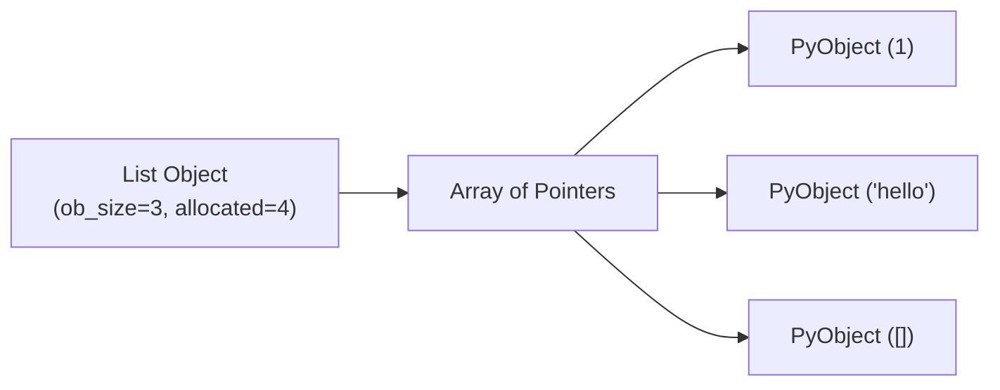

# Memory Layout & Internal Architecture of Python Data Structures

## Learning Objectives
- Understand how Python objects are allocated in memory (Stack vs. Heap).
- Comprehend the inner workings of CPython's `PyObject` overhead.
- Learn the memory layouts of dynamic arrays (`list`) and compact hash tables (`dict`).
- Recognize the impact of memory layout on CPU cache locality and performance.

## Prerequisites
- Basic familiarity with Python variables and assignment.
- Basic understanding of memory concepts (RAM).

## Concept
In Python, all values are objects allocated on the heap, and variables hold references (pointers) to these objects. This contrasts with lower-level languages where variables can directly store data. Understanding how data structures map to physical memory allows you to optimize for cache locality, minimize memory fragmentation, and avoid silent performance killers like excessive reallocation.

## Intuition
Think of Python memory like a giant library (the heap). Variables are just index cards in a catalog (the stack) that contain directions (pointers) to the books (objects) in the library. When you put a book in a list, you aren't physically storing the book inside a box; you're writing its location on a master list of index cards. 

## Formal Explanation
Python is primarily implemented in C (CPython). Every Python object is represented by a C struct called `PyObject`. Even a simple integer has significant overhead compared to raw C data types:
- `ob_refcnt` (8 bytes): Reference count for Garbage Collection.
- `ob_type` (8 bytes): Pointer to the object's type.
- `ob_digit` (variable): The actual integer value.

Thus, an integer in Python takes at least 28 bytes on a 64-bit system.

### `list` Layout
A Python `list` is a **Dynamic Array of Pointers**. It does not store the objects directly in a contiguous block. Instead, it stores a contiguous array of pointers to `PyObject` structs scattered across the heap. When a list grows beyond its capacity, Python over-allocates memory to maintain an amortized $O(1)$ `append` time complexity.

### `dict` Layout
Historically, dictionaries used a sparse hash table array which wasted a lot of memory. Since Python 3.6, CPython implements a **Compact Hash Table**. It separates the dictionary into two arrays:
1. `indices`: A small, sparse array mapping hash values to an index.
2. `entries`: A dense, contiguous array of `(hash, key, value)` structs.
This structure inherently preserves insertion order and reduces memory usage by 20-25% over older sparse implementations.

## Examples
Consider the following assignment:
```python
a = [1, 2, 3]
b = a
```
Here, `a` and `b` don't hold the list. They hold a memory address pointing to the same list object on the heap. Changing the contents of the list via `a` will be reflected in `b`.

## Visuals (use ascii or mermaid)


## Derivation (if applicable)
**List Growth Pattern:** 
When list capacity is exhausted, the new size is computed roughly as: `new_size = old_size + (old_size >> 3) + (old_size < 9 ? 3 : 6)`.
This geometric progression ensures that the total time to append $N$ elements is $O(N)$, giving an amortized time of $O(1)$ per append operation.

## Code
```python
import sys
import gc

# 1. Demonstrating memory overhead
empty_list = []
print(f"Empty list size: {sys.getsizeof(empty_list)} bytes") # Base overhead: ~56 bytes

# Appending triggers reallocation
for i in range(10):
    empty_list.append(i)
    # Observe how the allocated size jumps in chunks, not linearly
    print(f"Size with {i+1} elements: {sys.getsizeof(empty_list)} bytes")

# 2. Reference Counting and GC
class Node:
    def __init__(self, val):
        self.val = val
        self.next = None

node1 = Node(1)
print(sys.getrefcount(node1)) # Output: 2 (one for var, one for getrefcount arg)

# Creating a cyclic reference
node2 = Node(2)
node1.next = node2
node2.next = node1

# Deleting variables removes references, but cycle keeps refcount > 0
del node1
del node2

# Python's cyclic garbage collector cleans this up automatically in the background
gc.collect() 
```

## Practice
- Write a script to monitor the size of a dictionary as items are added. At what element counts does `sys.getsizeof()` reveal that a reallocation happened?
- Implement a simple script comparing the iteration time over 1,000,000 integers in a Python list versus a NumPy array to observe the effects of cache locality.

## Recall
- What is the `PyObject` struct in CPython?
- How much overhead in bytes does a basic Python integer have?
- Why do Python dictionaries (3.6+) maintain insertion order naturally?
- What causes a CPU cache miss when iterating through a standard Python list?

## Common Errors
- **Assuming Value Types:** Assuming Python variables store data by value; they store data by reference (pointer).
- **Ignoring Overhead:** Ignoring object memory overhead when processing millions of items (e.g., using a list of dicts instead of a Pandas DataFrame).
- **Misunderstanding Appends:** Thinking `append()` is strictly $O(1)$ in all cases; it's *amortized* $O(1)$, but individual appends that trigger array resizing take $O(N)$ time.

## Summary
Understanding Python's memory layout is crucial for writing high-performance code. All Python objects are heap-allocated `PyObject` structs with inherent garbage collection overhead. Python lists are contiguous arrays of pointers to scattered objects, leading to potential cache locality issues. Modern dictionaries use a compact two-array system that saves memory and naturally preserves insertion order. Proper awareness of these details helps in making appropriate engineering choices, like switching to C-arrays or NumPy for large-scale numerical data.

## Interview Questions
**Q1: How does a Python list resize itself? What is the amortized cost of `append()`?**
*Answer:* When full, a list allocates a new, larger array of pointers (using a growth factor of ~1.125 + a constant) and copies existing pointers over. The single reallocation is $O(N)$, but since it happens infrequently, the *amortized* cost of `append()` is $O(1)$.

**Q2: Why are Python lists considered cache-unfriendly for numerical computations compared to NumPy arrays?**
*Answer:* Python lists are arrays of pointers pointing to scattered `PyObject`s on the heap. Accessing elements requires dereferencing these pointers, breaking spatial cache locality. NumPy arrays store raw unboxed C-types consecutively in memory, minimizing CPU cache misses and utilizing fast CPU caching.

**Q3: Describe how the `dict` memory layout changed in Python 3.6.**
*Answer:* Pre-3.6, dicts used a single sparse array containing `(hash, key, value)` structs with empty slots wasting space. Post-3.6, they use a dense `entries` array maintaining insertion order, and a separate small sparse `indices` array that maps hashes to indices in the `entries` array. This significantly reduced memory usage.

## Further Reading
- CPython Source Code and Documentation (GitHub)
- Python `sys.getsizeof()` and `gc` module documentation
- Data-Oriented Design and CPU Cache optimization theory
