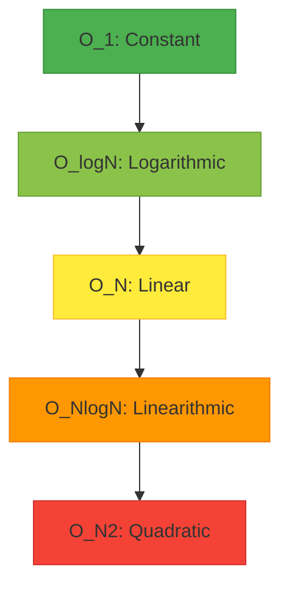

# Performance Comparison & Big O Analysis

## Learning Objectives
- Understand why wall-clock time is insufficient for algorithm analysis.
- Grasp the fundamentals of Big O notation.
- Compare the time complexity of common Python data structures.
- Learn to identify and avoid hidden performance traps in Python.

## Prerequisites
- Basic understanding of Python data structures (lists, dictionaries, sets).
- Familiarity with loops and conditional statements in Python.

## Concept
When analyzing algorithms and data structures, relying on wall-clock time is insufficient because execution speed depends on hardware, CPU load, and background processes. Instead, we use **Big O Notation** — a mathematical framework to describe how the execution time (Time Complexity) or memory usage (Space Complexity) of an algorithm grows relative to the input size ($N$).

## Intuition
Imagine you have to find a specific book in a library.
- **$O(1)$**: You know the exact coordinates of the book on a shelf. It takes the same time to grab it whether there are 10 or 10,000 books.
- **$O(\log N)$**: The books are sorted. You look in the middle, determine if your book is in the left or right half, and repeat. You eliminate half the remaining books each time.
- **$O(N)$**: The books are randomly placed. You have to check every single book one by one until you find it.
- **$O(N^2)$**: For every book in the library, you compare it to every other book in the library.

## Formal Explanation
Big O notation describes the upper bound of the growth rate of a function. 
- **$O(1)$ - Constant Time:** Takes the same amount of time regardless of data size (e.g., getting the first item in a list).
- **$O(\log N)$ - Logarithmic Time:** Time grows very slowly. Data is halved at each step (e.g., Binary Search).
- **$O(N)$ - Linear Time:** Time grows directly with data size (e.g., iterating through a list).
- **$O(N \log N)$ - Linearithmic Time:** Standard sorting algorithms (e.g., Merge Sort, Python's Timsort).
- **$O(N^2)$ - Quadratic Time:** Nested loops. Extremely slow for large $N$.

### Python Data Structure Complexities

**Python `list` (Dynamic Array)**
| Operation | Average Case | Worst Case | Notes |
| :--- | :---: | :---: | :--- |
| `append()` | $O(1)$ | $O(N)$ | $O(N)$ occurs when memory reallocation is triggered. |
| `pop()` | $O(1)$ | $O(1)$ | Removing from the end. |
| `pop(0)` / `insert(0, x)`| $O(N)$ | $O(N)$ | **CRITICAL:** Requires shifting all subsequent elements in memory. |
| Lookup / `lst[i]` | $O(1)$ | $O(1)$ | Direct memory offset calculation. |
| `x in lst` | $O(N)$ | $O(N)$ | Linear scan required. |

**Python `collections.deque` (Doubly Linked List)**
| Operation | Average Case | Worst Case | Notes |
| :--- | :---: | :---: | :--- |
| `append()` / `appendleft()` | $O(1)$ | $O(1)$ | Fast insertion at both ends. |
| `pop()` / `popleft()` | $O(1)$ | $O(1)$ | Fast removal at both ends. |
| Lookup / `dq[i]` | $O(N)$ | $O(N)$ | Slow random access; must traverse links. |

**Python `dict` and `set` (Hash Tables)**
| Operation | Average Case | Worst Case | Notes |
| :--- | :---: | :---: | :--- |
| Get Item / `d[k]` | $O(1)$ | $O(N)$ | $O(N)$ strictly happens on severe hash collisions. |
| Set Item / `d[k] = v` | $O(1)$ | $O(N)$ | Includes time to resize the hash table if load factor > 2/3. |
| Delete Item / `del d[k]` | $O(1)$ | $O(N)$ | Removes entry without shifting elements. |
| `x in set` | $O(1)$ | $O(N)$ | Massively faster than lists for membership tests. |

## Examples
### Industry Use Cases:
- **Search Engines:** Searching an index of billions of pages must be done in $O(\log N)$ or $O(1)$ time; an $O(N)$ linear scan would take hours per query.
- **Real-Time Data Streaming:** Ensuring constant time $O(1)$ insertion of incoming sensor metrics into a sliding window queue.

## Visuals


## Derivation
**Amortization for List Append:**
A list `append()` takes $O(N)$ when it hits its memory capacity and needs to reallocate. However, because it grows proportionally to its size, reallocations become increasingly rare. Thus, the total time for $N$ appends is $O(N)$, making the *amortized* cost per append $O(N)/N = O(1)$.

## Code
### Slow Code vs Fast Code: The Membership Test
```python
import timeit

# SETUP
setup_code = """
import random
lst = list(range(10000))
s = set(lst)
target = 9999
"""

# Test List Membership O(N)
list_test = "target in lst"
print("List Time:", timeit.timeit(stmt=list_test, setup=setup_code, number=10000)) 
# Output: ~0.150 seconds

# Test Set Membership O(1)
set_test = "target in s"
print("Set Time: ", timeit.timeit(stmt=set_test, setup=setup_code, number=10000))
# Output: ~0.0003 seconds (Massively faster)
```

### The $O(N)$ List Pop Trap
```python
from collections import deque
import time

def process_queue_with_list(n):
    q = list(range(n))
    while q:
        q.pop(0) # O(N) operation inside an O(N) loop = O(N^2)

def process_queue_with_deque(n):
    q = deque(range(n))
    while q:
        q.popleft() # O(1) operation inside an O(N) loop = O(N)

# Using list takes significantly longer due to memory shifting
```

## Practice
Use the `cProfile` module to profile a function that performs list inserts at index 0 vs appending to the end, and analyze the function call timings.

## Recall
- What is the average time complexity of a dictionary lookup in Python?
- Why is `pop(0)` on a Python list considered slow?
- How does `x in set` compare to `x in list` in terms of performance?

## Common Errors
1. **Using Lists as Queues:** Using `list.pop(0)` or `list.insert(0, val)` shifts all elements in memory. Always use `collections.deque` for queues.
2. **Repeated String Concatenation:** `str += "a"` inside a loop creates a new string every time because strings are immutable. This is $O(N^2)$. Use `''.join(list_of_strings)` which is $O(N)$.
3. **Hidden Loops:** Calling `min()`, `max()`, `sum()`, or `x in y` inside a `for` loop turns an $O(N)$ algorithm into an $O(N^2)$ algorithm without explicitly writing a nested loop.

## Summary
Understanding Big O notation is critical for writing scalable software. While Python abstracts away memory management, developers must still choose the right data structure (e.g., sets for membership, deques for queues) to avoid hidden performance bottlenecks like accidental $O(N^2)$ complexities.

## Interview Questions
**Q1: What is the time complexity of slicing a list in Python, e.g., `lst[a:b]`?**
*Answer:* $O(k)$ where $k$ is the length of the slice ($b - a$). Python must allocate a new list and copy $k$ references. It is not $O(1)$.

**Q2: You have two unsorted lists of size N and M. You need to find all common elements. Describe an algorithm.**
*Answer:* 
- Bad Approach: Nested loop (`for x in A: if x in B:`), taking $O(N \times M)$.
- Better Approach: Sort one list $O(M \log M)$, then binary search for each item in the other $O(N \log M)$. Total: $O((N+M) \log M)$.
- Best Approach: Convert one list to a set $O(M)$, then check membership for each item in the other list $O(N)$. Total Time: $O(N+M)$. Total Space: $O(M)$.

**Q3: Why is dictionary lookup $O(1)$ *average* but $O(N)$ *worst* case?**
*Answer:* When multiple keys produce the same hash, or hashes map to the same bucket (index), a **collision** occurs. Python resolves collisions using **Open Addressing with Probing**. If every single key collides and lands in the same probing sequence, the dictionary degenerates into a linear list search, yielding $O(N)$ time.

## Further Reading
- Python Time Complexity Wiki: https://wiki.python.org/moin/TimeComplexity
- Introduction to Algorithms (CLRS) - Chapter on Hash Tables.
