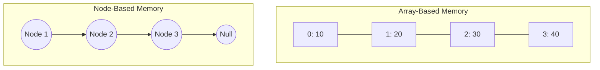

# Implementation Strategies for Data Structures in Python

## Learning Objectives
- Understand the core memory strategies (Array-Based, Node-Based, Hash-Based) used to implement data structures.
- Recognize the trade-offs in time and space complexity for each strategy.
- Differentiate between mutable and immutable data structures.
- Apply Python-specific optimizations like `__slots__` and lazy evaluation.

## Prerequisites
- Basic understanding of what a data structure is.
- Familiarity with Big O notation (Time and Space Complexity).
- Basic Python programming syntax.

## Concept
Data structure implementation strategies refer to the foundational ways memory is allocated, organized, and accessed to build higher-level data structures (like Lists, Trees, Hash Maps). The three primary strategies are **Array-Based (Contiguous Memory)**, **Node-Based (Linked Memory)**, and **Hash-Based**. Additionally, design choices like mutability vs. immutability significantly impact how data structures behave.

## Intuition
- **Array-Based:** Imagine a row of adjacent lockers. If you know the locker number, you can go straight to it.
- **Node-Based:** Imagine a treasure hunt. Each clue (node) tells you where to find the next clue, and they can be scattered anywhere.
- **Hash-Based:** Imagine a magic filing cabinet. You give it a word, and it mathematically calculates exactly which drawer contains the word, skipping the search entirely.

## Formal Explanation

### 1. Array-Based (Contiguous Memory)
Array-based implementations allocate a continuous block of memory. Accessing an element by its index is an $O(1)$ operation because the address can be calculated directly: `BaseAddress + (Index * ElementSize)`.
In Python, the standard `list` is a dynamic array of pointers. When full, a larger memory block is allocated, and pointers are copied.

### 2. Node-Based (Linked Memory)
Node-based structures consist of distinct memory allocations (nodes) scattered across the heap. Each node holds data and one or more pointers to other nodes. This is the foundation of Linked Lists and Trees. Python relies on object references and garbage collection (reference counting + cyclic GC) to manage this.

### 3. Hash-Based
Hash-based structures use a hash function to convert a key into an integer index, which determines the location (bucket) in an underlying array. Python's `dict` and `set` are heavily optimized hash tables. Modern Python dicts maintain insertion order by keeping a sparse array of indices pointing to a dense array of entries.

### 4. Mutable vs Immutable Implementations
- **Mutable** (e.g., `list`, `dict`): Can be changed in-place. Highly performant but not thread-safe by default.
- **Immutable** (e.g., `tuple`, `frozenset`): Cannot be changed after creation. Inherently thread-safe and can be used as hash keys.

### 5. Memory Management in Python
- **Object Overhead:** Every Python object has overhead (reference count, type pointer).
- **Slots (`__slots__`):** Suppresses the creation of `__dict__` in classes, saving memory when creating millions of nodes.
- **Generators:** Avoid materializing entire data structures in memory by yielding items one at a time.

## Examples
- **Array-Based:** Caching systems, fast lookups, NumPy arrays.
- **Node-Based:** DOM trees, ASTs (Abstract Syntax Trees), LRU Caches (Doubly Linked Lists).
- **Hash-Based:** Database indexing, counting frequencies, networking routing tables.

## Visuals


## Derivation (if applicable)
For dynamic arrays (Array-Based strategy), appending elements requires resizing when full. If we double the array size each time it fills up, the $N$ insertions take $O(N)$ time in total, giving an *amortized* time complexity of $O(1)$ per insertion.

## Code
```python
# Array-based (using Python list)
contiguous_array = [10, 20, 30]
contiguous_array.append(40) # Amortized O(1)

# Node-based implementation
class Node:
    __slots__ = ('value', 'next') # Optimization
    
    def __init__(self, value):
        self.value = value
        self.next = None

head = Node(10)
head.next = Node(20)

# Hash-based implementation (using Python dict)
hash_table = {}
hash_table["key1"] = "value1" # O(1) average case
```

## Practice
1. Create a dynamic array simulator class that doubles its internal list size when full.
2. Implement a basic singly linked list with `append` and `display` methods.
3. Compare the memory usage of a class with and without `__slots__` using `sys.getsizeof()`.

## Recall
- What is the time complexity of accessing an element by index in an array-based structure?
- Why do node-based structures have poor cache locality?
- How does Python handle hash collisions?

## Common Errors
- **Using a list as a queue:** Popping from the front of a list is $O(N)$. Use `collections.deque` instead.
- **Improper mutability:** Forgetting that immutable objects return new objects when modified, causing unexpected memory bloat in loops.
- **Unhashable types:** Using mutable objects (like lists) as dictionary keys (they are unhashable).

## Summary
Implementation strategies form the bedrock of data structures. Array-based structures provide fast index access and cache locality but require expensive resizing and shifting. Node-based structures allow dynamic growth and fast insertions/deletions at known nodes but suffer from poor sequential access speed. Hash-based structures offer $O(1)$ lookups but require more memory and collision management. Python provides high-level abstractions, but understanding these underlying strategies allows developers to optimize memory and performance.

## Interview Questions
1. **Why is appending to a Python list $O(1)$ amortized, but inserting at index 0 is $O(N)$?**
   *Answer:* A Python list is a dynamic array. Appending drops the item in the next available contiguous slot. Inserting at index 0 requires shifting every element one position to the right in memory.
2. **If you need a queue, why shouldn't you use a Python `list`? What should you use instead?**
   *Answer:* Dequeuing from the front of a list is $O(N)$. Use `collections.deque`, which is a doubly-linked list of blocks allowing $O(1)$ operations from both ends.
3. **How does Python resolve hash collisions in dictionaries?**
   *Answer:* CPython uses open addressing with randomized probing.

## Further Reading
- Python's CPython source code (`listobject.c`, `dictobject.c`)
- Python `sys.getsizeof()` and `memory_profiler` documentation
- "Data Structures and Algorithms in Python" by Michael T. Goodrich
