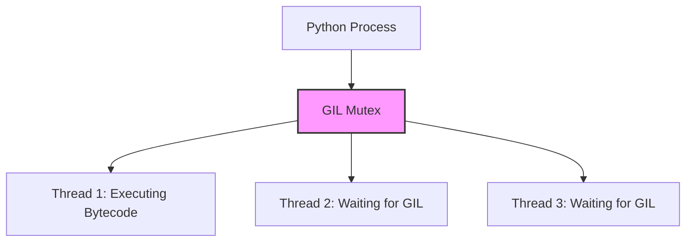

# Python's Advanced Standard Library: A Deep Dive

Welcome to this textbook-grade interactive lesson on Python's Advanced Standard Library. While many beginners are comfortable with basic built-in types and basic modules like `math` or `random`, mastering Python requires a deep understanding of its more advanced standard library modules. 

In this comprehensive guide, we will explore system interactions, memory management, concurrency models, asynchronous programming, and specialized data structures. This knowledge is crucial for writing performant, scalable, and memory-efficient applications.

---

## 1. System Interaction and Interpreter State: `sys` and `os`

When building production-grade applications, you often need to interact with the underlying operating system or query the state of the Python interpreter. The `os` and `sys` modules provide these capabilities.

### 1.1 The `sys` Module

The `sys` module provides access to variables and functions that interact strongly with the interpreter. It is the key to understanding how Python manages execution, imports, and memory.

#### Memory Profiling with `sys.getsizeof()`

Understanding object size in memory is critical for optimization. `sys.getsizeof()` returns the size of an object in bytes.

```python
import sys

# Analyzing the size of basic types
print(f"Size of integer 0: {sys.getsizeof(0)} bytes")
print(f"Size of integer 1: {sys.getsizeof(1)} bytes")
print(f"Size of large integer: {sys.getsizeof(10**100)} bytes")

# Analyzing container sizes
empty_list = []
print(f"Size of empty list: {sys.getsizeof(empty_list)} bytes")

empty_dict = {}
print(f"Size of empty dictionary: {sys.getsizeof(empty_dict)} bytes")
```

> [!WARNING]
> `sys.getsizeof()` only returns the size of the container itself, not the objects it contains. To accurately measure the size of a nested collection, you need a recursive function to traverse the objects.

#### Exploring Interpreter Settings

The `sys` module also lets you inspect and modify interpreter limits, such as the maximum recursion depth, which is important for algorithms like Deep First Search (DFS).

```python
import sys

# Get current recursion limit (default is typically 1000)
current_limit = sys.getrecursionlimit()
print(f"Current recursion limit: {current_limit}")

# Increase limit for deep recursive algorithms
sys.setrecursionlimit(2000)
print(f"New recursion limit: {sys.getrecursionlimit()}")

# Check Python version and platform
print(f"Python version: {sys.version_info}")
print(f"Operating System platform: {sys.platform}")
```

### 1.2 The `os` Module

The `os` module provides a portable way of using operating system-dependent functionality, particularly file and directory operations.

#### Efficient Directory Traversal: `os.scandir()`

Prior to Python 3.5, `os.listdir()` was the standard for reading directory contents. However, `os.listdir()` returns a list of strings, requiring subsequent `os.stat()` calls to determine file types or sizes, causing significant overhead.

`os.scandir()` provides a highly optimized alternative. It yields `os.DirEntry` objects, which cache file attributes.

```python
import os
import time

def list_files_legacy(path):
    start = time.time()
    for filename in os.listdir(path):
        full_path = os.path.join(path, filename)
        if os.path.isfile(full_path):
            size = os.path.getsize(full_path)
    print(f"Legacy os.listdir() took: {time.time() - start:.4f} seconds")

def list_files_modern(path):
    start = time.time()
    with os.scandir(path) as it:
        for entry in it:
            if entry.is_file():
                size = entry.stat().st_size
    print(f"Modern os.scandir() took: {time.time() - start:.4f} seconds")

# In real scenarios with thousands of files, os.scandir() is noticeably faster
# list_files_legacy('.')
# list_files_modern('.')
```

> [!TIP]
> Always use `with os.scandir(path) as it:` to ensure that the internal file descriptors are closed immediately when you are done iterating.

---

## 2. Concurrency: `threading` vs `multiprocessing`

Concurrency allows your program to deal with multiple things at once. In Python, due to the Global Interpreter Lock (GIL), true parallelism for CPU-bound tasks requires multiple processes.

### 2.1 The Global Interpreter Lock (GIL)

The GIL is a mutex that protects access to Python objects, preventing multiple threads from executing Python bytecodes at once.



### 2.2 I/O-Bound Concurrency: `threading`

For tasks that spend most of their time waiting for external events (e.g., network requests, disk I/O), the GIL is released, making `threading` an excellent choice.

```python
import threading
import time
import urllib.request

def download_url(url):
    print(f"Starting download: {url}")
    # Simulating I/O Wait
    time.sleep(1) 
    print(f"Finished download: {url}")

urls = [
    "http://example.com/1",
    "http://example.com/2",
    "http://example.com/3",
    "http://example.com/4",
]

start = time.time()

# Creating and starting threads
threads = []
for url in urls:
    thread = threading.Thread(target=download_url, args=(url,))
    threads.append(thread)
    thread.start()

# Waiting for all threads to complete
for thread in threads:
    thread.join()

print(f"Total time with threading: {time.time() - start:.2f}s")
# The time should be ~1 second instead of 4 seconds sequentially.
```

### 2.3 CPU-Bound Parallelism: `multiprocessing`

For CPU-intensive tasks (e.g., heavy mathematical computations, image processing), the GIL becomes a bottleneck. The `multiprocessing` module bypasses the GIL by spawning entirely new operating system processes, each with its own Python interpreter and memory space.

```python
import multiprocessing
import time
import math

def compute_heavy_math(n):
    # Simulating CPU bound work
    count = 0
    for i in range(10**7):
        count += math.sqrt(i)
    return count

if __name__ == "__main__":
    start = time.time()
    
    # ProcessPoolExecutor is modern way (via concurrent.futures) 
    # but using raw multiprocessing pool here
    with multiprocessing.Pool(processes=4) as pool:
        results = pool.map(compute_heavy_math, range(4))
        
    print(f"Total time with multiprocessing: {time.time() - start:.2f}s")
```

#### Shared Memory Across Processes

Historically, sharing state between processes required serialization (pickling) which is slow. Python 3.8 introduced `multiprocessing.shared_memory`.

```python
from multiprocessing import Process, shared_memory
import numpy as np

def modify_shared_array(shm_name, shape, dtype):
    # Attach to the existing shared memory block
    existing_shm = shared_memory.SharedMemory(name=shm_name)
    
    # Create a numpy array backed by shared memory
    c = np.ndarray(shape, dtype=dtype, buffer=existing_shm.buf)
    
    # Modify data
    c[-1] = 999
    
    # Close access to the shared memory block
    existing_shm.close()

if __name__ == '__main__':
    # Create a NumPy array
    a = np.array([1, 1, 2, 3, 5, 8], dtype=np.int64)
    
    # Create a shared memory block of appropriate size
    shm = shared_memory.SharedMemory(create=True, size=a.nbytes)
    
    # Create a NumPy array backed by shared memory
    b = np.ndarray(a.shape, dtype=a.dtype, buffer=shm.buf)
    b[:] = a[:]
    
    # Spawn process
    p = Process(target=modify_shared_array, args=(shm.name, a.shape, a.dtype))
    p.start()
    p.join()
    
    print(f"Modified array in parent process: {b}") # Output ends in 999
    
    # Clean up
    shm.close()
    shm.unlink()
```

---

## 3. Asynchronous Programming: `asyncio`

`asyncio` is the modern approach to I/O-bound concurrency. Instead of relying on OS-level threads (which are expensive to spawn and context-switch), `asyncio` uses an event loop and coroutines to achieve concurrency within a single thread.

### The Event Loop Architecture

```mermaid
sequenceDiagram
    participant OS as Operating System
    participant Loop as Event Loop
    participant Task1 as Coroutine 1
    participant Task2 as Coroutine 2

    Loop->>Task1: Execute until await
    Task1-->>Loop: Yield control (awaiting I/O)
    Loop->>Task2: Execute until await
    Task2-->>Loop: Yield control (awaiting I/O)
    OS-->>Loop: I/O Ready for Task1
    Loop->>Task1: Resume execution
```

### Coroutines with `async` and `await`

```python
import asyncio
import time

async def fetch_data(id, delay):
    print(f"Task {id}: Starting fetch...")
    # asyncio.sleep simulates non-blocking I/O operations
    await asyncio.sleep(delay)
    print(f"Task {id}: Finished fetch!")
    return f"Data {id}"

async def main():
    start = time.time()
    
    # asyncio.gather runs awaitables concurrently
    results = await asyncio.gather(
        fetch_data(1, 2),
        fetch_data(2, 3),
        fetch_data(3, 1)
    )
    
    print(f"Results: {results}")
    print(f"Total time: {time.time() - start:.2f}s")

if __name__ == "__main__":
    # In Jupyter/IPython, await main() can be run directly. 
    # In standard scripts, use asyncio.run(main())
    # asyncio.run(main())
    pass
```

> [!IMPORTANT]
> A single blocking call (like `time.sleep()` or `requests.get()`) inside an asynchronous function will block the entire event loop, defeating the purpose of `asyncio`. Always use async-compatible libraries (e.g., `aiohttp` instead of `requests`).

---

## 4. Advanced Data Structures: The `collections` Module

Python's built-in `list`, `dict`, and `set` are heavily optimized, but they aren't always the right tool for every algorithmic problem. The `collections` module provides specialized data structures that offer superior Big-O performance in specific scenarios.

### 4.1 `deque`: Double-Ended Queue

A standard Python `list` is implemented as an array. Appending to the end is $O(1)$, but inserting or deleting from the beginning is $O(N)$ because all subsequent elements must be shifted in memory.

A `collections.deque` is implemented as a doubly-linked list. Appends and pops from **both** ends are $O(1)$.

```python
from collections import deque

# Initialize a deque
d = deque(['a', 'b', 'c'])

# O(1) operations on both ends
d.append('d')         # Right append
d.appendleft('z')     # Left append
print(d)              # deque(['z', 'a', 'b', 'c', 'd'])

right_item = d.pop()  # O(1) right pop
left_item = d.popleft() # O(1) left pop

# Bounded deques are great for maintaining a rolling window of items
history = deque(maxlen=3)
for i in range(5):
    history.append(i)
    print(f"Appended {i}: {history}")
# Notice how older items are automatically discarded.
```

### 4.2 `defaultdict` and `Counter`

`defaultdict` removes the need to check if a key exists before modifying it, providing cleaner code.

```python
from collections import defaultdict

# Grouping words by their starting letter
words = ["apple", "bat", "bar", "atom", "book"]

# Using list as the default factory
grouped_words = defaultdict(list)

for word in words:
    first_letter = word[0]
    # No KeyError! If key doesn't exist, an empty list is created.
    grouped_words[first_letter].append(word)

print(dict(grouped_words))
```

`Counter` is a highly optimized dictionary subclass for counting hashable objects.

```python
from collections import Counter

text = "the quick brown fox jumps over the lazy dog the quick fox"
words = text.split()

# Count frequencies in one line
word_counts = Counter(words)

# O(N log K) retrieval of most common elements using a heap internally
top_words = word_counts.most_common(2)
print(f"Top 2 words: {top_words}")
```

### 4.3 `namedtuple`: Memory Efficient Objects

If you need a simple container class to store data but don't need methods, instances of standard classes have significant memory overhead due to their internal `__dict__`. 

`namedtuple` provides a lightweight, immutable object that is highly memory-efficient.

```python
from collections import namedtuple
import sys

# Define a named tuple type
Point = namedtuple('Point', ['x', 'y', 'z'])

# Create an instance
p = Point(10, 20, 30)

print(f"Coordinates: x={p.x}, y={p.y}, z={p.z}")

# Compare memory usage
class PointClass:
    def __init__(self, x, y, z):
        self.x = x
        self.y = y
        self.z = z

obj_point = PointClass(10, 20, 30)
tuple_point = Point(10, 20, 30)

print(f"Class object size: {sys.getsizeof(obj_point)} bytes + dict overhead")
print(f"NamedTuple size: {sys.getsizeof(tuple_point)} bytes (No dict)")
```

---

## 5. Summary and Best Practices

To write professional-grade Python code, keep these principles in mind:

1. **System Operations**: Use `os.scandir()` instead of `os.listdir()` to minimize system calls and memory usage when parsing large directories. Profile object sizes with `sys.getsizeof()`.
2. **Concurrency Selection**: 
   - Use `threading` for I/O bound tasks where the OS spends time waiting (network, files).
   - Use `multiprocessing` for pure CPU-bound calculations to bypass the GIL.
   - Use `asyncio` for high-concurrency network operations within a single thread.
3. **Data Structures**: Analyze your algorithm's Big-O requirements. If you need frequent $O(1)$ operations at the front of a sequence, swap out `list` for `collections.deque`. 
4. **Memory Profiling**: Large data processing should rely on generators `(x for x in data)` to process items lazily without loading the entire collection into RAM.

Mastering these libraries forms the foundation of moving from a Python intermediate to a Python expert.
