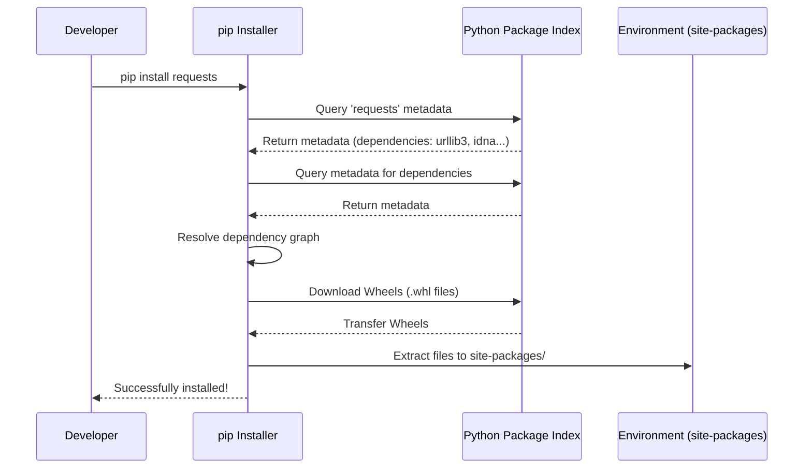
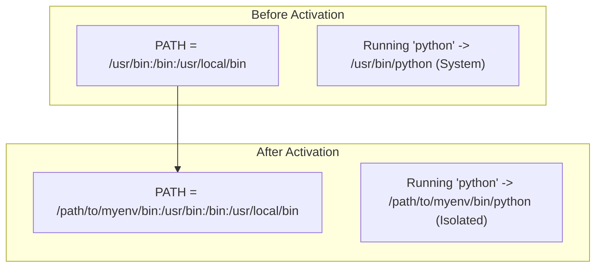

# Chapter 4.2: Third-Party Libraries and Environment Management: The Definitive Guide

Welcome to the comprehensive textbook chapter on managing third-party libraries and configuring isolated environments in Python. While Python's Standard Library is famously "batteries included," modern software engineering heavily relies on specialized, community-driven tools. 

Managing these dependencies effectively is a fundamental skill. Poor dependency management leads to the infamous "It works on my machine!" problem, security vulnerabilities, and "dependency hell."

---

## 1. The Python Package Index (PyPI) and `pip`

The Python Package Index (PyPI) is the official third-party software repository for Python. As of the mid-2020s, it hosts hundreds of thousands of packages. 

To interact with PyPI, Python developers use `pip` (Pip Installs Packages).

### 1.1 Understanding `pip`

`pip` is the standard package installer for Python. It fetches packages from PyPI (or other configured indexes), resolves dependencies, and installs them into your environment.

> [!NOTE]
> `pip` is itself a Python package and comes pre-installed with Python binaries from python.org (Python 3.4+).

#### How `pip` Works Under the Hood

When you execute `pip install requests`, the following sequence of events occurs:

1. **Resolution:** `pip` queries PyPI for the `requests` package. It reads the metadata of the package to determine its dependencies (e.g., `urllib3`, `certifi`, `idna`, `charset_normalizer`).
2. **Download:** `pip` downloads the appropriate distribution archives for the current platform. Whenever possible, it downloads **Wheels** (`.whl`), which are pre-compiled binary packages. If a Wheel is unavailable, it downloads a Source Distribution (`sdist`, usually a `.tar.gz`) and builds it locally.
3. **Installation:** `pip` extracts the contents of the Wheel and places them into the `site-packages` directory of the active Python environment. It also generates metadata folders (e.g., `requests-2.31.0.dist-info`).



### 1.2 The Dependency Resolution Algorithm

Before version 20.3, `pip` used a simplistic, linear dependency resolver. It installed packages in the order it found them, which often resulted in conflicting versions being installed silently.

Modern `pip` uses a **backtracking resolver**. If Package A requires Package C (v1.0) and Package B requires Package C (v2.0), the resolver will evaluate the constraints. If a mutually compatible version exists, it installs it; otherwise, it aborts the installation with a `ResolutionImpossible` error, preventing a broken environment.

> [!WARNING]
> If you encounter dependency resolution errors, do NOT force install (`--no-deps` or `--force-reinstall`) unless you know exactly what you are doing. Instead, analyze the conflict and adjust your version constraints.

---

## 2. Environment Isolation: `venv`

Installing packages globally (into the system Python) is universally considered a bad practice. It leads to:
- **Dependency Conflicts:** Project A needs Django 3, but Project B needs Django 4. Global installation cannot accommodate both simultaneously.
- **System Instability:** Many operating systems (like Linux distributions) rely on the system Python for administrative tools (e.g., `apt`, `yum`). Modifying global packages can break your OS.

The solution is **Virtual Environments**.

### 2.1 The Anatomy of `venv`

A virtual environment is a self-contained directory tree that contains a Python installation for a particular version of Python, plus a number of additional packages.

The `venv` module is built into the Standard Library (since Python 3.3).

```bash
# Creating a virtual environment named 'myenv'
python -m venv myenv
```

#### What exactly happens when you run this command?

1. A directory named `myenv` is created.
2. A `pyvenv.cfg` file is generated, pointing to the base Python executable that created the environment.
3. A `Scripts` (on Windows) or `bin` (on POSIX) directory is created containing the Python executable wrapper and activation scripts (like `activate.bat` or `activate`).
4. A `Lib/site-packages` directory is created. This is completely empty (except for `pip` and `setuptools`).

### 2.2 Activation: How it tricks your shell

When you "activate" a virtual environment:

```bash
# Windows
myenv\Scripts\activate

# macOS / Linux
source myenv/bin/activate
```

The activation script does **not** launch a new shell. Instead, it temporarily modifies your current shell's environment variables—specifically, the `PATH` variable.



By prepending the virtual environment's `bin`/`Scripts` directory to the `PATH`, your shell intercepts commands like `python` and `pip` and routes them to the isolated environment instead of the global system.

### 2.3 Exploring `sys.prefix` and `sys.path`

When the virtual environment's Python executable runs, it dynamically determines where its standard library and site-packages are located.

```python
import sys
import pprint

# sys.prefix points to the base of the environment
print(f"Environment Prefix: {sys.prefix}")
print(f"Base Prefix: {sys.base_prefix}") 

# If sys.prefix != sys.base_prefix, you are in a virtual environment!
is_venv = sys.prefix != sys.base_prefix
print(f"Are we in a virtual environment? {is_venv}")

# sys.path is the list of directories Python searches for modules
print("\nModule Search Path (sys.path):")
pprint.pprint(sys.path)
```

In a virtual environment, `sys.path` guarantees that the environment's local `site-packages` is searched *before* falling back to the standard library, ensuring isolated dependencies take precedence.

---

## 3. Modern Dependency Management and Packaging

While `pip` + `venv` is the foundational approach, modern Python development often leverages higher-level tools to enforce reproducibility.

### 3.1 The `requirements.txt` Workflow (Classic)

The traditional way to share dependencies is via a text file.

```text
# requirements.txt
requests==2.31.0
pydantic>=2.0.0,<3.0.0
pytest==7.4.0
```

> [!IMPORTANT]
> Pinning exact versions (e.g., `==2.31.0`) in applications ensures that every developer and production server runs the exact same code. This is called a **deterministic build**.

### 3.2 The Modern Era: `pyproject.toml`

PEP 518 introduced `pyproject.toml` as the standard configuration file for Python projects, replacing `setup.py`. It provides a unified place for build system requirements, project metadata, and tool configuration.

### 3.3 Advanced Tools: Poetry and pip-tools

Tools like **Poetry** and **pip-tools** solve the "transitive dependency problem." 

If you depend on `requests`, you actually depend on `urllib3` transitively. If `urllib3` releases a breaking update, your app might crash even if you pinned `requests`. 

These tools generate a **lock file** (`poetry.lock` or `requirements.txt` generated by `pip-compile`). The lock file pins every single package in the dependency tree down to its cryptographic hash, ensuring 100% reproducible environments.

---

## 4. Deep Dive: Essential Third-Party Libraries

To illustrate the power of the ecosystem, let's explore three foundational third-party libraries that virtually every modern Python developer uses.

### 4.1 Requests: HTTP for Humans

The standard library provides `urllib`, which is powerful but notoriously verbose. `requests` abstracts away the complexities of HTTP requests, connection pooling, and payload parsing.

#### Example: Consuming a REST API

```python
import requests
from typing import Dict, Any

class GitHubAPIClient:
    """A simple client to interact with the GitHub API."""
    
    BASE_URL = "https://api.github.com"
    
    def __init__(self, token: str = None):
        # Using a Session object enables connection pooling (TCP reuse)
        # which significantly improves performance for multiple requests.
        self.session = requests.Session()
        
        # Set default headers for all requests
        self.session.headers.update({
            "Accept": "application/vnd.github.v3+json",
            "User-Agent": "Python-DSA-Master-App"
        })
        
        if token:
            self.session.headers["Authorization"] = f"token {token}"
            
    def get_user_info(self, username: str) -> Dict[str, Any]:
        """Fetch user profile information."""
        url = f"{self.BASE_URL}/users/{username}"
        
        try:
            # The requests library automatically handles redirects,
            # decompression, and SSL verification.
            response = self.session.get(url, timeout=10)
            
            # Raise an HTTPError if the status code is 4xx or 5xx
            response.raise_for_status()
            
            # Automatically parses the JSON response body into a Python dict
            return response.json()
            
        except requests.exceptions.Timeout:
            print("The request timed out!")
        except requests.exceptions.HTTPError as err:
            print(f"HTTP error occurred: {err}")
        except Exception as err:
            print(f"An error occurred: {err}")
            
        return {}

# Interactive Execution
if __name__ == '__main__':
    client = GitHubAPIClient()
    user_data = client.get_user_info("octocat")
    print(f"Name: {user_data.get('name')}")
    print(f"Public Repos: {user_data.get('public_repos')}")
```

### 4.2 Pydantic: Type-Safe Data Validation

Python's dynamic typing is flexible, but when processing external data (like JSON from APIs or databases), you need strict guarantees about data structure. `pydantic` uses Python type hints to validate data at runtime. 

Its core validation logic is written in **Rust**, making it astonishingly fast and memory-efficient.

#### Example: Robust Data Parsing

```python
from pydantic import BaseModel, EmailStr, Field, ValidationError
from typing import List, Optional
from datetime import datetime

# Define a Schema using Pydantic Models
class Address(BaseModel):
    street: str
    city: str
    zip_code: str = Field(pattern=r'^\d{5}(?:-\d{4})?$') # Regex validation

class User(BaseModel):
    id: int
    name: str = Field(min_length=2, max_length=50)
    email: EmailStr # Validates standard email formats
    is_active: bool = True
    signup_ts: Optional[datetime] = None
    addresses: List[Address] = []

# Raw JSON data (e.g., received from a web request)
external_data = {
    "id": "123", # Note: It's a string, Pydantic will coerce to int!
    "name": "Jane Doe",
    "email": "jane.doe@example.com",
    "signup_ts": "2023-10-27T10:30:00Z", # Standard ISO format parsed to datetime
    "addresses": [
        {"street": "123 Main St", "city": "Springfield", "zip_code": "12345"}
    ]
}

if __name__ == '__main__':
    try:
        # Pydantic validates and parses the dictionary
        user = User(**external_data)
        
        print(f"Successfully parsed user: {user.name}")
        print(f"ID is now an integer: {type(user.id)} -> {user.id}")
        print(f"Timestamp is a datetime object: {type(user.signup_ts)}")
        
        # Serialize back to JSON natively
        print(f"\nJSON Output:\n{user.model_dump_json(indent=2)}")
        
    except ValidationError as e:
        print("Validation failed!")
        print(e.json(indent=2))
```

> [!TIP]
> Pydantic is the engine powering modern frameworks like FastAPI. It shifts the burden of validation from manual `if/else` checks to clean, declarative data structures.

### 4.3 Pytest: Modern, Scalable Testing

The standard library includes `unittest`, which heavily relies on verbose Object-Oriented boilerplate (similar to Java's JUnit). `pytest` is a third-party alternative that allows you to write simple functions to test your code.

#### Key Features of Pytest:
- **Plain `assert` statements:** No more `self.assertEqual()` or `self.assertTrue()`. Pytest inspects standard Python `assert` statements and provides detailed introspection on failure.
- **Fixtures:** A powerful dependency injection mechanism for test setup and teardown.
- **Parametrization:** Run the same test multiple times with different inputs effortlessly.

#### Example: Pytest in Action

```python
# test_math_operations.py

import pytest

def add(a: int, b: int) -> int:
    return a + b

def divide(a: float, b: float) -> float:
    if b == 0:
        raise ValueError("Cannot divide by zero")
    return a / b

# 1. Simple Test using standard assert
def test_add():
    assert add(2, 3) == 5
    assert add(-1, 1) == 0

# 2. Parametrization: Run this test 3 times with different data
@pytest.mark.parametrize("a, b, expected", [
    (10, 2, 5.0),
    (9, 3, 3.0),
    (5, 2, 2.5)
])
def test_divide_valid(a, b, expected):
    assert divide(a, b) == expected

# 3. Testing Exceptions
def test_divide_by_zero():
    # Context manager checks if the specific exception is raised
    with pytest.raises(ValueError, match="Cannot divide by zero"):
        divide(10, 0)

# 4. Fixtures: Reusable setups
@pytest.fixture
def sample_user_data():
    """Provides consistent test data to any test that requests it."""
    return {"id": 1, "username": "test_user"}

def test_user_initialization(sample_user_data):
    # The fixture's return value is injected as an argument
    assert sample_user_data["username"] == "test_user"
    assert sample_user_data["id"] > 0
```

---

## 5. Security and Best Practices

When integrating third-party code into your projects, you inherit both its functionality and its vulnerabilities. Supply chain attacks are a growing threat.

1. **Vulnerability Scanning:** Use tools like `pip-audit` or `safety` to scan your environments for known CVEs (Common Vulnerabilities and Exposures).
    ```bash
    pip install pip-audit
    pip-audit
    ```
2. **Never Run `pip install` as Root/Admin:** Using `sudo pip install` on Linux can overwrite system Python packages and break your OS. Always use virtual environments.
3. **Audit Typosquatting:** Attackers upload malicious packages to PyPI with names similar to popular ones (e.g., `requeests` instead of `requests`). Always double-check package names before installation.
4. **Automate Dependency Updates:** Use services like Dependabot or Renovate in your CI/CD pipelines to keep your packages updated safely.

---

## Summary

In this chapter, we explored the architecture of Python's dependency management ecosystem. You learned how `pip` resolves and installs packages, and how `venv` isolates these packages by manipulating environment variables and system paths. 

We also dived deep into three industry-standard libraries: `requests` for robust networking, `pydantic` for strict data validation, and `pytest` for scalable testing. Finally, we reviewed critical security practices for safeguarding your applications against supply chain vulnerabilities. Mastering these tools elevates you from writing simple scripts to engineering production-ready Python applications.
