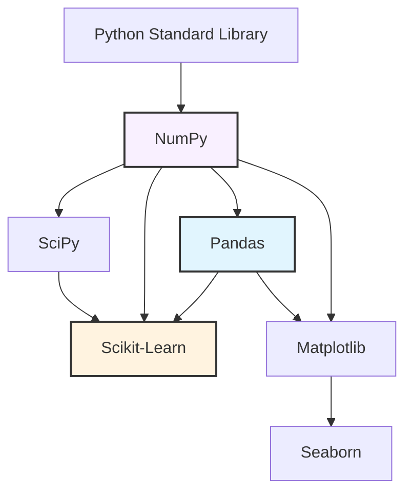

# Chapter 3: Python Data Science Ecosystem: A Comprehensive Guide

Welcome to the definitive guide on Python's Data Science libraries. Python has emerged as the lingua franca of data science, machine learning, and artificial intelligence. However, Python itself is an interpreted, dynamically typed language, which typically makes it slow for heavy numerical computations. 

The secret to Python's dominance lies in its ecosystem of libraries that provide Pythonic interfaces to highly optimized, pre-compiled C, C++, and Fortran routines.

In this textbook-grade lesson, we will dive deep into the fundamental pillars of the Python data science stack: **NumPy**, **Pandas**, **Matplotlib/Seaborn**, and **Scikit-Learn**. 

---

## 1. The Data Science Ecosystem Architecture

Before we dive into the code, it is essential to understand how these libraries interact. They are not isolated tools; they form a cohesive, layered architecture.



> [!NOTE]
> **NumPy** forms the bedrock of this ecosystem. Almost every other data science library uses NumPy arrays (`ndarray`) as their fundamental data structure for interchanging data.

---

## 2. NumPy: The Foundation of Numerical Computing

NumPy (Numerical Python) is the core library for scientific computing in Python. It provides a high-performance multidimensional array object, and tools for working with these arrays.

### 2.1 The `ndarray` Data Structure and Memory Layout

At the heart of NumPy is the `ndarray` (N-dimensional array). Unlike Python lists, which are arrays of pointers to objects scattered across memory, NumPy arrays are densely packed, contiguous blocks of memory of a single data type (homogeneous).

```python
import numpy as np
import sys

# Python List
py_list = [1, 2, 3, 4, 5]
print(f"Python list size in bytes: {sys.getsizeof(py_list) + sum(sys.getsizeof(i) for i in py_list)}")

# NumPy Array
np_array = np.array([1, 2, 3, 4, 5], dtype=np.int32)
print(f"NumPy array size in bytes: {np_array.nbytes}")
```

#### Memory Strides
NumPy navigates these contiguous memory blocks using **strides**. Strides represent the number of bytes to step in each dimension when traversing an array. This abstraction allows NumPy to perform operations like transposing arrays ($O(1)$ time complexity) simply by swapping the strides, without copying the underlying data.

### 2.2 Vectorization and SIMD

**Vectorization** is the process of replacing explicit loops with array expressions. Behind the scenes, NumPy delegates these operations to optimized C code that utilizes SIMD (Single Instruction, Multiple Data) CPU instructions.

> [!TIP]
> **Never use `for` loops to iterate over NumPy arrays if a vectorized alternative exists.** Loop overhead in Python will negate any performance benefits.

```python
import numpy as np
import time

# Create a large array of 10 million elements
size = 10_000_000
arr1 = np.random.rand(size)
arr2 = np.random.rand(size)

# Approach 1: Python Loop (Anti-pattern)
start = time.time()
result_loop = np.empty(size)
for i in range(size):
    result_loop[i] = arr1[i] + arr2[i]
loop_time = time.time() - start

# Approach 2: Vectorized Operation (Best Practice)
start = time.time()
result_vec = arr1 + arr2
vec_time = time.time() - start

print(f"Loop Time: {loop_time:.4f}s")
print(f"Vectorized Time: {vec_time:.4f}s")
print(f"Speedup: {loop_time / vec_time:.2f}x")
```

### 2.3 Broadcasting

Broadcasting is a powerful mechanism that allows NumPy to perform arithmetic operations on arrays of different shapes. It implicitly "stretches" the smaller array to match the shape of the larger array, *without actually copying data in memory*.

**Broadcasting Rules:**
1. If the arrays have different dimensions, pad the shape of the smaller array with ones on the left side.
2. If the shape of the two arrays does not match in any dimension, the array with shape equal to 1 in that dimension is stretched to match the other shape.
3. If in any dimension the sizes disagree and neither is equal to 1, an error is raised.

```python
import numpy as np

# A matrix of shape (3, 4)
matrix = np.array([[1, 2, 3, 4],
                   [5, 6, 7, 8],
                   [9, 10, 11, 12]])

# A vector of shape (4,)
vector = np.array([1, 0, 1, 0])

# Broadcasting adds the vector to EVERY ROW of the matrix
# Shape (3, 4) + Shape (4,) -> Shape (3, 4) + Shape (1, 4) -> Shape (3, 4)
result = matrix + vector
print("Result of Broadcasting:\n", result)
```

---

## 3. Pandas: Relational Data and Analysis

While NumPy is excellent for homogeneous numerical data, real-world data is usually tabular and heterogeneous (containing numbers, strings, dates, etc.). Pandas provides high-level data structures (`Series` and `DataFrame`) that make working with "relational" or "labeled" data easy and intuitive.

### 3.1 Series and DataFrame

- **Series**: A one-dimensional labeled array capable of holding any data type.
- **DataFrame**: A two-dimensional labeled data structure with columns of potentially different types (like a SQL table or Excel spreadsheet).

```python
import pandas as pd

# Creating a DataFrame from a dictionary
data = {
    'Name': ['Alice', 'Bob', 'Charlie', 'David'],
    'Age': [25, 30, 35, 40],
    'Department': ['Engineering', 'Marketing', 'Engineering', 'HR'],
    'Salary': [85000, 70000, 95000, 60000]
}
df = pd.DataFrame(data)

# Setting a semantic index
df.set_index('Name', inplace=True)
print(df)
```

### 3.2 Indexing: `loc` vs `iloc`

Understanding indexing is the most critical hurdle in mastering Pandas.
- **`.loc[]`**: Label-based indexing. You select data by the index/column *names*.
- **`.iloc[]`**: Integer-location based indexing. You select data by their integer *position* (0-indexed).

```python
# Label-based: Get Alice's Salary
alice_salary = df.loc['Alice', 'Salary']

# Position-based: Get the first row, second column
first_row_col2 = df.iloc[0, 1]

# Slicing with loc is INCLUSIVE of the endpoint
eng_dept = df.loc['Alice':'Charlie', ['Age', 'Department']]
```

### 3.3 The Split-Apply-Combine Pattern

Pandas excels at data aggregation through the `groupby()` function, which implements the "Split-Apply-Combine" paradigm.

```mermaid
flowchart LR
    A[Original DataFrame] -->|Split by 'Department'| B[Group: Engineering]
    A -->|Split| C[Group: Marketing]
    A -->|Split| D[Group: HR]
    
    B -->|Apply mean()| E[Mean Salary: 90k]
    C -->|Apply mean()| F[Mean Salary: 70k]
    D -->|Apply mean()| G[Mean Salary: 60k]
    
    E -->|Combine| H[Aggregated DataFrame]
    F --> H
    G --> H
```

```python
# Calculate average salary per department
avg_salary = df.groupby('Department')['Salary'].mean()
print(avg_salary)

# Multiple aggregations simultaneously
agg_stats = df.groupby('Department').agg({
    'Salary': ['mean', 'max', 'min'],
    'Age': 'mean'
})
print(agg_stats)
```

### 3.4 Memory Optimization for Large Datasets

Pandas defaults to allocating the maximum precision data types (`float64`, `int64`, `object` for strings). For large datasets, this leads to `MemoryError`.

> [!TIP]
> **Categoricals**: If a string column has low cardinality (few unique values compared to the total number of rows), converting it to a `category` type will drastically reduce memory consumption. It maps strings to integers internally.

```python
# Create a large DataFrame
large_df = pd.DataFrame({
    'Status': ['Active', 'Inactive', 'Pending'] * 100000,
    'Value': np.random.randn(300000)
})

print(f"Memory before optimization: {large_df.memory_usage(deep=True).sum() / 1e6:.2f} MB")

# Downcast floats and convert low-cardinality strings to category
large_df['Value'] = pd.to_numeric(large_df['Value'], downcast='float')
large_df['Status'] = large_df['Status'].astype('category')

print(f"Memory after optimization: {large_df.memory_usage(deep=True).sum() / 1e6:.2f} MB")
```

---

## 4. Data Visualization: Matplotlib and Seaborn

Visualizing data is critical for uncovering patterns and communicating results.

### 4.1 Matplotlib Architecture: Pyplot vs Object-Oriented API

Matplotlib offers two ways to create plots:
1. **Pyplot API (`plt.plot()`)**: State-based, MATLAB-like, easy for quick scripts.
2. **Object-Oriented API (`fig, ax = plt.subplots()`)**: Explicit, gives you full control over the figure and axes. **Always use this for professional code.**

```python
import matplotlib.pyplot as plt
import numpy as np

x = np.linspace(0, 10, 100)

# Object-Oriented Approach (Recommended)
fig, ax = plt.subplots(figsize=(8, 5)) # Create Figure and Axes
ax.plot(x, np.sin(x), label='Sine Wave', color='blue', linestyle='--')
ax.plot(x, np.cos(x), label='Cosine Wave', color='red', linewidth=2)

ax.set_title('Trigonometric Functions', fontsize=16)
ax.set_xlabel('X-axis')
ax.set_ylabel('Amplitude')
ax.legend()
ax.grid(True, alpha=0.3)

# Display the plot (in a real script)
# plt.show()
```

> [!WARNING]
> When generating plots in a loop, memory leaks will occur unless you explicitly close the figures using `plt.close(fig)`.

### 4.2 Seaborn: Statistical Data Visualization

Seaborn is built on top of Matplotlib. It provides a high-level interface for drawing attractive and informative statistical graphics. It natively understands Pandas DataFrames.

```python
import seaborn as sns
import pandas as pd

# Load built-in dataset
tips = sns.load_dataset('tips')

# Create a complex statistical plot with one line of code
# scatter plot with regression line, separated by 'smoker' status
sns.lmplot(x='total_bill', y='tip', hue='smoker', data=tips, markers=['o', 'x'])
```

---

## 5. Scikit-Learn: Machine Learning Ecosystem

Scikit-Learn (`sklearn`) is the industry standard library for traditional machine learning algorithms, data preprocessing, and model evaluation.

### 5.1 The Estimator API

Scikit-Learn's genius lies in its uniform API. Almost every object shares a consistent interface:
- **Estimators**: Objects that learn from data. (e.g., `model.fit(X, y)`).
- **Transformers**: Objects that transform data. (e.g., `scaler.transform(X)` or `scaler.fit_transform(X)`).
- **Predictors**: Objects that make predictions. (e.g., `model.predict(X)`).

```python
from sklearn.model_selection import train_test_split
from sklearn.preprocessing import StandardScaler
from sklearn.linear_model import LogisticRegression
from sklearn.metrics import accuracy_score
import numpy as np

# 1. Generate synthetic data
X = np.random.randn(1000, 5) # 1000 samples, 5 features
y = (X[:, 0] + X[:, 1] > 0).astype(int) # Binary target

# 2. Split data
X_train, X_test, y_train, y_test = train_test_split(X, y, test_size=0.2, random_state=42)

# 3. Preprocess data (Scaling)
scaler = StandardScaler()
X_train_scaled = scaler.fit_transform(X_train) # Learn parameters AND transform
X_test_scaled = scaler.transform(X_test)       # ONLY transform based on learned parameters

# 4. Train Model
model = LogisticRegression()
model.fit(X_train_scaled, y_train)

# 5. Evaluate Model
predictions = model.predict(X_test_scaled)
print(f"Model Accuracy: {accuracy_score(y_test, predictions):.2f}")
```

### 5.2 Pipelines to Prevent Data Leakage

Data leakage happens when information from the test dataset leaks into the training process (e.g., scaling the entire dataset *before* splitting). Scikit-Learn `Pipeline` objects combine transformers and estimators to ensure safe cross-validation and prevent leakage.

```python
from sklearn.pipeline import Pipeline

# The Pipeline ensures fit() is called on the training data ONLY,
# and transform() is called on the validation/test folds during cross-validation.
pipeline = Pipeline([
    ('scaler', StandardScaler()),
    ('classifier', LogisticRegression())
])

# Fit the entire pipeline
pipeline.fit(X_train, y_train)

# Predict using the entire pipeline
preds = pipeline.predict(X_test)
```

---

## 6. Summary and Key Takeaways

1. **Avoid Python Loops**: Leverage NumPy's vectorized operations and broadcasting for numerical workloads.
2. **Understand Memory**: NumPy arrays rely on contiguous memory and strides. Pandas DataFrames can be optimized by downcasting datatypes and using Categoricals.
3. **Use the Object-Oriented Matplotlib API**: `fig, ax = plt.subplots()` gives you fine-grained control and prevents state-based confusion.
4. **Master the Scikit-Learn API**: The uniform `fit`, `transform`, `predict` architecture and the use of `Pipelines` are the foundation of robust machine learning systems in Python.

> [!CAUTION]
> Always be mindful of **data copies vs. views** in NumPy and Pandas. Operations like slicing usually return a memory *view*, meaning modifying the slice modifies the original array. Use `.copy()` when an independent clone is required.
