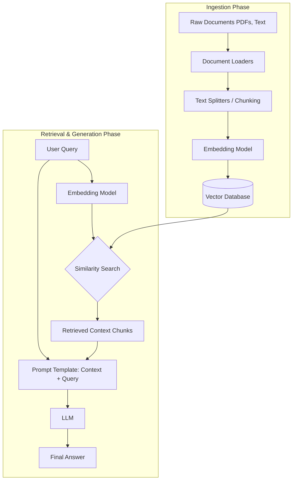

# Chapter 5: Advanced AI Libraries - LLMs and Orchestration

Welcome to a deep dive into the modern landscape of Artificial Intelligence. In the past few years, the center of gravity in AI has dramatically shifted from traditional machine learning and convolutional networks towards Large Language Models (LLMs) built on the Transformer architecture. 

In this comprehensive chapter, we will explore the libraries that make working with these gargantuan models not just possible, but highly efficient. We will start with the engine room—Hugging Face Transformers—understanding its mathematical underpinnings and memory optimizations. Then, we will move up the stack to orchestration frameworks like LangChain, focusing on how to build intelligent Agents and Retrieval-Augmented Generation (RAG) pipelines.

---

## 1. The Hugging Face Ecosystem: The Engine of Modern AI

Hugging Face has emerged as the GitHub of Machine Learning. It provides a central hub for models, datasets, and a suite of open-source libraries, most notably `transformers`.

### 1.1 The Mathematical Core: The Transformer Architecture

To truly master these libraries, you must understand the architecture they wrap. The Transformer relies on the **Self-Attention** mechanism. Unlike Recurrent Neural Networks (RNNs) that process tokens sequentially, Transformers process entire sequences simultaneously.

#### The Self-Attention Mechanism

Given a sequence of input embeddings $X \in \mathbb{R}^{N \times d}$, where $N$ is the sequence length and $d$ is the embedding dimension. The model computes three matrices: Query ($Q$), Key ($K$), and Value ($V$) using learned weight matrices $W_Q, W_K, W_V$:

$$Q = XW_Q, \quad K = XW_K, \quad V = XW_V$$

The attention scores are then calculated as:

$$\text{Attention}(Q, K, V) = \text{softmax}\left(\frac{QK^T}{\sqrt{d_k}}\right)V$$

Where:
- $QK^T$ computes a dot product similarity between every query and key, resulting in an $N \times N$ matrix.
- Scaling by $\sqrt{d_k}$ prevents the dot products from growing too large, which would push the softmax function into regions with exceedingly small gradients.
- The softmax function normalizes the scores to a probability distribution.
- The final multiplication by $V$ computes the weighted sum of the values.

> [!IMPORTANT]  
> **The Complexity Problem**: The $QK^T$ operation scales quadratically with respect to the sequence length $N$. Time and space complexity are $\mathcal{O}(N^2 \cdot d)$. This is why LLMs struggle with infinitely long contexts.

### 1.2 Memory Bottlenecks and Optimization

Loading a 7-Billion parameter model (e.g., Llama 2 7B) requires significant resources. In standard 32-bit floating point (FP32), each parameter takes 4 bytes.
$7,000,000,000 \times 4 \text{ bytes} \approx 28 \text{ GB of VRAM}$

Most consumer GPUs do not have 28GB of VRAM. Thus, Hugging Face implements critical optimization strategies.

#### Quantization

Quantization reduces the precision of the model weights, commonly using the `bitsandbytes` library. 
- **16-bit (FP16/BF16)**: Reduces size by half (~14GB).
- **8-bit (INT8)**: Uses 1 byte per parameter (~7GB).
- **4-bit (NF4/INT4)**: Uses 4 bits per parameter (~3.5GB), enabling large models to run on 8GB GPUs.

#### FlashAttention

While quantization solves weight memory, the $\mathcal{O}(N^2)$ activation memory from Self-Attention remains a bottleneck during generation. **FlashAttention** is a hardware-aware algorithm that fuses the attention operations, drastically reducing memory reads and writes between the GPU's High Bandwidth Memory (HBM) and SRAM. It reduces the memory footprint of attention from $\mathcal{O}(N^2)$ to $\mathcal{O}(N)$, speeding up inference and training.

### 1.3 Hands-On: Text Generation with Hugging Face

Let's build a script to load a model and generate text, incorporating quantization techniques.

```python
import torch
from transformers import AutoModelForCausalLM, AutoTokenizer, pipeline

def generate_text(prompt: str, model_id: str = "gpt2"):
    """
    Demonstrates text generation using Hugging Face pipelines.
    For demonstration, we use a small model (gpt2). 
    In production, you might use 'meta-llama/Llama-2-7b-chat-hf'.
    """
    print(f"Loading {model_id}...")
    
    # Load Tokenizer
    tokenizer = AutoTokenizer.from_pretrained(model_id)
    
    # Load Model (Optional: use torch_dtype=torch.float16 for half-precision)
    model = AutoModelForCausalLM.from_pretrained(
        model_id, 
        device_map="auto", # Automatically allocates model layers to available GPUs/CPU
        torch_dtype=torch.float16
    )
    
    # Initialize Pipeline
    generator = pipeline(
        "text-generation",
        model=model,
        tokenizer=tokenizer,
        max_new_tokens=50,
        temperature=0.7,      # Controls randomness (higher = more creative)
        top_p=0.9             # Nucleus sampling
    )
    
    print("\nGenerating response...\n")
    result = generator(prompt)
    print(result[0]['generated_text'])

if __name__ == "__main__":
    sample_prompt = "The future of artificial intelligence lies in"
    # Note: Requires network connection to download the model the first time
    # generate_text(sample_prompt) 
```

---

## 2. LangChain and Orchestration Frameworks

While Hugging Face provides the models, building an application requires stitching these models together with other components—databases, APIs, and business logic. LangChain is the preeminent orchestration framework for this.

### 2.1 Core Concepts

1.  **LLMs/Chat Models**: The underlying engine (OpenAI, HuggingFace, Anthropic).
2.  **Prompts**: Templates to dynamically format user inputs before sending them to the LLM.
3.  **Chains**: Sequences of operations (Prompt $\rightarrow$ LLM $\rightarrow$ Output Parser).
4.  **Agents**: The pinnacle of orchestration. Agents use an LLM as a reasoning engine to determine *which* actions (tools) to take and in *what* order.
5.  **Memory**: Persisting state between calls (e.g., chat history).

### 2.2 Hands-On: Building a LangChain Chain (LCEL)

Modern LangChain uses the LangChain Expression Language (LCEL), leveraging Python's `__or__` (pipe `|`) operator to chain components elegantly.

```python
import os
# Requires langchain and langchain-openai
from langchain_openai import ChatOpenAI
from langchain_core.prompts import ChatPromptTemplate
from langchain_core.output_parsers import StrOutputParser

def run_simple_chain():
    """
    Demonstrates a simple LCEL chain: Prompt | LLM | Parser
    """
    # Initialize the LLM (Requires OPENAI_API_KEY environment variable)
    # Using a placeholder for demonstration
    os.environ["OPENAI_API_KEY"] = "sk-placeholder-key"
    
    try:
        llm = ChatOpenAI(model="gpt-3.5-turbo", temperature=0)
    except Exception as e:
        print(f"Skipping execution: OpenAI API key required. ({e})")
        return

    # Define a Prompt Template
    prompt = ChatPromptTemplate.from_messages([
        ("system", "You are a senior technical writer. Explain complex technical concepts in simple terms."),
        ("user", "Explain {concept} in one paragraph.")
    ])

    # Define the output parser to convert the LLM message object to a string
    output_parser = StrOutputParser()

    # Construct the Chain using LCEL
    chain = prompt | llm | output_parser

    # Execute the chain
    concept_to_explain = "Retrieval-Augmented Generation"
    print(f"Executing chain for concept: {concept_to_explain}\n")
    
    # In a real environment, this would call the API
    # response = chain.invoke({"concept": concept_to_explain})
    # print(response)

if __name__ == "__main__":
    run_simple_chain()
```

---

## 3. Deep Dive: Retrieval-Augmented Generation (RAG)

LLMs suffer from two major limitations:
1.  **Hallucination**: They confidently state false information.
2.  **Stale Knowledge**: Their knowledge cutoff is the date they were trained. They know nothing about your private enterprise data.

**Retrieval-Augmented Generation (RAG)** solves this by giving the LLM an open-book test. Instead of relying on internal memory, it searches an external database for relevant facts, injects those facts into the prompt, and then answers the question based *only* on that context.

### 3.1 The Architecture of RAG



### 3.2 Vector Mathematics and Embeddings

Embeddings map text to high-dimensional vectors (e.g., 1536 dimensions for OpenAI's `text-embedding-ada-002`). The meaning of the text is encoded geometrically.

To find relevant chunks for a user query, the vector database computes distances.

**1. Cosine Similarity:**
Measures the cosine of the angle between two vectors. It ignores magnitude and focuses purely on direction (semantic meaning).

$$\text{Cosine Similarity} = \frac{A \cdot B}{||A|| ||B||} = \frac{\sum_{i=1}^{n} A_i B_i}{\sqrt{\sum_{i=1}^{n}A_i^2} \sqrt{\sum_{i=1}^{n}B_i^2}}$$
- Range: $[-1, 1]$. (1 = identical direction, 0 = orthogonal/unrelated).

**2. Dot Product:**
If vectors are normalized ($||A||=1, ||B||=1$), the dot product equals Cosine Similarity. It is faster to compute, making it the preferred metric for large vector databases.

### 3.3 Hands-On: A Complete RAG Pipeline

Let's build a functional RAG pipeline using LangChain and a local FAISS vector database.

```python
import os
from typing import List

# LangChain Imports
from langchain_community.document_loaders import TextLoader
from langchain_text_splitters import RecursiveCharacterTextSplitter
from langchain_community.embeddings import HuggingFaceEmbeddings
from langchain_community.vectorstores import FAISS
from langchain_core.prompts import ChatPromptTemplate
from langchain_core.runnables import RunnablePassthrough
from langchain_core.output_parsers import StrOutputParser

# Using a mock LLM for local demonstration without API keys
from langchain_community.llms import FakeListLLM

def build_rag_pipeline():
    """
    Constructs a complete Retrieval-Augmented Generation pipeline.
    """
    print("1. Creating Mock Document...")
    # Create a temporary file to act as our private knowledge base
    mock_data = (
        "Project Orion was initiated in 2024 to redesign the core database architecture. "
        "The lead engineer is Dr. Sarah Jenkins. The project utilizes a distributed "
        "PostgreSQL cluster with a specialized caching layer built on Redis. "
        "Project Orion's budget was increased by 20% in Q3 due to hardware costs."
    )
    with open("mock_orion.txt", "w") as f:
        f.write(mock_data)

    print("2. Loading and Chunking...")
    loader = TextLoader("mock_orion.txt")
    docs = loader.load()

    # Split text into chunks. 
    # chunk_overlap ensures context isn't lost at the boundaries.
    text_splitter = RecursiveCharacterTextSplitter(
        chunk_size=100,
        chunk_overlap=20,
        length_function=len
    )
    chunks = text_splitter.split_documents(docs)
    print(f"Created {len(chunks)} chunks.")

    print("3. Generating Embeddings and Vector DB...")
    # Using local open-source embeddings (SentenceTransformers)
    # This downloads a small embedding model locally
    embeddings = HuggingFaceEmbeddings(model_name="all-MiniLM-L6-v2")
    
    # Create FAISS Vector Store
    vectorstore = FAISS.from_documents(chunks, embeddings)
    
    # Create a retriever interface
    retriever = vectorstore.as_retriever(search_kwargs={"k": 2}) # Get top 2 chunks

    print("4. Constructing RAG Chain...")
    
    # Define the RAG prompt
    template = """Answer the question based ONLY on the following context:
    {context}
    
    Question: {question}
    """
    prompt = ChatPromptTemplate.from_template(template)

    # Mock LLM that returns a predetermined response for testing
    mock_llm = FakeListLLM(responses=[
        "Based on the context, the lead engineer for Project Orion is Dr. Sarah Jenkins."
    ])

    # LCEL Chain formulation
    # 1. retriever fetches context.
    # 2. RunnablePassthrough passes the user question along.
    rag_chain = (
        {"context": retriever, "question": RunnablePassthrough()}
        | prompt
        | mock_llm
        | StrOutputParser()
    )

    print("\n5. Executing Query...")
    query = "Who is the lead engineer for Project Orion?"
    print(f"Query: {query}")
    
    response = rag_chain.invoke(query)
    print(f"\nResponse: {response}")

    # Cleanup
    if os.path.exists("mock_orion.txt"):
        os.remove("mock_orion.txt")

if __name__ == '__main__':
    # Try running the pipeline (requires 'sentence-transformers', 'faiss-cpu' installed)
    try:
        build_rag_pipeline()
    except ImportError as e:
        print(f"Missing dependency: {e}. ")
        print("Install via: pip install langchain-community sentence-transformers faiss-cpu")
```

### 3.4 Advanced RAG Optimization Techniques

As RAG applications move to production, standard implementations face challenges in accuracy and latency. 

> [!TIP]
> **Production Optimization Tips**
> - **Semantic Routing**: Instead of passing every query to the LLM, use a fast embedding model to classify the intent of the query and route it to different pipelines.
> - **Query Transformation (HyDE)**: Sometimes a user query doesn't semantically match the document text. Hypothetical Document Embeddings (HyDE) uses an LLM to generate a fake answer to the query first, and then embeds the *fake answer* to search the vector database.
> - **GPTCache / Caching Layer**: Embedding and LLM calls are expensive. Hash the user's query and store the response in Redis. If another user asks the exact or semantically similar query, return the cached answer to save $O(N^2)$ compute.

## 4. Summary

We have transitioned from the underlying hardware mechanics to the high-level orchestration of intelligent systems:
- **Hugging Face** manages the models, dealing with the harsh realities of GPU memory, $O(N^2)$ attention costs, and quantization.
- **LangChain** provides the abstraction layer, letting you glue models to data sources and execution logic using tools like LCEL.
- **RAG** represents the current industry standard for deploying LLMs in enterprise environments, elegantly combining vector similarity search with language generation to eliminate hallucinations and integrate proprietary data.

By mastering these libraries, you shift from simply consuming AI APIs to engineering robust, scalable AI architectures.
