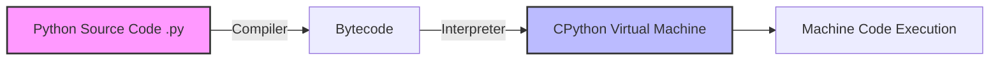

# Competitive Programming Strategy in Python: A Textbook Guide

## 1. Introduction to Competitive Programming (CP) in Python

### What is Competitive Programming?
Competitive programming (CP) is essentially a "mind sport" where participants solve well-defined algorithmic and mathematical problems under strict time and memory constraints. Problems usually include:
- A clear problem description.
- Input and output formats.
- Constraints on the sizes of inputs (e.g., $N \le 10^5$).
- Time limit (typically 1 to 2 seconds).
- Memory limit (typically 256 MB).

### Why use Python for CP?
Historically, C++ and Java have dominated CP. However, Python has rapidly gained popularity. 

**Advantages of Python:**
1. **Concise Syntax:** Less boilerplate means you can write solutions much faster.
2. **Rich Standard Library:** Libraries like `collections`, `heapq`, `math`, `bisect`, and `itertools` implement complex algorithms in highly optimized C code.
3. **Arbitrary-Precision Integers:** Python handles extremely large integers out-of-the-box, meaning you don't need to write custom `BigInt` classes or worry about integer overflow ($2^{63}-1$).

**Disadvantages of Python:**
1. **Slower Execution:** Python is an interpreted language. Code runs in CPython (the default interpreter) which compiles to bytecode and runs on a virtual machine. Operations are up to 10-50x slower than C++.
2. **High Memory Overhead:** Everything is an object. A standard integer in C is 4 bytes; in Python, it carries object overhead (at least 28 bytes).

### Industry Use Cases
- **Technical Interviews:** Top tech companies (FAANG/MAANG) use CP-style algorithmic challenges in their coding interviews.
- **Rapid Prototyping:** Validating an algorithm in Python before optimizing the final version in C++ or Rust.
- **Data Engineering & AI:** Optimal algorithm design translates directly to processing large datasets efficiently in backend engineering.

---

## 2. Python Architecture and Execution Model

To optimize Python for CP, you need to understand how CPython processes your code. 



### The Global Interpreter Lock (GIL) and Single-Threaded Constraints
In CP, multiprocessing or threading is almost never used or permitted by online judges. You are constrained to a single thread executing Python bytecode. Because every Python object requires runtime type-checking and memory management (reference counting), loops natively in Python are inherently slow.

**The Golden Rule of Python CP:** **Push loops into C!**
Whenever possible, use built-in functions (`map()`, `sum()`, `max()`, `min()`) or list comprehensions rather than writing explicit `for` loops. The built-in functions execute their internal loops directly in C, bypassing the CPython evaluation loop overhead.

### Computational Limits in Python
In C++, a standard time limit of 1 second usually allows for $10^8$ simple operations.
In Python, **aim for a maximum of $10^7$ operations per second.**

**Time Complexity Guide for $N$ (assuming 1 second limit):**
| $N$ (Input Size) | Acceptable Complexity | Examples in Python |
|:---:|:---:|:---|
| $10^{18}$ | $O(1)$ or $O(\log N)$ | Math formulas, Binary Search on Answer |
| $10^8$ | $O(N)$ (Strictly Optimized) | Only heavily optimized linear scans, two-pointers |
| $10^7$ | $O(N)$ | Safe linear algorithms, greedy, sliding window |
| $10^5$ | $O(N \log N)$ | Sorting, Segment Trees, Binary Search |
| $10^4$ | $O(N \sqrt{N})$ | Mo's Algorithm, Block decomposition |
| $10^3$ | $O(N^2)$ | DP on trees, pairwise distance |
| $100$ | $O(N^3)$ | Floyd-Warshall, Matrix Multiplication |
| $20$ | $O(2^N)$ | Bitmask DP, Backtracking |
| $10$ | $O(N!)$ | Permutations |

---

## 3. Fast I/O (Input/Output) Optimization

The most common reason for Time Limit Exceeded (TLE) in Python, despite having the correct $O(N \log N)$ algorithm, is slow Input/Output. 

The standard `input()` and `print()` functions are heavily overloaded with formatting and buffer flushing.

### Deep Dive: Standard I/O vs. Fast I/O

> [!WARNING]
> Never use `input()` inside a loop if $N > 10^5$. It will almost guarantee a TLE.

**Optimized I/O Boilerplate:**

```python
import sys
import os

# Read all bytes from standard input in one go
def fast_io():
    # sys.stdin.read().split() reads the entire input and splits by whitespace.
    # Returns a list of strings. Highly efficient for space-separated inputs.
    input_data = sys.stdin.read().split()
    
    if not input_data:
        return
    
    # Iterator over the list of strings
    iterator = iter(input_data)
    
    # Example: reading an array size and the array
    try:
        n = int(next(iterator))
        arr = [int(next(iterator)) for _ in range(n)]
        
        # Output buffering
        out = []
        out.append(str(sum(arr)))
        
        # Write once
        sys.stdout.write("\n".join(out) + "\n")
    except StopIteration:
        pass
```

### Explanation of the I/O Optimization:
1. **`sys.stdin.read()`**: Makes a single system call to read the entire file descriptor buffer into a Python string.
2. **`.split()`**: A highly optimized C function that tokenizes the string by any whitespace (spaces, newlines).
3. **`iter()`**: Creates an iterator. `next(iterator)` is faster than keeping a global index variable and indexing `input_data[idx]`.
4. **`sys.stdout.write()`**: Writes a single string block to standard output. Concatenating with `'\n'.join()` ensures we don't flush the buffer repeatedly.

---

## 4. Python-Specific Built-in Optimizations

Python's standard library is your biggest weapon. 

### 4.1. `collections.deque` vs `list`
A Python `list` is a dynamic array. Appending to the end is $O(1)$ amortized. However, inserting or deleting from the front (`list.insert(0, val)` or `list.pop(0)`) is $O(N)$ because every subsequent element must be shifted in memory.

If you need a Queue or a Deque (Double Ended Queue), use `collections.deque`, which is implemented as a doubly linked list of blocks in C.
- `deque.append()`: $O(1)$
- `deque.appendleft()`: $O(1)$
- `deque.popleft()`: $O(1)$

```python
from collections import deque

dq = deque([1, 2, 3])
dq.append(4)      # [1, 2, 3, 4]
dq.appendleft(0)  # [0, 1, 2, 3, 4]
dq.popleft()      # returns 0, deque is [1, 2, 3, 4]
```

### 4.2. `collections.Counter`
Finding the frequency of elements in an array manually takes a few lines of code and operates as a dictionary. `Counter` does this efficiently in C.

```python
from collections import Counter
arr = [1, 1, 2, 3, 3, 3, 4]
freq = Counter(arr) # Counter({3: 3, 1: 2, 2: 1, 4: 1})
most_common = freq.most_common(1) # [(3, 3)]
```

### 4.3. `heapq` (Priority Queue)
Python does not have a dedicated `PriorityQueue` class optimized for CP (the one in `queue` is thread-safe and thus slow). Instead, use `heapq`, which provides functions to manipulate a standard `list` as a Min-Heap.

- `heapq.heappush(heap, item)`: $O(\log N)$
- `heapq.heappop(heap)`: $O(\log N)$
- `heapq.heapify(x)`: $O(N)$

> [!TIP]
> `heapq` only provides a Min-Heap. To simulate a Max-Heap with integers, multiply the values by `-1` before pushing, and multiply by `-1` again after popping.

### 4.4. `bisect` (Binary Search)
Instead of writing a custom binary search algorithm which can be prone to off-by-one errors, use `bisect`.
- `bisect_left(arr, x)`: Returns the first index where `x` can be inserted to maintain order.
- `bisect_right(arr, x)`: Returns the index *after* the last occurrence of `x`.

```python
import bisect
arr = [1, 3, 4, 4, 6, 8]
print(bisect.bisect_left(arr, 4))  # Output: 2
print(bisect.bisect_right(arr, 4)) # Output: 4
```

---

## 5. Architectural Memory & Recursion Issues

### Recursion Limit
Python limits the depth of the call stack to prevent C-level stack overflow crashes (default is typically 1000). In CP, a graph with $10^5$ nodes represented as a linked list will require $10^5$ recursive calls for Depth First Search (DFS), leading to a `RecursionError`.

**Solution:** Increase the recursion limit manually.

```python
import sys
sys.setrecursionlimit(1 << 25) # Approx 33 million
```

> [!CAUTION]
> Even with an increased recursion limit, Deep Recursion in Python consumes a massive amount of memory due to stack frames. If memory limits are tight (e.g., 256MB) and graph nodes $V = 10^5$, an iterative DFS using an explicit stack (`list`) is much safer and highly recommended.

### Local vs Global Variables
In CPython, accessing local variables inside a function is noticeably faster than accessing global variables. The compiler maps local variables to an array accessed by index (using the `LOAD_FAST` opcode), whereas global variables are stored in a dictionary requiring a hash lookup (`LOAD_GLOBAL`).

**Always wrap your logic in a `main()` or `solve()` function.**

```python
# SLOW
n = int(input())
arr = list(map(int, input().split()))
ans = 0
for x in arr:
    ans += x

# FAST
def solve():
    n = int(input())
    arr = list(map(int, input().split()))
    ans = 0
    for x in arr:
        ans += x
        
if __name__ == '__main__':
    solve()
```

---

## 6. Comprehensive Python CP Template

Here is an industry-grade, textbook-standard template for Python CP.

```python
"""
Competitive Programming Template (Python 3)
Features:
- Fast I/O
- Recursion depth override
- Local function encapsulation
- Type hinting for clarity
"""

import sys
import math
from collections import defaultdict, deque, Counter
import heapq
import bisect

# Increase recursion depth for deep graph traversals
sys.setrecursionlimit(1 << 25)

def solve() -> None:
    """
    Core logic function. 
    Reads from sys.stdin, computes, and writes to sys.stdout.
    """
    # Read entire input from standard input
    input_data = sys.stdin.read().split()
    if not input_data:
        return
    
    iterator = iter(input_data)
    
    def next_int() -> int:
        return int(next(iterator))
        
    def next_str() -> str:
        return next(iterator)

    try:
        # Example Problem: Read T test cases
        T = next_int()
        
        out = []
        for _ in range(T):
            N = next_int()
            A = [next_int() for _ in range(N)]
            
            # Example logic: Sum of array
            # We use Python's built-in sum() which runs in C
            total_sum = sum(A)
            
            out.append(str(total_sum))
            
        # Fast output
        sys.stdout.write("\n".join(out) + "\n")
        
    except StopIteration:
        # Reached EOF safely
        pass

if __name__ == '__main__':
    solve()
```

---

## 7. Common Pitfalls and Avoidance Strategies

1. **String Concatenation in Loops**
   - **Bad:** `s = ""; for i in range(N): s += str(i)` (Time: $O(N^2)$ because strings are immutable; a new string is created every time).
   - **Good:** `arr = []; for i in range(N): arr.append(str(i)); s = "".join(arr)` (Time: $O(N)$).
   
2. **List `in` operator (Membership Testing)**
   - **Bad:** `if x in my_list:` (Time: $O(N)$)
   - **Good:** Convert to set first: `my_set = set(my_list); if x in my_set:` (Time: $O(1)$)
   
3. **Popping from arbitrary indices**
   - **Bad:** `my_list.pop(0)` or `my_list.remove(value)` (Time: $O(N)$)
   - **Good:** Use `deque` for $O(1)$ ends, or `del dict[key]` for associative mapping.

4. **Iterating multi-dimensional arrays**
   - In Python, `matrix = [[0] * M for _ in range(N)]` creates a list of lists. Iterating through this is slower than iterating through a 1D list `arr = [0] * (N * M)`. If strict TLE occurs, flatten 2D arrays to 1D and access via `index = r * M + c`.

---

## 8. Summary

Mastering Competitive Programming in Python is about balancing the expressive, concise nature of the language with an acute awareness of CPython's internal mechanics. 
To succeed:
- Use **Fast I/O**.
- Wrap code in **local functions**.
- Heavily leverage **built-in C-optimized libraries** (`collections`, `itertools`, `bisect`, `heapq`).
- Avoid operations that trigger $O(N)$ shifts (like `list.insert(0, x)`).
- Be extremely wary of the $10^7$ operations per second limit.

## 9. Practical Exercises

1. **Exercise 1 (Fast I/O):** Write a script that reads $10^6$ integers and prints their sum. Compare the runtime using standard `input()` vs `sys.stdin.read()`.
2. **Exercise 2 (Data Structures):** Implement a sliding window maximum using `collections.deque` in $O(N)$ time.
3. **Exercise 3 (Recursion to Iteration):** Given a tree represented as an adjacency list, write a Depth First Search (DFS) iteratively using a `list` as a stack, avoiding `sys.setrecursionlimit`.
