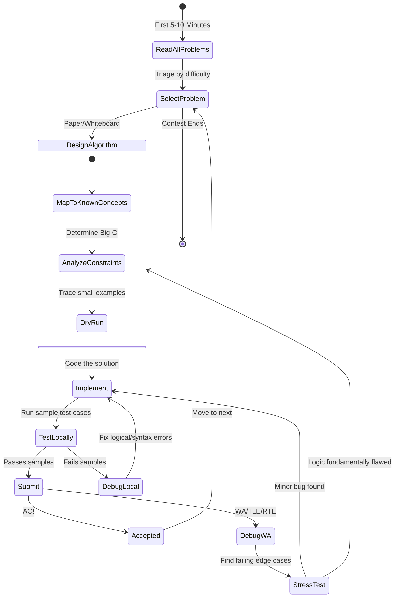

# Chapter 2: Contest Preparation and Optimal Workflows

Welcome to the definitive guide on Contest Preparation and Workflows for Competitive Programming (CP). While mastering algorithms and data structures is the foundation of CP, your environment, workflow, and psychological resilience determine how effectively you can apply that knowledge under intense time pressure.

This textbook-grade chapter deeply explores the routines, tooling, and mental models adopted by top-tier competitive programmers. Whether you are preparing for a Codeforces round, a Meta Hacker Cup, or a FAANG technical interview, mastering these workflows is crucial.

---

## 1. The Tripartite Lifecycle of a Contest

Competitive programming is not a single event; it is a continuous cycle divided into three critical phases:

1.  **Pre-Contest (Preparation):** Environment setup, boilerplate creation, and mental conditioning.
2.  **In-Contest (Execution):** Problem triage, algorithmic design, implementation, and debugging.
3.  **Post-Contest (Upsolving):** Reflection, learning, and filling knowledge gaps.

> [!NOTE]
> Industry Parallel: This lifecycle perfectly mirrors software engineering sprints. Pre-contest is sprint planning and environment setup. In-contest is the execution and firefighting phase. Post-contest is the retrospective and blameless post-mortem.

Let's visualize the optimal workflow during the execution phase:



---

## 2. Pre-Contest: Setting the Stage

Preparation minimizes friction. In a 2-hour contest, losing 10 minutes to environment issues or writing boilerplate code can cost you hundreds of ranking places.

### 2.1 Tooling and IDE Setup
You must have a robust, distraction-free environment. 
-   **Snippets:** Pre-configure your IDE (VS Code, Neovim, etc.) with snippets for common algorithms (Segment Trees, DSU, Dijkstra).
-   **Automated Run Scripts:** Have a single keybind to compile (if applicable) and run your code against `input.txt` and output to `output.txt`.

### 2.2 The Python CP Template
Python is slower than C++, but its expressiveness allows for rapid implementation. To mitigate Python's speed disadvantages, you must use optimized I/O.

> [!TIP]
> Standard `input()` and `print()` in Python are too slow for massive datasets ($> 10^5$ operations). Using `sys.stdin.read` or `sys.stdin.readline` can reduce I/O time by over 80%.

Here is a textbook-grade Python competitive programming template:

```python
import sys
import math
from collections import defaultdict, deque
from heapq import heappush, heappop

# Deep recursion requires increasing the limit
sys.setrecursionlimit(200000)

def solve():
    """
    Main logic for a single test case.
    """
    # Fast read for a single line of integers
    n, m = map(int, sys.stdin.readline().split())
    
    # Read a list of integers
    arr = list(map(int, sys.stdin.readline().split()))
    
    # Implement algorithm...
    ans = n + m + sum(arr)
    
    # Fast output
    sys.stdout.write(f"{ans}\n")

def main():
    """
    Entry point. Handles multiple test cases if required.
    """
    # Read all contents at once if you prefer bulk reading
    # input_data = sys.stdin.read().split()
    
    # Read number of test cases
    t_str = sys.stdin.readline()
    if not t_str:
        return
    t = int(t_str)
    
    for _ in range(t):
        solve()

if __name__ == '__main__':
    main()
```

---

## 3. During the Contest: The Execution Engine

### 3.1 Problem Triage (The First 10 Minutes)
Never start coding immediately. Read **all** problem statements. 
-   Your brain performs *background processing*. Reading a hard problem early allows your subconscious to chew on it while you solve the easy ones.
-   Identify the difficulty gradient. Platforms usually order by difficulty (A, B, C, D), but sometimes C is easier than B. Monitor the scoreboard.

### 3.2 Algorithmic Design and Constraint Analysis
Before touching the keyboard, derive the required time complexity from the problem constraints.

| Constraint $N$ | Maximum Permissible Time Complexity | Typical Algorithms |
| :--- | :--- | :--- |
| $N \le 10$ | $O(N!)$ | Backtracking, Permutations |
| $N \le 20$ | $O(2^N)$ | Bitmask DP, Meet in the Middle |
| $N \le 500$ | $O(N^3)$ | Floyd-Warshall, Matrix Multiplication |
| $N \le 5 \times 10^3$ | $O(N^2)$ | DP, Nested Loops |
| $N \le 2 \times 10^5$ | $O(N \log N)$ or $O(N)$ | Sorting, Segment Trees, Two Pointers |
| $N \le 10^9$ | $O(\log N)$ or $O(1)$ | Binary Search, Math |

> [!IMPORTANT]
> If $N = 10^5$, do not even attempt an $O(N^2)$ solution. You will receive a Time Limit Exceeded (TLE) verdict. Design an $O(N \log N)$ algorithm on paper first.

### 3.3 The Art of Debugging and Rubber Ducking
When a solution fails (Wrong Answer - WA), panic is the enemy. 
1.  **Re-read the constraints:** Did you miss that arrays can contain negative numbers? 
2.  **Integer Overflow (Not for Python):** In C++/Java, did you use `int` instead of `long long`? (Python handles arbitrarily large integers automatically, a massive advantage!)
3.  **Edge Cases:** Check $N=1$, empty arrays, all elements equal, etc.

---

## 4. Deep Dive: Automated Stress Testing

The single most powerful tool in a competitive programmer's arsenal is the **Stress Tester**. 

If you have a complex $O(N \log N)$ solution that yields WA, and staring at the code reveals nothing, you must stress test.

**Concept:**
1. Write a `slow_solve` function: A simple, naive, brute-force algorithm ($O(N^2)$ or $O(2^N)$) that is 100% guaranteed to be correct, but too slow for the full constraints.
2. Write a `generator`: A function that creates random inputs.
3. Run both your `fast_solve` and `slow_solve` on thousands of small, randomly generated inputs until their outputs differ.

Here is a robust, reusable Python stress-testing harness:

```python
import random
import sys

# ---------------------------------------------------------
# 1. The Complex/Optimized Solution (Currently Failing)
# ---------------------------------------------------------
def fast_solve(arr):
    """
    Supposed to be O(N). Contains a subtle bug.
    Finds the maximum subarray sum.
    """
    max_so_far = -float('inf')
    curr_max = 0
    for x in arr:
        curr_max += x
        if max_so_far < curr_max:
            max_so_far = curr_max
        # BUG: We forgot to reset curr_max to 0 if it drops below 0!
        # Correct logic: if curr_max < 0: curr_max = 0
    return max_so_far

# ---------------------------------------------------------
# 2. The Brute Force Solution (Guaranteed Correct)
# ---------------------------------------------------------
def slow_solve(arr):
    """
    O(N^2) brute force. Guaranteed to be correct.
    """
    n = len(arr)
    ans = -float('inf')
    for i in range(n):
        curr = 0
        for j in range(i, n):
            curr += arr[j]
            ans = max(ans, curr)
    return ans

# ---------------------------------------------------------
# 3. The Test Case Generator
# ---------------------------------------------------------
def generate_test_case():
    """Generates small arrays for stress testing."""
    n = random.randint(1, 10) # Keep sizes small to easily debug the failing case
    arr = [random.randint(-10, 10) for _ in range(n)]
    return arr

# ---------------------------------------------------------
# 4. The Harness
# ---------------------------------------------------------
def stress_test(max_tests=1000):
    print("Starting Stress Test...")
    for test_num in range(1, max_tests + 1):
        arr = generate_test_case()
        
        # Run both solutions
        expected = slow_solve(arr)
        actual = fast_solve(arr)
        
        # Compare
        if expected != actual:
            print(f"❌ WA found on Test #{test_num}")
            print(f"Input Data: {arr}")
            print(f"Expected Output (Slow): {expected}")
            print(f"Your Output (Fast): {actual}")
            return # Halt immediately upon finding a failing case
            
    print(f"✅ All {max_tests} test cases passed!")

if __name__ == '__main__':
    # Run the stress test locally
    stress_test()
```

> [!WARNING]
> Keep the generated test cases small (e.g., $N \le 10$). If your stress tester finds a failing array of size 10,000, you will never be able to manually trace it on paper to find the bug!

---

## 5. Post-Contest: The Growth Phase (Upsolving)

Growth does not occur during the contest; it occurs afterward.

**Upsolving** is the practice of solving the problems you failed during the contest after it ends.
-   **Rule of Thumb:** Always try to upsolve exactly *one* problem above what you managed in the contest. If you solved A and B, you MUST upsolve C. Upsolving D might be too massive a leap.
-   **Read Editorials:** After trying for 1-2 hours without success, read the official editorial.
-   **Study Master Code:** Go to the standings, filter by Python users (if that's your language), and read the solutions of highly-rated coders. Notice their abstractions, language tricks, and structural choices.

---

## 6. Real-World Interview Applications

How does this translate to FAANG interviews?

1.  **Handling Being Stuck:** Interviewers care deeply about your reaction to failure. Applying the "Stress Test" mentality mentally—creating a tiny example and tracing your code line-by-line—shows immense engineering maturity.
2.  **Constraint Probe:** In an interview, asking, "What is the maximum size of this list? Will it fit in memory?" mirrors CP constraint analysis. It immediately narrows down your algorithmic options and impresses the interviewer.
3.  **Modularization:** Writing clean, modular helper functions (like `slow_solve` or `generate_input`) demonstrates an understanding of test-driven development (TDD) principles.

## 7. Summary

-   **Pre-Contest:** Perfect your environment and templating. Friction is your enemy.
-   **In-Contest:** Read everything, map constraints to Big-O limits, and design entirely on paper before touching the keyboard.
-   **Debugging:** Rely on structured stress-testing over blind code modification.
-   **Post-Contest:** Upsolving is mandatory. It is the sole driver of long-term improvement.
