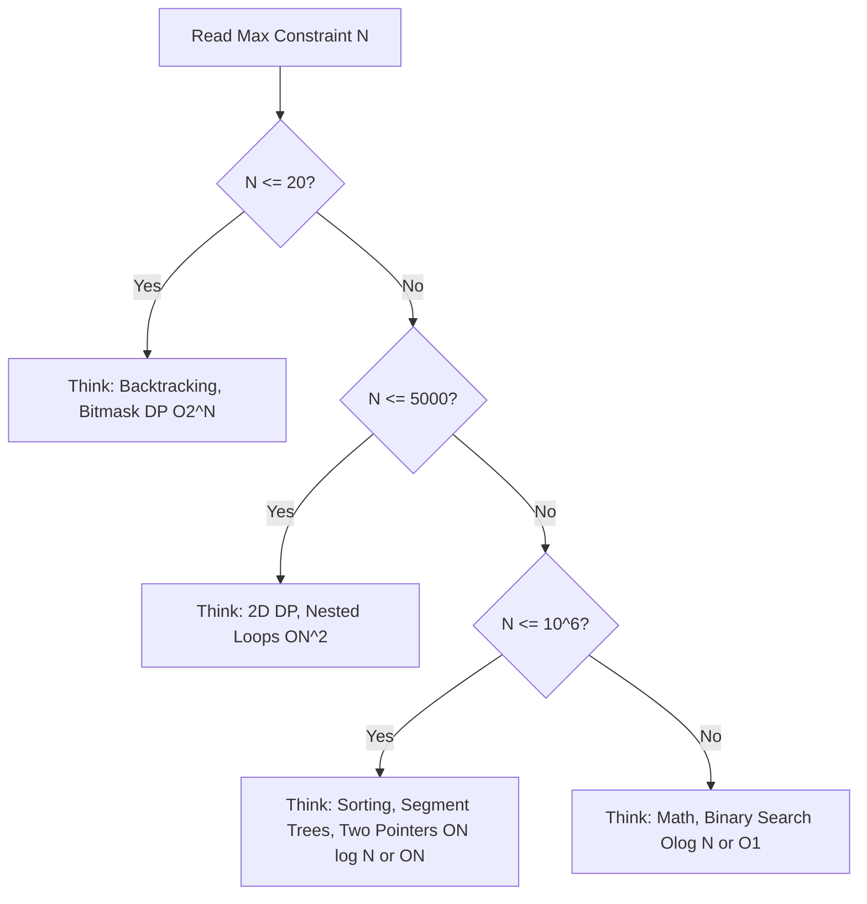
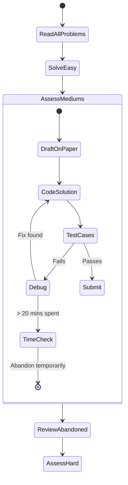

# Chapter 3: Time Management and Complexity Analysis in Competitive Programming

Welcome to the definitive guide on Time Management and Complexity Analysis for Competitive Programming in Python. Whether you are aiming for Grandmaster status on Codeforces, a high rating on LeetCode, or preparing for high-stakes technical interviews, mastering how your code scales and how you allocate your time is critical.

In this textbook-grade lesson, we will bridge the gap between theoretical computer science and pragmatic, high-pressure problem solving. We will explore Big-O analysis, hardware constraints, Python-specific performance tuning, and contest psychology.

---

## 1. Introduction and Overview

**What is it?**  
Time management in competitive programming (CP) is two-fold:
1. **Algorithmic Time Management:** Designing algorithms that execute within the strict time limits (often 1.0 to 2.0 seconds) set by the online judge.
2. **Contest Time Management:** Efficiently distributing your fixed contest time (e.g., 2 hours) across reading, planning, coding, and debugging multiple problems.

**Why does it exist?**  
Online judges run your code against dozens or hundreds of hidden test cases. A correct but unoptimized solution that results in a **Time Limit Exceeded (TLE)** is mathematically identical to a wrong answer in terms of points. Understanding complexity allows you to *predict* TLE before you type a single line of code, saving precious contest time.

**Industry Use Cases:**  
In the real world, this translates to scaling backend systems, ensuring APIs respond within tight SLAs (Service Level Agreements), and optimizing database queries. Knowing how data sizes impact processing time is a fundamental skill for any senior engineer.

> [!TIP]
> **The Golden Rule of CP:** Never start coding until you have mathematically proven to yourself that your algorithm fits within both the Time Limit and the Memory Limit.

---

## 2. The $10^8$ Rule: Predicting Time Complexity

Modern CPUs typically execute roughly $10^8$ (100 million) basic operations per second. 
In Python, because it is an interpreted language, a safer estimate is **$10^7$ to $2 \times 10^7$ operations per second** for native CPython, or closer to $10^8$ if you are using PyPy3 (which JIT compiles your code).

By looking at the maximum constraint ($N$) given in a problem, you can reverse-engineer the intended time complexity.

### Constraint Mapping Table

| Max Constraint ($N$) | Allowed Complexity | Typical Algorithms / Paradigms |
| :--- | :--- | :--- |
| $N \le 10$ or $11$ | $O(N!), O(N^6)$ | Backtracking, Permutations, Factorial brute force. |
| $N \le 20$ or $25$ | $O(2^N), O(N \cdot 2^N)$ | Bitmask DP, Meet-in-the-middle, Subset generation. |
| $N \le 100$ | $O(N^4)$ | 4D DP, nested loops. |
| $N \le 500$ | $O(N^3)$ | Floyd-Warshall, Matrix Chain Multiplication. |
| $N \le 5000$ | $O(N^2)$ | 2D DP, simple ad-hoc nested loops, Bubble/Insertion sort. |
| $N \le 10^5$ to $10^6$ | $O(N \log N), O(N)$ | Sorting, Segment Trees, Binary Search on Answer, Two Pointers, Greedy, Hash Maps. |
| $N \ge 10^9$ | $O(\log N), O(1)$ | Binary Search on math formulas, Fast Exponentiation, $O(1)$ Math combinatorics. |

### Mermaid Visualization: Constraint Decision Tree



---

## 3. Deep Dive: Asymptotic Complexity Analysis

To effectively manage algorithmic time, you must intuitively understand Big-O notation. Big-O describes the *worst-case* upper bound of an algorithm as the input size $N$ approaches infinity, ignoring constant factors.

### 3.1 Common Big-O Classes

1. **$O(1)$ - Constant Time:** Operations like dictionary lookups, array indexing, and basic math.
2. **$O(\log N)$ - Logarithmic Time:** Operations that halve the search space at each step (Binary Search).
3. **$O(N)$ - Linear Time:** Iterating through an array once.
4. **$O(N \log N)$ - Linearithmic Time:** The hallmark of efficient sorting (Merge Sort, Quick Sort) and divide-and-conquer algorithms.
5. **$O(N^2)$ - Quadratic Time:** Nested loops over the same array.
6. **$O(2^N)$ - Exponential Time:** Branching out into 2 paths at every step without memoization.

### 3.2 Amortized Complexity

Amortized analysis gives the average performance of each operation in the worst case. 
For example, appending to a Python list is technically $O(N)$ in the worst case when the underlying array needs to resize. However, because it doubles in size each time, the *amortized* cost across many appends is $O(1)$.

> [!WARNING]
> While Big-O ignores constants, in Competitive Programming, **constants matter heavily**. 
> An algorithm with $50 \times N$ operations might TLE, while $2 \times N$ operations will pass easily.

---

## 4. Python-Specific Performance Optimizations

Python is fundamentally slower than C++. To compete at high levels, you must optimize the "hidden constants."

### 4.1 Fast I/O
The default `input()` and `print()` in Python are slow due to flushing buffers and overhead. For problems with $10^5$ lines of input, this alone can cause a TLE.

```python
# standard_io.py
# Slow - Can cause TLE on massive inputs
def solve_slow():
    n = int(input())
    for _ in range(n):
        x, y = map(int, input().split())
        print(x + y)
```

**Optimized Fast I/O:**
Read the entire input at once using `sys.stdin.read` and write large chunks using `sys.stdout.write`.

```python
# fast_io.py
import sys

def solve_fast():
    # Read all content from standard input at once
    input_data = sys.stdin.read().split()
    if not input_data:
        return
    
    n = int(input_data[0])
    results = []
    
    # Process inputs iteratively
    idx = 1
    for _ in range(n):
        x = int(input_data[idx])
        y = int(input_data[idx+1])
        results.append(str(x + y))
        idx += 2
        
    # Join and print all results at once to minimize I/O overhead
    sys.stdout.write('\n'.join(results) + '\n')
```

### 4.2 Avoiding Hidden Constants
Certain Python operations hide massive complexity:
- `arr.pop(0)` is $O(N)$ because it shifts all elements. Use `collections.deque` and `deque.popleft()` for $O(1)$ operations.
- `arr[i:j]` (List slicing) creates a *new* list in memory, taking $O(K)$ time where $K$ is the slice length. Pass indices instead of slicing lists.
- `sum()`, `min()`, `max()` inside a loop over a subarray easily turn $O(N)$ logic into $O(N^2)$.
- String concatenation `s += "a"` is sometimes optimized in CPython, but joining a list of strings `"".join(lst)` is safer and strictly $O(N)$.

### 4.3 Python vs PyPy
Most competitive programming platforms offer **PyPy3**. PyPy is an alternative implementation of Python that uses a Just-In-Time (JIT) compiler. 
- For heavy loops, math, and list operations, PyPy3 can be **5x to 10x faster** than CPython.
- Always submit under PyPy3 if your algorithm is tight on the time limit.

---

## 5. Extensive Code Examples: TLE vs AC (Accepted)

Let's look at realistic scenarios where time complexity dictates the outcome.

### Example 1: The Two Sum Problem (Variation)
Given an array of size $N \le 2 \times 10^5$, find if any two numbers sum to `target`.

```python
# BAD APPROACH: O(N^2) Time Complexity
# For N = 200,000, max operations = (2 * 10^5)^2 = 4 * 10^10.
# This will definitely TLE (> 400 seconds in Python).
def solve_tle(arr: list[int], target: int) -> bool:
    n = len(arr)
    for i in range(n):
        for j in range(i + 1, n):
            if arr[i] + arr[j] == target:
                return True
    return False

# GOOD APPROACH: O(N) Time Complexity using a Hash Set
# For N = 200,000, operations = 2 * 10^5.
# This will easily pass in < 0.1 seconds.
def solve_ac(arr: list[int], target: int) -> bool:
    seen = set()
    for num in arr:
        if target - num in seen:
            return True
        seen.add(num)
    return False
```

### Example 2: Finding Maximum Subarray Sum of Size K (Sliding Window)
Given an array $N \le 10^5$ and an integer $K$, find the max sum of any contiguous subarray of size $K$.

```python
# BAD APPROACH: Re-calculating sum every time. O(N * K)
# If N = 10^5 and K = 10^4, operations = 10^9 (TLE)
def max_subarray_tle(arr: list[int], k: int) -> int:
    max_sum = float('-inf')
    for i in range(len(arr) - k + 1):
        current_sum = sum(arr[i:i+k]) # Slicing is O(K), sum is O(K)
        max_sum = max(max_sum, current_sum)
    return max_sum

# GOOD APPROACH: Sliding Window O(N)
# Operations strictly proportional to N. Fast and efficient.
def max_subarray_ac(arr: list[int], k: int) -> int:
    if not arr or k <= 0:
        return 0
        
    current_sum = sum(arr[:k])
    max_sum = current_sum
    
    for i in range(k, len(arr)):
        # Slide the window: subtract the element leaving, add the element entering
        current_sum += arr[i] - arr[i - k]
        if current_sum > max_sum:
            max_sum = current_sum
            
    return max_sum
```

---

## 6. Contest Time Allocation Strategies

Solving algorithms is only half the battle. Managing your time during a live contest determines your final rank.

### 6.1 The Triage Phase (First 5-10 Minutes)
Do not immediately start coding Problem A. Read through *all* problems briefly.
Classify them:
- **Easy:** You immediately see the solution.
- **Medium:** You know the topic (e.g., BFS, DP) but need to work out the details.
- **Hard:** You have no idea where to start.

### 6.2 The Execution Phase
1. **Solve Easy problems instantly:** Secure base points. Do not overcomplicate them.
2. **Paper First:** For Medium problems, **write logic on paper first**. Tracing state transitions or drawing graph edges on paper uncovers bugs before you start typing.
3. **Time Boxing:** Set a strict budget. E.g., "I will spend max 30 minutes on Problem C. If I am not close, I switch to Problem D."

### 6.3 Combating the Sunk Cost Fallacy
> [!CAUTION]
> The biggest trap in CP is the **Sunk Cost Fallacy**. You spend 45 minutes debugging Problem B. You feel "I'm so close, I can't quit now!" In reality, your logic might be fundamentally flawed. **Pause.** Move to the next problem. Your subconscious will continue processing Problem B in the background.

### Mermaid Visualization: Contest Workflow



---

## 7. Real-World / Interview Applications

Understanding CP time management applies directly to software engineering interviews. 

### Q&A Example 1:
**Interviewer:** "We have a log file with 10 million entries ($10^7$). We need to find the frequency of top 10 error messages."
**Your CP brain:** $N=10^7$. An $O(N \log N)$ sort will do roughly $10^7 \times 24 \approx 2.4 \times 10^8$ operations, which might take 2-3 seconds. An $O(N)$ approach using a Hash Map and a Min-Heap of size 10 will take $10^7 \times \log(10)$ operations, which is nearly instant. 
*Result: You confidently propose the $O(N)$ approach.*

### Q&A Example 2:
**Interviewer:** "How do you handle being stuck on a bug during production debugging?"
**Your CP brain:** "I apply time-boxing. If I am debugging for more than 30 minutes without finding the root cause, I escalate, write down my current hypotheses, and step away for a 5-minute break to reset my perspective, avoiding the sunk-cost fallacy."

---

## 8. Practical Exercises

To truly master this material, try the following exercises:

1. **Benchmark the difference:** Write a Python script using the `time` module. Generate a random array of $10^5$ integers. Run the $O(N^2)$ `solve_tle` and the $O(N)$ `solve_ac` functions from Example 1. Note the catastrophic difference in runtime.
2. **Analyze standard library:** Look up the time complexity of Python's `list.sort()`. (Hint: It uses Timsort, $O(N \log N)$ worst case, $O(N)$ best case).
3. **Contest Simulation:** Take a virtual contest on Codeforces (Div 2 or Div 3). Strictly allocate 10 minutes to reading, and cap your debugging time to 20 minutes per problem. See how it affects your stress levels and performance.

---

## 9. Summary

1. **Constraints dictate algorithms:** Always use the $10^8$ rule to predict the required Big-O complexity before coding.
2. **Constants matter:** In Python, avoid slow I/O, accidental $O(N)$ list operations like slicing, and use PyPy3 when possible.
3. **Manage your psychology:** Write on paper first. Do not fall for the sunk-cost fallacy. Time-box your debugging.
4. **Practice:** The ability to instantly map constraints to algorithms ($N=10^5 \rightarrow O(N \log N)$) becomes second nature with practice.

Mastering these skills not only turns you into a formidable competitive programmer but also a highly capable software engineer who writes performant, scalable code by default.
